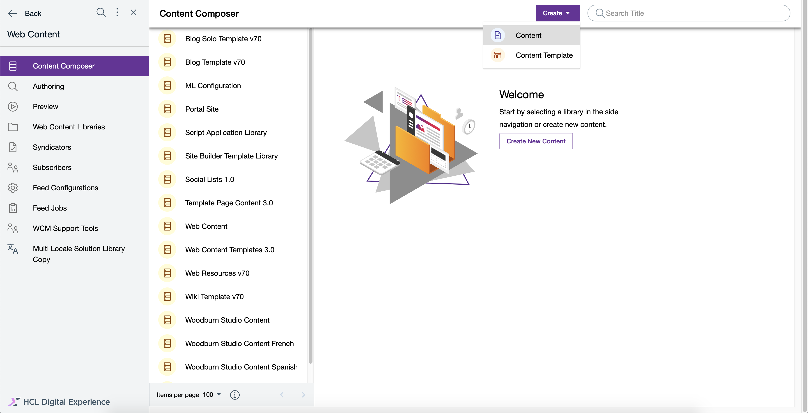
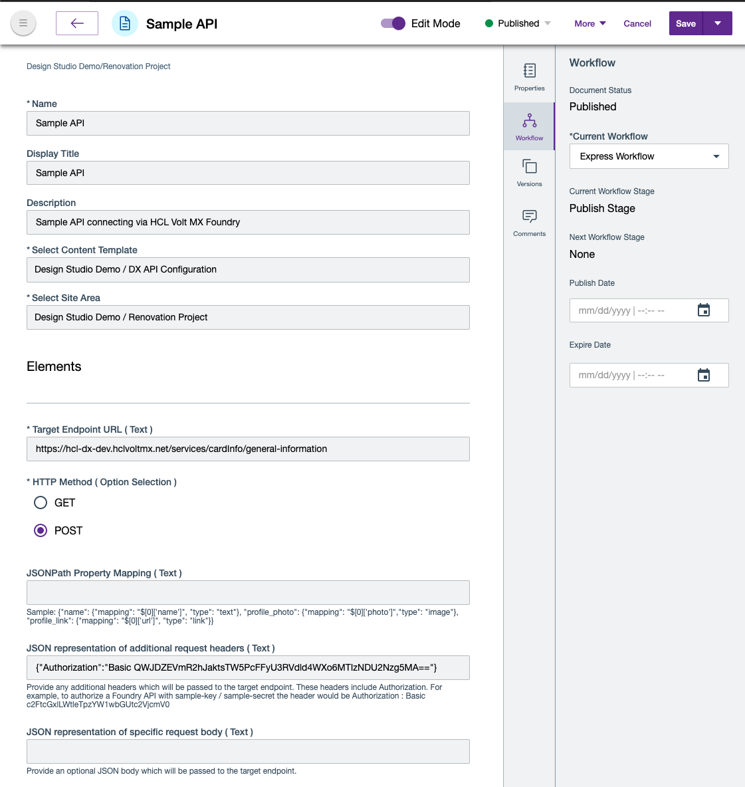
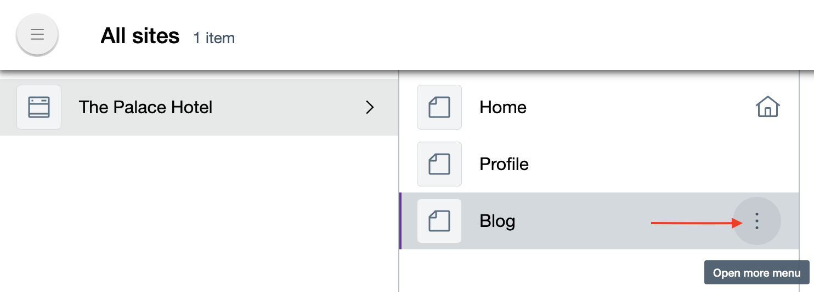
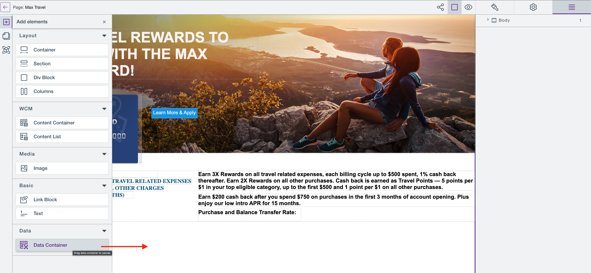
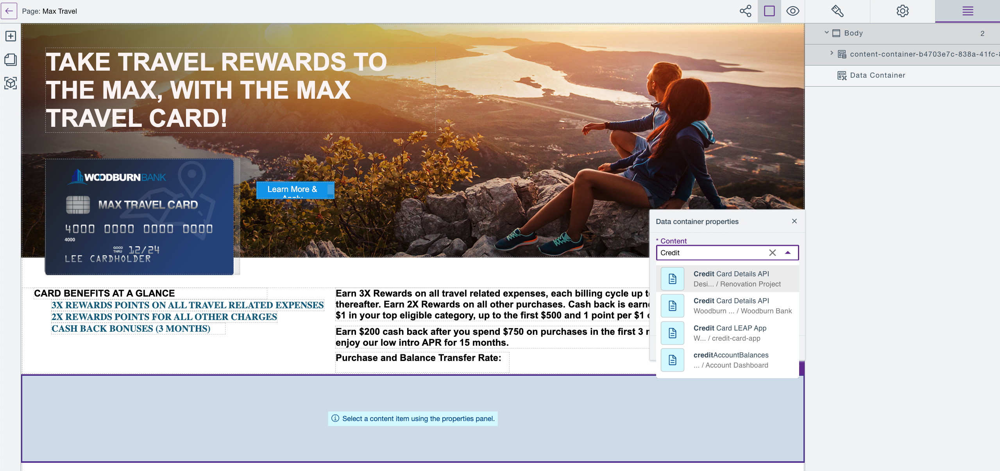
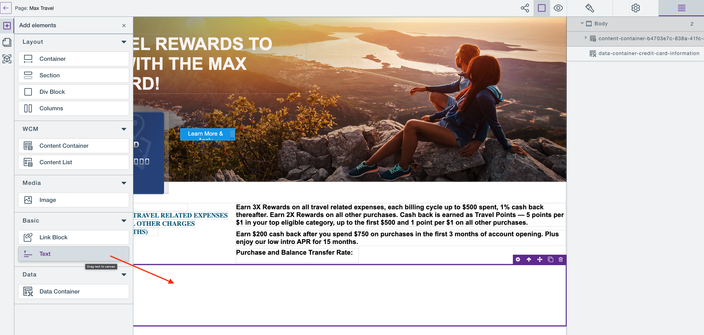
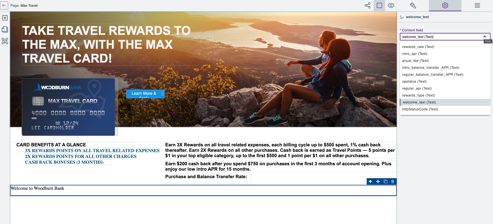

# Use data containers

This section details how you can use data containers on pages created and managed with HCL Design Studio (Beta).

## Overview

A data container provides the capability of rendering information from an external data source based on an API configuration. This API configuration is stored as a content item based on the Content Template **DX API Configuration**.
!!! note
    The Content Template is part of the default templates within the library **Design Studio Demo**

## Create an API configuration
API configurations are stored as **content items**. A content item can be created with **Content Composer**.
!!! important
    Refer to the [HCL Content Composer](https://help.hcltechsw.com/digital-experience/9.5/content_composer/cont_comp_overview.html) documentation for a detailed description on how to create content with **Content Composer**.

!!! note
    This example uses an API from [HCL Volt MX Foundry](https://opensource.hcltechsw.com/volt-mx-docs/). Refer to the [HCL Volt MX User Guide](https://opensource.hcltechsw.com/volt-mx-docs/docs/documentation/Foundry/voltmx_foundry_user_guide/Content/Introduction.html) topic for a detailed description on how to create an **integration service**.

Follow the steps to create an API configuration in HCL Content Composer.

1. In the **HCL Content Composer Dashboard**, click the **Create** button and choose **Content**.
    
2. Provide a **Name, Display Title and Description**.
3. Select the **DX API Configuration** Content Template from the **Design Studio Demo** library.
4. Select a Site Area where the configuration should be stored.
5. Enter the **Target Endpoint URL** of the API.
6. Select the HTTP Method (verb) that should be used to connect to the Target Endpoint URL.
    - The Data Container provides read-only access to an external API. All HCL Volt MX Foundry APIs require a POST request and do not support any response via an HTTP GET request.
7. Provide an optional JSONPath Property Mapping.
    - By default, the Data Container provides a direct mapping of root properties from a JSON structure to the selection dialog in the page editor. Any tree structure needs to be transformed with an optional mapping instruction. The mapping is a JSON representation in the format `{"key": {"mapping": "JSONPath", "type": "text"}}`. For an in-depth description, refer to the [JSONPath documentation](https://goessner.net/articles/JsonPath/index.html#e2).
8. Provide an optional JSON representation of additional request headers.
    - To connect to your HCL Volt MX Foundry API, you can leverage the App Key and App Secret as a base64 encoded Authorization.
9. Provide an optional JSON body payload.
10. Click **Save**.
    

## Create a data container

This section describes how to create a data container on your site and its pages in HCL Design Studio (Beta).

Follow the steps to create a data container from your site using HCL Digital Experience 9.5 Design Studio (Beta).

1.  In the **Sites** overview, hover over the site where you want to create a data container until you see the overflow menu button.

    

2.  Click the Overflow menu button, and choose **Open page in editor**.
3.  Click **Open add elements panel**.
4.  Under **Data**, drag and drop **Data Container** onto the page.
    
5.  In the Data container properties, search for the name of the content to use. You can select the desired content item from the displayed list. The list is limited to the content items that matches the **DX API Configuration** Content Template.
    
6.  You can edit and use a custom name or keep the auto-generated name. The auto-generated names are appended with numbers if the names already exist within a data container.
7. Under **Basic**, drag and drop **Text** onto the data container.
    
8. In the text field properties, select which element from the configured API should be rendered.
    

!!! important
    Data container does not provide editing capabilities for the content that are provided by third-party. The data container rendering is limited to only the **Text** elements. Other elements are not supported.

## HCL Digital Experience Solution Feedback

HCL Digital Experience is interested in your experience and feedback working with HCL Digital Experience 9.5 release software. To offer comments or issues on your findings, please access the [HCL Digital Experience 9.5 Feedback Reporting application](https://www.hclleap.com/apps/secure/org/app/158bbc7c-f357-4ef0-8023-654dd90780d4/launch/index.html?form=F_Form1).

