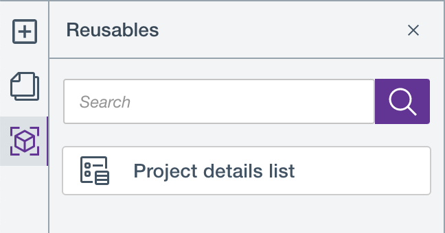

# Use reusable blocks

The following section details information and steps on how to use reusable content items across your HCL Digital Experience site.

## Overview

Users can reuse a content item multiple times across different pages of their HCL Digital Experience sites. Reusable content items are called *reusable
blocks*.

As of HCL Digital Experience CF205 and higher releases, the following reusable blocks made available are:

-   [Content Container](../building_content/use_content_containers.md)
-   [Content list](../building_content/use_content_lists.md) 
-   [Data containers](../building_content/use_data_containers.md)

More content items will be introduced in future releases.

To access available reusable blocks, you need to be on the HCL Design Studio (Beta) Page editor and click the *Reusable blocks* icon as shown below:

!!! note
    A reusable block is not made available or to be reused if it is already used in a page. For example, the three reusable blocks `Designer-Amanda Smithsen`, `Profile - Woodburn Studio` , and `Designer Contact Me` are not available for reuse in the said page as they are already in use:

## Create a new reusable block

Content containers with WCM Content Items are automatically created as **new** reusable blocks and are automatically added in the **Reusables** panel as soon as they are created, as shown below:

You can create a reusable block as if you are creating a new content container for your page.

1. To create a new content container, follow the steps in [Add a content item to a Design Studio (Beta)](../update_content_items.md#add-a-content-item-to-a-design-studio-beta-page).
2. Access the newly-created reusable block in Page editor view, then open the Reusable blocks panel as shown below:

## Edit an existing reusable block

To edit an existing reusable block, follow the steps in [Edit a content item in a Design Studio (Beta)](../update_content_items.md#edit-a-content-item-in-a-design-studio-beta-page).

!!! note
    Make sure the name of your reusable block is unique and identifiable for you to be able to quickly locate it from the list.

## Use a reusable block
To use a reusable block:

1.  Open any page in Page Editor view.

2.  Click the **Reusables** panel to display the list of reusable blocks.

3.  Drag and drop the selected content list block to the Page Editor canvas.

!!! note
    The reusable block is disabled if it is already added in the page the user is currently on.  [Content list block disabled in Reusables panel](../../../images/disabled-content-list-reusable.png)

## Delete a reusable block

!!! notes
    - Deleting a reusable block results in an error if the reusable block is being used in your current or other pages. 
    - Deleting a reusable block also results in an error if the reusable block has already been deleted by another authorized user. In this case, the **Reusables** panel refreshes and updates the list of reusable blocks.
    - In previous releases (CF196 - CF202), once you delete a Content Container in Page Editor mode, the Content Container is also deleted in WCM. However, when a Content Container becomes a reusable block and you delete it from Page Editor mode, it will remain in WCM.

To delete a reusable block:

1.  Open any page in Page Editor view.

2.  Click the **Reusables** panel to display the list of reusable blocks.

3. Hover on the reusable block that you want to delete and click the **Delete** icon.

    

3.  A confirmation modal appears. Click **Delete** to confirm deletion or **Cancel** to cancel deletion.

    

4.  A message appears if the selected reusable block is successfully deleted.

## How to present your feedback on HCL Design Studio (Beta)

HCL Digital Experience welcomes your feedback and suggestions on Design Studio (Beta), and encourages you to present your input through cases and discussions with HCL Support DX leaders.