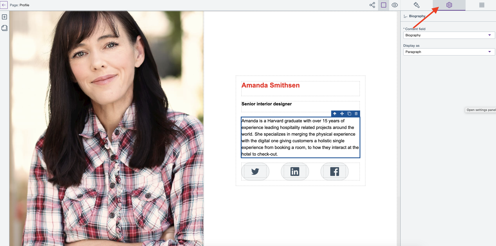

# Use text elements

Learn how to use Text elements for your HCL Design Studio (Beta) site and pages.

## Setting the HTML tag for Text Elements
The HTML tag may affect how browsers display elements, SEO, and accessibility tools.

To set the HTML tags for your text elements:

1.  From **Sites Overview**, select and open an existing page you wish to edit in Page editor view.

2.  On the Page editor canvas, select an element and click the **Settings** icon to open the Page element settings menu of the selected element.

    

    > **Note:** For newly-created site pages, you need to add content elements first in order to perform this action.

3.  Go to the **Display as** drop-down and click the arrow view the HTML tag selections. In the example below, the HTML tag for the `passive` text element is `paragraph`.

    

4.  Select from the drop down menu the new HTML tag you wish to apply on the selected text element. Changes are automatically saved.

