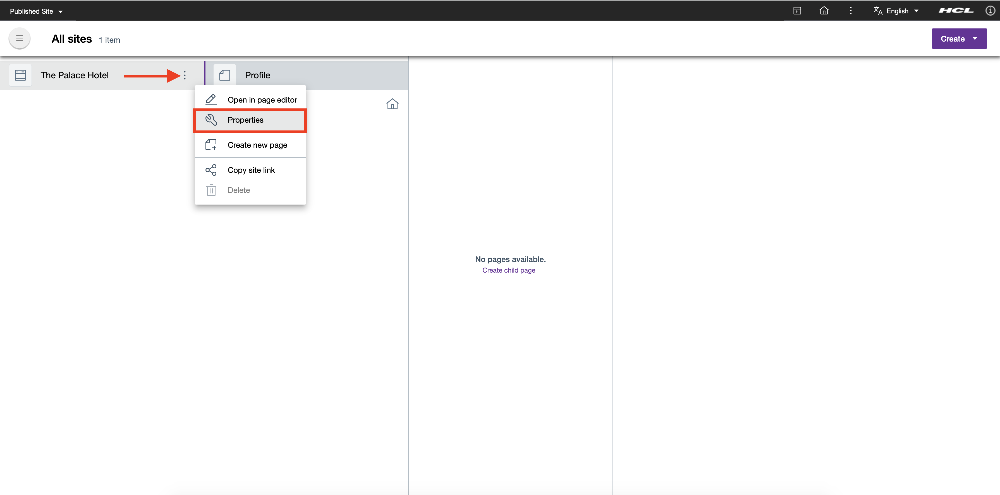

# Web Content Manager Open Standards REST APIs

This topic provides access instructions for the Web Content Manager Open Standards based Digital Experience REST APIs (Beta). The API design for this version of the WCM DX REST API is intended to facilitate the creation of Web Content Manager, also Design Studio (Beta) assets.

## Web Content Manager Open Standards REST APIs

The API design for version 2.0 of the WCM DX REST API is intended to leverage the open standards format of the [Experience API](https://help.hcltechsw.com/digital-experience/9.5/open_api/openapi_overview.html) and facilitate the creation of Web Content Manager, also Design Studio (Beta) assets.

!!! note
    The Web Content Manager Open Standards DX Beta code changes are possible until finalized and delivered in a later HCL DX 9.5 release for production use.

After installing HCL Digital Experience 9.5 CF196 or higher release, the Open Standards REST API may be accessed at `/dx/api/wcm/v2/explorer`.

## Get the UUID of a selected site or a page

!!! note
    The UUIDs can be copied and used to explore the new Web Content Manager APIs, which are presented through the updates to the [HCL Experience API](https://help.hcltechsw.com/digital-experience/9.5/open_api/openapi_overview.html).

Follow the steps to get the UUID of a selected site:

1.  From **Sites** overview, navigate to the selected site.
2.  Hover and click the overflow (3-dot) menu button of the selected site, and then click **Properties**.

    

3.  The **Site Properties** panel of the selected site appears on the right. Click **Copy UUID**.

    

You may also follow the same steps when getting the UUID for a page.

1.  From **Sites** overview, navigate to the selected page.
2.  Click **Properties** to open the Properties panel of the selected page.

    

3.  The Page **Properties** panel of the selected page appears on the right. Click **Copy UUID**.

    

## How to present your feedback on HCL Design Studio (Beta)

HCL Digital Experience welcomes your feedback and suggestions on Design Studio (Beta), and encourages you to present your input through cases and discussions with HCL Support DX leaders.

