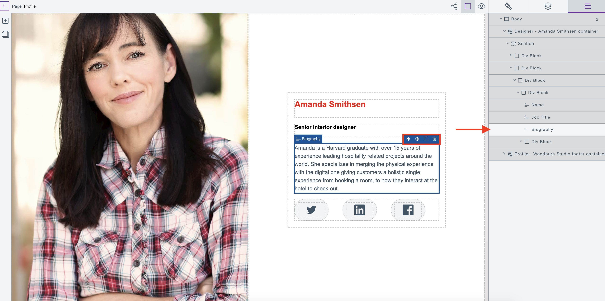
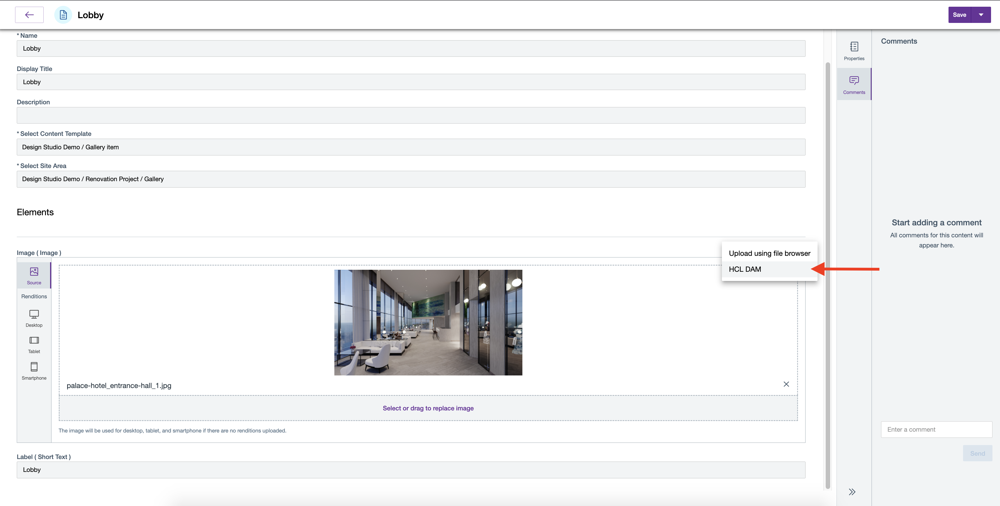

# Update Content items

This section provides the steps on how to update Content items in your HCL Digital Experience site using Design Studio (Beta).

## Add a content item to a Design Studio (Beta) page

1.  Create a new page or open the page you wish to edit in Page editor.
2.  Locate and click the plus icon to open the **Add Elements** panel, as shown below.

    

3.  Select and drag a content item from the **Add Elements** panel to the Editor field.

For CF196 and higher releases, the following content elements are available in the HCL Design Studio (Beta) Page editor:

  -   **Layout**
    -   Container
    -   Section
    -   Div block
    -   Columns
  -   **WCM**
    -   Content container
  -   **Basic**
    -   Text
    -   Link block (text or image)
  -   **Media**
    -   Image
    
  >**Important notes:** 
  > -   When using content on a page made with the HCL Design Studio, the selected content item should have a workflow assigned to it and should be in Published state. Content that is in Draft state is not searchable for selection in the Design Studio (Beta). 
  > -   We recommend that you do not move or update the workflow state of content items that are in use in site pages in Design Studio to Published state.

## Edit a content item in a Design Studio (Beta) page

When editing text elements or link block elements inline, they are automatically saved to the content items that are linked to them. Changes are automatically saved two (2) seconds after the user stops typing.

1.  Open the page you wish to edit in Page editor.
2.  On the canvas, select a content element to start inline editing and updating.
    -   For text and link block elements, double-click to start inline editing.
    -   Use the inline element menu of the element on the canvas, or the **Content elements** panel on the right side to perform element actions such as move element, copy element, or delete element.

        

3.  If the updates are valid, edits are saved without notification.

  >**Note:** If the updates are rejected, an error notification pops up to notify the user that the changes are rejected and the content item is reverted to the last valid value.

## Replace an image in a Design Studio (Beta) page

>**Note:** When you use Design Studio (Beta), replacing an image sometimes does not reflect due to the images being cached for a long time. Starting with HCL DX 9.5 CF200, you can run the authoring tuning task with `-DAuthoringServer=true` to set the browser cache for WCM images to 10s to improve your authoring experience. See [Tune your environment](https://help.hcltechsw.com/digital-experience/9.5/install/tune_servers.html) for more information.

1.  Open the page you wish to edit in Page editor.
2.  In the Page editor, select the image element that you want to replace.
3.  Open the Settings panel as shown below.

    

4.  Click on **Replace Image**.

    

5.  On the Page Details page, scroll down to the **Elements** section and locate the image element to replace.
6.  Click **Select or drag to replace** the selected image element with an image file from your local file system.

    

    Replace the current image as you would in [HCL Content Composer](https://help.hcltechsw.com/digital-experience/9.5/content_composer/manage_content_items.html#section_tdv_hcl_xnb).

7.  Once done, click **Save** to save the image file as the new image element content, then go back the page editor by clicking on the arrow (**←**) on the top left.

    Alternatively, you can also click **Save and Close**.

Replacing the image element content can also be done using the HCL Experience APIs, HCL Content Composer, and WCM authoring tools.

You can replace the image element content using the HCL Digital Asset Manager (DAM) if DAM is the image source.

