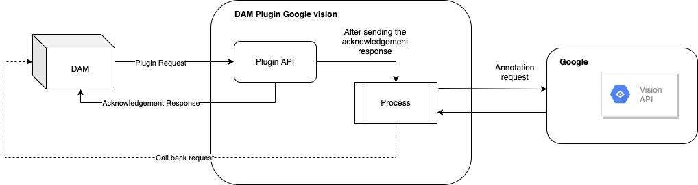

# Image Tagging by Google Vision AI

DAM Extensibility allows DAM to support user-defined custom renditions and configure transformations for assets. Additional operations such as keywords generation for images can be implemented by configuring plugins such as Google Vision.

## Image tagging by Google Vision AI

Image tagging simply requires setting keywords for the elements that are contained in a visual. It allows the effective and direct search on the basis of preassigned keywords.



## Google vision plugin configuration

Keywords can be generated for the images by configuring Google vision plugin provided out of the box, for the supported mime types.

Following configuration changes are required for generating image keywords by Google vision plugin:

1. Generate API key for Vision API and provide the same for apiKey in 'values.yaml'

```
# Security configuration for dam-plugin-google-vision
  damPluginGoogleVision:
    # Authentication key for Plugin API
    authenticationKey: "PluginSecretAuthKey"
    # API key for Google vision
    apiKey: ""
```

2. Under plugin configuration, enable google-vision by setting the enable flag to true.

```
{
   "google-vision":{
      "url":"<PROTOCOL>://<GOOGLE_VISION_HOST>/dx/api/google-vision/v0/googleVisionAI",
      "callBackHost": "<PROTOCOL>://<DAM_HOST>",
      "authKey": "PluginSecretAuthKey",
      "enable": true,
      "actions":{
         "annotation": {
            "params": {},
            "url": "/annotation"
         }
      }
   }
}
```

3. In case, if keywords are to be not generated or added to a specific mime type, modify supplemental stack in rendition-extensibility.json for the specific mime type.

```
{
  'image/jpeg': {
    rendition: [
      {
        name: 'Original',
        transformationStack: [],
        thumbnailStack: [],
        supplementalStack: [
          {
            plugin: 'google-vision',
            operation: {
              annotation: {},
            },
          },
        ],
      }
    ],
  }
}
```
There are two configurations available in values.yaml for keyword generation.

    - maxResults : Maximum number of keywords (default value is 25)
    - confidencePercentage: Threshold confidence percentage for the keywords (default value is 60)

If the keywords generated by Google vision API with confidencePercentage greater than or equal to 60 (the configured confidence percentage), then the top 25 (configured maxResults) keywords would be sent by the Plugin to DAM.

```
damPluginGoogleVision:
    # Specifying 10 in maxResults will exactly return the same number of results, even though the Vision API might generate more than that
    maxResults: 25
    # The plugin would send back only the results which has confidence score more than or equal to the provided value
    confidencePercentage: 60
```
There are two types of keywords. Keywords generated by a plugin like Google vision are termed as Plugin-generated keywords and keywords added by the user are termed as User-defined keywords. To note, currently the differentiation isn't shown on UI yet.

## API Modifications

Introduced a new field keywordDetails which contains an array of keyword objects in GET /collection/collectionId/item/itemId. Each Keyword object contains

    - keyword
    - confidencePercentage: Percentage indicating how likely the image contains an object related to keyword according to the plugin (Empty in case of User-defined keyword)
    - source : Name of the plugin used (userDefined in case of keyword added by user)

PATCH /collections/collectionId/items/itemId 

!!! note
    Send either keywordDetails or keywords, but not both.

```
{
  keywordDetails: [
    {
      keyword: "string"
    }
  ]
}
```

```
{
  keywords: ["string"]
}
```

PUT /collections/collectionId/items/itemId

```
{
  keywordDetails: [
    {
      keyword: "string"
    }
  ]
}
```

```
{
  keywords: ["string"]
}
```

## Callback-API request

Body
```
"[{\"keyword\":\"string\",\"confidencePercentage\":\"string\"}]"
```

## Additional Usage Information for this extension capability: 

1.	When a DAM image is uploaded to a Collection, keywords are generated if the plugin for keyword auto-creation is enabled (In this case, to the Google Vision API and image tagging service).

2. If the DAM image is replaced with another image, the original keywords generated are not removed. New keywords are generated by plugin for the new image will be appended to the existing keywords. The new keywords are not visible instantly (as these are being generated by background asynchronous process). To view the new keywords, refresh or navigate back to landing page and perform edit to see the newly appended keywords.

3.	Even if the initial image is restored, keywords of both images will be visible.

For additional information about the Google Vision API and image resource processing, reference the . 
