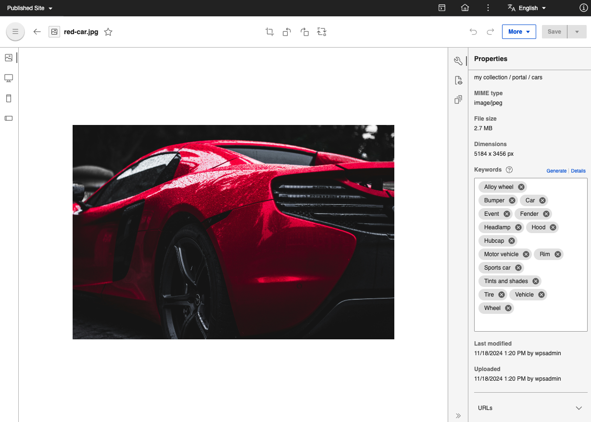

# Edit the metadata of a media asset

This section shows how to edit the embedded metadata of a media asset in HCL Digital Asset Management \(DAM\).

!!! notes

    -   Embedded metadata is supported only for image/jpeg MIME type.
    -   Embedded metadata is not supported for all file types.
    -   Embedded metadata is not supported for videos.
    -   Embedded metadata properties show only the available meta information for a selected media asset.

## View/edit the embedded metadata of a media asset

Follow these steps to view/edit the embedded metadata of a media asset:

1.  Click **Collection**.
2.  Click a media asset to see its embedded metadata.
3.  To edit, hover over the media asset and click **Edit** \(pencil icon\).
4.  Select and click any of the following right side menu options to view/edit the media asset metadata:
    -   **Information** – Presents asset name, title, type, size, description and options to preview the display of the image media asset. You can also view/edit the **Title**, **Description**, **Custom URL**, and **Keywords** of the media asset. Select Enter to confirm new keywords added. 
    -   **Insights** - Displays the Collection folder location\(s\) where this image is placed, and the last associated modification dates.
    -   **Versions** - Presents multiple versions of the asset that have been saved. You can also use this feature to view versions of media asset renditions.
5.  Click **Save**. A notification shows that the media asset information is updated successfully.

## DAM Asset Tagging with Google Vision API

Beginning with HCL Digital Experience 9.5 Container Update CF205, using a custom  Digital Asset Management extension that provides integration with the Google Vision API, DX practitioners can leverage the integration to automate additional asset tagging to the DAM media item details. This feature can be used alongside traditional DAM asset tagging methods and can help content authors and marketing professionals fine tune the relevance of their DAM assets in search results for target audiences.  

**Pre-requisites:**

1. An entitlement to Google Vision API (acquired separately). 
2. Configuration of the Digital Asset Management extension capability to integration Google Vision image tagging. Reference this Help Center topic .

