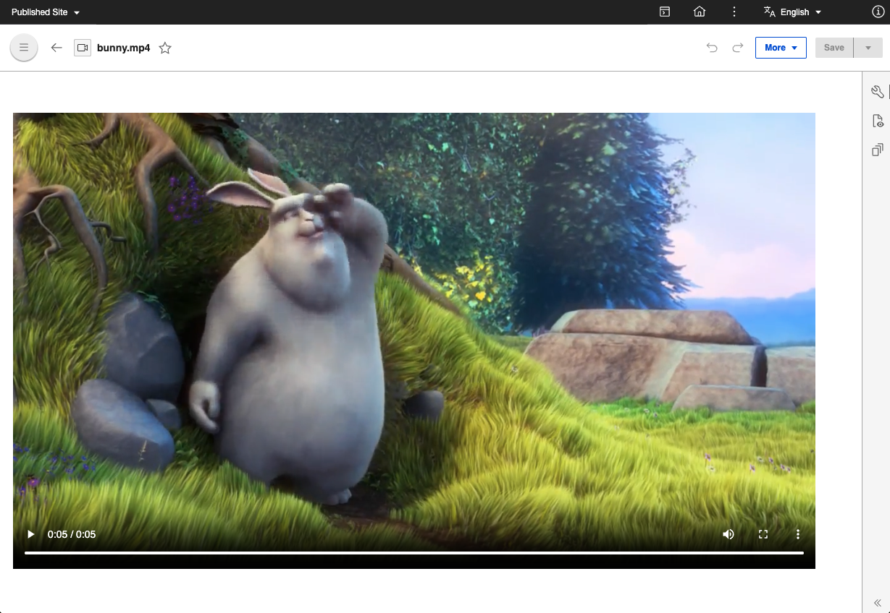
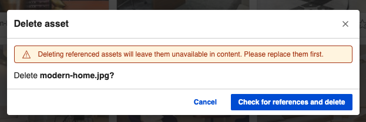

# Manage media assets

This section provides the steps on how to manage media assets and view configuration settings using HCL Digital Asset Management \(DAM\).

## Prerequisite

HCL DAM CF181 or higher should be installed and configured to the HCL Digital Experience 9.5 Container Release update, following these instructions in the [Install the HCL Digital Experience 9.5 Container components](../../digital_asset_mgmt/index.md) topic.

## View supported file formats

Follow these steps to view a list of file formats supported by HCL Digital Experience 9.5 DAM.

1.  Log in to your HCL Digital Experience 9.5 platform and select **Digital Assets** from the Practitioner Studio navigator.

    
    

    The HCL Digital Experience 9.5 DAM can also be accessed from the Practitioner Studio **Digital Assets** tile.

2.  From the HCL Digital Experience 9.5 DAM user interface, select the gear icon \(for **Settings**\) located at the far top-right of the DAM menu bar.
3.  **Settings** will display the **Supported file formats** section by default.

    

The following are supported media asset file formats in HCL Digital Experience 9.5 Container. From CF205 onwards, *WebP* file type extension is also supported.

|File type|Extension|
|---------|---------|
|.png|image/png|
|.svg|image/svg+xml|
|.gif|image/gif|
|.jpg|image/jpeg|
|.jpeg|image/jpeg|
|.tif|image/tiff|
|.tiff|image/tiff|
|.webp|image/.webp|

!!! note 
    You can set the maximum file size for the DAM asset uploads. For more information on configuring the file size, see the [DAM API](https://opensource.hcltechsw.com/experience-api-documentation/dam-api/#operation/MediaTypeGroupController.updateById) topic.

|File type|Extension|
|---------|---------|
|.ogv|video/ogg|
|.mp4|video/mp4|
|.webm|video/webm|

!!! notes

    -   You can set the maximum file size for the DAM asset uploads. For more information on configuring the file size, see the [DAM API](https://opensource.hcltechsw.com/experience-api-documentation/dam-api/#operation/MediaTypeGroupController.updateById) topic.
    -   Videos are automatically synchronized once they are uploaded. Auto-synchronization is a background activity in HCL Digital Asset Management that happens when any video is uploaded and when Kaltura integration is configured and enabled.

|File type|Extension|
|---------|---------|
|.pptx|application/vnd.openxmlformats-officedocument.presentationml.presentation|
|.xls|application/vnd.ms-excel   application/octet-stream   application/x-msi|
|.doc|application/msword|
|.docx|application/vnd.openxmlformats-officedocument.wordprocessingml.document|
|.xlsx|application/vnd.openxmlformats-officedocument.spreadsheetml.sheet|
|.ppt|application/vnd.ms-powerpoint|
|.pdf|application/pdf|

## Play a video in DAM

Play uploaded videos in DAM using the DAM binary URL or the Kaltura Player \(if the Kaltura plugin is configured and enabled\):

-   Use the DAM binary URL when:
    -   The uploaded video synchronization status is SYNC FAILED.
    -   The Kaltura plugin is not configured and enabled.

        

-   Use the Kaltura Player when:
    -   The video synchronization status is SYNCED, play the video based on the configured Player ID.
    -   The Kaltura plugin is configured and enabled.

        

!!! note 
    Videos being synced in progress displays a warning message and cannot be played yet.

For more information on the video synchronization statuses for uploaded videos, see [Upload rich media assets](upload_rich_media_assets.md#ul_zhl_vxq_qnb).

## Download a media asset source, version, or rendition

Use the HCL Digital Experience 9.5 DAM editor to download a media asset source, version, or rendition:

1.  From the HCL Digital Experience 9.5 DAM user interface, hover over a media asset to access and click the Overflow menu on the far right \(three vertical dots icon\). Then, select **Download**.

    

2.  A pop-up will appear for you to select your Download actions. You can rename downloaded media asset and choose to download **Source** or **Renditions**, or all asset types.

    

3.  Click **Download** to proceed.

## Deleting a media asset

Use the HCL Digital Experience 9.5 DAM editor to delete a media asset, including its renditions:

1.  From the HCL Digital Experience 9.5 DAM user interface, hover over a media asset to access and click the Overflow menu on the far right \(three vertical dots icon\). Then, select **Delete**.
2.  A pop-up will appear for you to select your Delete action. If the selected media assets will not affect any references, click **Check for references and delete** to complete action.

    
