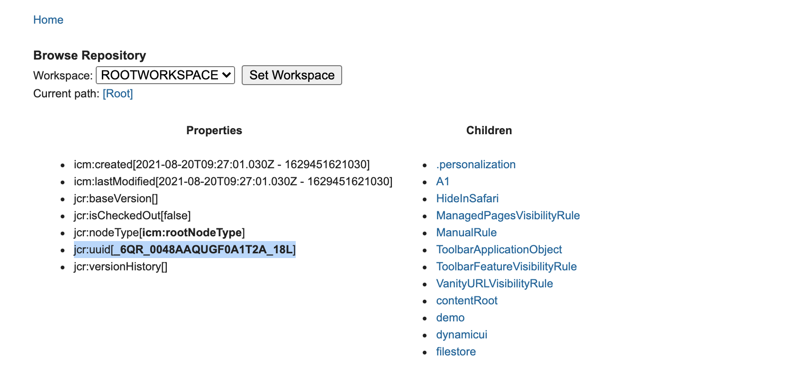

# Personalization Folder APIs

The Personalization Folder REST APIs provide access to personalization folder capabilities using REST services.

As of HCL Digital Experience Container Update and CF CF201, REST APIs are available for Personalization **Create a Folder**, **Get a Folder**, and **Delete a Folder** rule types. For more information on HCL Digital Experience Personalization Folders, refer to the [Personalization](https://help.hcltechsw.com/digital-experience/8.5/pzn/pzn_overview.md) Help Center topic.

APIs are in beta stage at this time - changes are possible until finalized.

## Access and launch the Personalization REST API Explorer

To access the DX Search REST APIs Explorer, after installing HCL DX 9.5 CF or Container Update CF200 or later, launch the following URL, located at

```
dx/api/pzn/v1/explorer/
```

**Example:**

```
https://localhost:10039/dx/api/pzn/v1/explorer/
```

## Endpoints

The following Personalization REST APIs are available:

1.  POST or create a new Personalization Folder REST API
2.  GET Personalization Folder details REST API using folder ID
3.  DELETE Personalization Folder REST API using folder ID

## Create a new Personalization Folder REST API

Use this API to create a new Personalization folder in the Personalization workspace.

-   **POST request to:**

    ```
    https://localhost:10039/wps/mycontenthandler/pzn-rest/folders
    ```


-   **POST Personalization Folder REST API example:**

    ```
    https://localhost:10039/wps/mycontenthandler/pzn-rest/folders
    ```


-   **Sample Request Payload:**

    ```
    {
      "title": "demo",
      "description": "demo folder",
      "parentId": "b7bbddd7-95c6-4062-8971-134f780002f1"
    }
    ```


-   **Steps to execute the POST Personalization Folder RESTAPI:**

    1.  Login to your Digital Experience solution.
    2.  The login cookie contains the Authentication token. Leave the cookie field empty if you are already authenticated, unless you intend to put a token value.
    3.  Provide the title of the folder.
    4.  \(Optional\): Provide a description of the folder.
    5.  \(Optional\) Provide the `parentId` of the location of the folder where you want to create. Otherwise, the new folder is to be created in the workspace by default.

        To get the `parentId` of the workspace or folder:

        1.  Navigate to [WCM Support Tools](https://help.hcltechsw.com/digital-experience/8.5/trouble/wcm_support_tools.md).
        2.  Click **Browse Nodes**.
        3.  To get the workspace `parentID`, navigate to **Properties** section and use the value of the **jcr:uuid** field as shown below.

            

        4.  To get the `parentID` for an existing folder, click to select a folder from the **Children** section and use the value of the **jcr:uuid** field as shown below.

            

    Example:

    


-   **Response Structure Details:**

    -   The response structure will get the details of the created folder and the response for the created folder.
    -   For more details on the Response Payload, please refer to the *Response Payload* section below.
    -   The example below shows the response for one Personalization folder:

        ```
        {
          "id": "5bd89b0d-f024-4de2-a991-976315e917be",
          "description": "demo folder",
          "title": "demo",
          "authors": "uid=wpsadmin,o=defaultWIMFileBasedRealm",
          "creator": "uid=wpsadmin,o=defaultWIMFileBasedRealm",
          "created": "2022-01-13T07:14:01.035Z",
          "lastModified": "2022-01-13T07:14:01.035Z",
          "lastModifier": "uid=wpsadmin,o=defaultWIMFileBasedRealm",
          "parentId": "_6QR_0048AAQUGF0A1T2A_18L"
        }
        ```


-   **Combined Response Structure:**

    When you execute Post Personalization Folder REST API, it creates a folder in the Personalization interface Workspace or inside an existing folder.

    `parentId` is the main attribute to use to find the difference between the rules available in the `Workspace` and `Folder`:

    -   `Workspace parentId` always starts with a hyphen \("-"\).

        Example:

        ```
        "parentId": "_6QR_0048AAQUGF0A1T2A_18L"
        ```

    -   `Folder parentId` always starts without a hyphen \("-"\).

        Example:

        ```
        "parentId": "ee99433c-82d2-46eb-b48b-90cc234e57e2"
        ```


-   **POST Personalization Folder REST API Success and Error Messages**

    |Error Code|Means|
    |----------|-----|
    |200|This code will come when we create a folder successfully.|
    |400|This code will be presented if the input parameters are missing or invalid.    -   Title is missing in body.
    -   Title is empty in body.
    -   `ParentId` is invalid in body.
|
    |401|This code will be presented when the `LtpaToken` is invalid or expired.|
    |403|This code will be presented when user access is restricted.|
    |409|This code will be presented when we you are trying to create a folder with the same of an existing folder.|
    |500|This code will be presented when an internal server error occurs.|


## Get Personalization Folder-ID REST API

The Get Personalization Folder ID REST API is used to get individual Personalization Folder ID details.

-   **GET Request format:**

    ```
    https://localhost:10039/wps/mycontenthandler/pzn-rest/folders/{folder-id}
    ```


-   **GET Personalization Folder ID example:**

    ```
    https://localhost:10039/wps/mycontenthandler/pzn-rest/folders/5bd89b0d-f024-4de2-a991-976315e917be
    ```


-   **Steps to execute the GET Personalization Folder ID REST API:**

    1.  Login to your Digital Experience solution.
    2.  The login cookie contains the Authentication token. Leave the cookie field empty if you are already authenticated, unless you intend to put a token value.
    3.  Obtain the Get Personalization Folder ID details using the REST API `GET all` API command, as shown in the following example:

        


-   **Response structure details:**

    The response structure will get the details of the selected Personalization ID folder. For more details, see *Response Payload* below.


-   **GET Personalization Folder ID Success and Error Messages:**

    |Error Code|Means|
    |----------|-----|
    |200|This code will be presented when the folder details are obtained successfully.|
    |401|This code will be presented when the `LtpaToken` is invalid or expired.|
    |403|This code will be presented when access is restricted for user.|
    |404|This code will be presented when the Folder ID is not found or invalid.|
    |500|This code will be presented when an internal server error occurs.|


## Delete Personalization Folder REST API

The Delete Personalization Folder ID REST API is used to delete a selected Personalization Folder.

**Note:** When deleting a folder, it would delete all the rules and sub-folders created within it.

-   **DELETE Request format:**

    ```
    https://localhost:10039/wps/mycontenthandler/pzn-rest/folders/{folder-id}
    ```


-   **DELETE Personalization Folder ID example:**

    ```
    https://localhost:10039/wps/mycontenthandler/pzn-rest/folders/880bb281-bb82-489c-a220-56104f0f638d
    ```


-   **Steps to execute the DELETE Personalization Folder ID REST API:**

    1.  Login to your Digital Experience solution.
    2.  The login cookie contains the Authentication token. Leave the cookie field empty if you are already authenticated, unless you intend to put a token value.
    3.  Delete the Personalization Folder you wish to delete by providing the folder ID as shown in the following example:

        


-   **Response structure details:**

    ```
    {
      "message": Folder with id: 880bb281-bb82-489c-a220-56104f0f638d deleted successfully
    }
    ```


-   **DELETE Personalization Folder ID Success and Error Messages:**

    |Error Code|Means|
    |----------|-----|
    |200|This code will be presented when the selected folder is deleted successfully.|
    |401|This code will be presented when the `LtpaToken` is invalid or expired.|
    |403|This code will be presented when access is restricted for user.|
    |404|This code will be presented when the Folder ID is not found or invalid.|
    |500|This code will be presented when an internal server error occurs.|


## Response payload

-   `"id"` - Field to indicate folder uuid.
-   `"description"` - Field to indicate description of the folder.
-   `"title"` - Field to indicate that title of the folder.
-   `"authors"` - Field to indicate that owner of the folder.
-   `"creator"` - Field to indicate that creator of the folder.
-   `"created"` - Field to indicate that creation date and time of the folder.
-   `"lastModified"` - Filed to indicate that last modified date and time of the folder.
-   `"lastModifier"` - Filed to indicate that details of the user who is last modified the folder.
-   `"parentId"` - Field to indicate to find the difference between the location of the folder.

