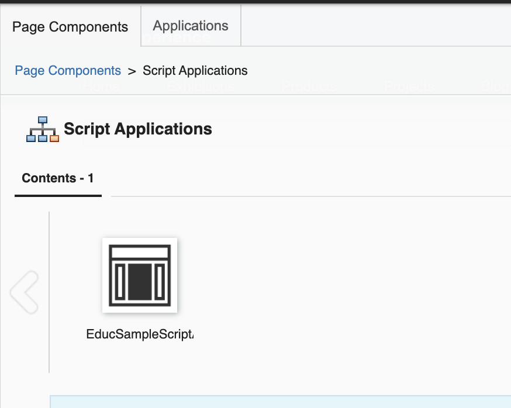

# Deploy a React App to DX as a Script Application

## Overview

This guide describes the steps on how to deploy a built React app into DX to become a ScriptApp.

!!! note
    Migration to [Webpack](https://webpack.js.org/) is optional and is only done as a preparation for advanced deployments. The sample WebPack configuration that is included is intended for quick deployments, which combines all dependencies along with actual application files.

For optimal loading of multiple DX ScriptApps in a single page, custom Webpack bundling is needed. For more information, see [How To Deploy Multiple DX ScriptApps with Shared Dependencies](./04AppsSharingDependencies.md).

## PreRequisites

1. Follow the online guide on how to install HCL DXClient [DXClient 9.5](../../../integrate_apps/development_tools/dxclient/index.md). Please note that the DX and/or DXClient link provided here may be superseded, you may use a newer version if available.  If you have replaced the default context root of your DX installation, you must update the [config.json](../../../integrate_apps/development_tools/dxclient/installation/dxclient.md#dxclient-installation-configuration) file of your DXClient accordingly.
    ```
    "dxContextRoot":"/wps",
    "contenthandlerPath": "/wps/mycontenthandler",
    "xmlConfigPath": "/wps/config",
    ```

3. Add the 'Script Application Library' to the list of visible libraries in your DX Library Explorer. Follow the series of links via the Web Content menu: Preferences -> Edit Shared Settings. Make sure that you click the OK button.  
   
   
   

4. Make sure that the following modules are included in the target theme profile for the DX pages that will contain the ScriptApp:
   1. "wp_react_16_10_2",
   2. "wp_react_dom_16_10_2",
   3. "wp_react_router_dom_512"

   
   
   

## How To Bundle and Deploy React Applications to DX
1. Update the `package.json` project file to configure the dxclient parameters. Double-check and update the configuration values as needed. Also, add the deploy-dx-app lines as-is among the scripts. The variables in the scripts will automatically pick up the values from environment variables and config. 
    ```
    {
        ...
        "config": {
           "dxclient": {
               "wcmContentName": "EducSampleScriptApp01",
               "wcmSiteArea": "Script Application Library/Script Applications",
               "mainHtmlFile": "index.html",
               "contentRoot": "./build",
               "protocol": "https",
               "hostname": "localhost",
               "port": "10041"
           }
        },
        "scripts": {
            ...
            "dx-deploy-app": "dxclient deploy-scriptapplication push -dxUsername $dxUsername -dxPassword $dxPassword -wcmContentName \"$npm_package_config_dxclient_wcmContentName\" -wcmSiteArea \"$npm_package_config_dxclient_wcmSiteArea\" -mainHtmlFile $npm_package_config_dxclient_mainHtmlFile -contentRoot \"$npm_package_config_dxclient_contentRoot\" -dxProtocol $npm_package_config_dxclient_protocol -hostname $npm_package_config_dxclient_hostname -dxPort $npm_package_config_dxclient_port",
            "dx-deploy-app-use-env": "dxclient deploy-scriptapplication push -dxUsername $dxUsername -dxPassword $dxPassword -wcmContentName \"$npm_package_config_dxclient_wcmContentName\" -wcmSiteArea \"$npm_package_config_dxclient_wcmSiteArea\" -mainHtmlFile $npm_package_config_dxclient_mainHtmlFile -contentRoot \"$npm_package_config_dxclient_contentRoot\" -dxProtocol $dxProtocol -hostname $dxHostname -dxPort $dxPort"
        },
        ...
    }
    ```
   Make sure the contentRoot folder specified in the dxclient config matches your app's build folder:
    ```
        ...
        "config": {
           "dxclient": {
               ...
               "contentRoot": "./build",
               ...
           }
        },
        ...
    ```
2. Test your React App in local browser:
    ```
        cd <app-folder>
        npm install
        npm start
    ```
3. Build your application as-usual:
    ```
        cd <app-folder>
        npm install
        npm run build
    ```
4. Execute the npm script dx-deploy-app, pre-set with the DX admin username and password.

        dxUsername=<username> dxPassword=<password> npm run dx-deploy-app 
            > sample-app@0.1.0 dx-deploy-app
            > dxclient deploy-scriptapplication push -dxUsername $dxUsername -dxPassword $dxPassword -wcmContentName "$npm_package_config_dxclient_wcmContentName" -wcmSiteArea "$npm_package_config_dxclient_wcmSiteArea" -mainHtmlFile $npm_package_config_dxclient_mainHtmlFile -contentRoot "$npm_package_config_dxclient_contentRoot" -dxProtocol $npm_package_config_dxclient_protocol -hostname $npm_package_config_dxclient_hostname -dxPort $npm_package_config_dxclient_port
            2022-08-08 21:13:36 : Begin content push to Portal.
            2022-08-08 21:13:36 : WCM content ID: .
            2022-08-08 21:13:36 : WCM Content Path: .
            2022-08-08 21:13:36 : WCM Content Title: .
            2022-08-08 21:13:36 : Main HTML file: index.html.
            2022-08-08 21:13:36 : PrebuiltZip path does not exist.
            2022-08-08 21:13:36 : Archive file: 
            /var/folders/mp/bcmnxk3s0rbbj1cbbl0875bw0000gn/T/tmp--14373-oFwJoCUJU4yG-.zip
            (51965 bytes in 5 files) 
            131.d190506afae2cd09f1fd.bundle.js
            index.html
            main.269f6c0111b67c725c63.bundle.js
            main.269f6c0111b67c725c63.bundle.js.LICENSE.txt
            main.9a71fbc56a658baede15.css.
            2022-08-08 21:13:39 : Content push was successful.
            2022-08-08 21:13:39 : End content push to Portal.
            2022-08-08 21:13:39 : Body content: {"results":{"status":"success","importedFiles":{"file":[{"filename":"HTML/index.html"},{"filename":"JavaScript/main.269f6c0111b67c725c63.bundle.js"},{"filename":"JavaScript/131.d190506afae2cd09f1fd.bundle.js"},{"filename":"CSS/main.9a71fbc56a658baede15.css"}]},"skippedFiles":"","message":"The file that you selected was imported successfully.","contentId":"6fa0b659-7b18-499d-a8de-090a0e9f8987"}}.     

5. Check the DXClient logs in store/logs/logger.log file within your workspace.
6. Prepare your target DX page that will host the ScriptApp. ([link to detailed steps](#how-to-prepare-a-dx-page-for-dx-scriptapps))
7. Add the ScriptApp (matching the wcmContentName in the package.json config) into the target DX test page. ([link to detailed steps](#how-to-add-a-deployed-dx-scriptapp-into-a-dx-page))

## How to Prepare a DX Page for DX ScriptApps
1. If you have an existing target page for the ScriptApp, then skip to step #3. Otherwise, you may create a sibling or child page under the Woodburn Studio site to have a temporary test page:
   

2. Enter a Page Title and choose Basic (Portal 8.5 Theme), then click the Create Page button:
   

3. Right-click the menu button at the right of the target page.
   Choose Open Page Settings.
   Edit the Page Properties by clicking the pen button:
       
   

4. Edit the theme settings in the Advanced tab, Theme(Portal 8.5) and Profile(Deferred with React) then click Save button:
   

## How To Add a Deployed DX ScriptApp into a DX Page
1. Click the [+] Add page components and applications icon near the upper left-most side:
   

2. Click the Script Application icon:
   

3. Check if the script is loaded successfully:
   

4. Click the Add this content to the page button:
   

5. Click the page name and check if the script is rendered correctly.
   
6. Turn-off edit mode and check the page.

## Optional: How To Migrate Apps to use Webpack and Deploy as DX ScriptApp

Here are the steps on how to migrate React applications to use [Webpack](https://webpack.js.org/) as a bundler and then prepare it for deployments to DX to become a DX ScriptApp.


1. Create a webpack.common.js file. Update the main entry section to point to the correct index js/ts file .
   ```
   const MiniCssExtractPlugin = require("mini-css-extract-plugin");
   const svgToMiniDataURI = require('mini-svg-data-uri');
   
   module.exports = {
       entry: {
           main: "./src/index.js",
       },
       resolve: {
           preferRelative: true,
           extensions: [".js", ".jsx", ".module.scss"]
       },
       module: {
           rules: [
               {
                   test: /\.(js|mjs|jsx|ts|tsx)$/,
                   exclude: /(node_modules|bower_components)/,
                   use: {
                       loader: 'babel-loader',
                       options: {
                           presets: ['@babel/preset-env','@babel/preset-react'],
                           cacheDirectory: true,
                       }
                   }
               },
               {
                   test: /\.(htm|html)$/,
                   use: ['html-loader'],
               },
               {
                   test: /\.(js|mjs|jsx|ts|tsx)$/,
                   use: 'ts-loader',
                   exclude: /node_modules/,
               },
               {
                   test: /\.s[ac]ss$/i,
                   use: [MiniCssExtractPlugin.loader, "css-loader", "sass-loader"],
               },
               {
                   test: /\.css$/,
                   use: ['style-loader', 'css-loader'],
               },
               {
                   test: /\.svg/,
                   type: 'asset/inline',
                   generator: {
                       dataUrl: content => {
                           content = content.toString();
                           return svgToMiniDataURI(content);
                       }
                   }
               },
               {
                   test: /\.(png|jpg|jpeg|gif|woff|woff2|ttf|eot|ico)$/,
                   type: 'asset'
               },
           ],
   
       }
   };      
   ```
2. Create a webpack.dev.js file. Update the template, filename, favicon and manifest in the HTMLWebPackPlugin section (you may remove filename, favicon and manifest if your project does not have them).
   ```
   const path = require('path');
   const common = require('./webpack.common');
   const { merge } = require('webpack-merge'); // New import based on the 5.0.3 changelog
   const HTMLWebpackPlugin = require('html-webpack-plugin');
   
   module.exports = merge (common, {
       mode: "development",
       devtool: 'eval',
       output: {
           filename: "[name].bundle.js",
           path: path.resolve(__dirname, "dist-dev"),
       },
       plugins: [
           new HTMLWebpackPlugin({
               template: "./public/index.html",
               filename: "./index.html",
               favicon: "./public/favicon.ico",
               manifest: "./public/manifest.json"
           })
       ],
       module: {
           rules: [
           ]
       }
   });
   ```
3. Create a webpack.dx-scriptapp.js file. Update the template in the HTMLWebPackPlugin section.
   ```
   const path = require("path");
   const common = require("./webpack.common");
   const webpack = require('webpack');
   const { merge } = require('webpack-merge');
   const {CleanWebpackPlugin} = require("clean-webpack-plugin");
   const MiniCssExtractPlugin = require("mini-css-extract-plugin");
   const OptimizeCssAssetsPlugin = require("css-minimizer-webpack-plugin");
   const TerserPlugin = require("terser-webpack-plugin");
   const { DllReferencePlugin } = require('webpack');
   const HTMLWebpackPlugin = require('html-webpack-plugin');
   const CopyPlugin = require("copy-webpack-plugin");
   
   module.exports = merge(common, {
       mode: "production",
       output: {
           filename: "[name].[contenthash].bundle.js",
           path: path.resolve(__dirname, "dist-dx-scriptapp")
       },
       optimization: {
           minimizer: [
               new OptimizeCssAssetsPlugin(),
               new TerserPlugin(),
               new HTMLWebpackPlugin({
                   template: "./public/index.html",
                   minify: {
                       removeAttributeQuotes: true,
                       removeComments: true,
                       collapseWhitespace: false,
                   }
               })
           ]
       },
       plugins: [
           new CopyPlugin({
               patterns: [
                   './src/sp-config.json',
               ]
           }),
           new MiniCssExtractPlugin({
               filename: "[name].[contenthash].css"
           }),
           new CleanWebpackPlugin(),
       ],
       module: {
           rules: [
           ]
       },
   });
   ```

4. Update your project's package.json file.
   1. Add the dxclient parameters as config. Double-check and update the config values as needed.
    ```
    {
        ...
        "config": {
           "dxclient": {
               "wcmContentName": "EducSampleScriptApp01",
               "wcmSiteArea": "Script Application Library/Script Applications",
               "mainHtmlFile": "index.html",
               "contentRoot": "./dist-dx-scriptapp",
               "protocol": "https",
               "hostname": "localhost",
               "port": "10041"
           }
        },

        ...
    }
    ```
   2. Modify the start and build scripts to use the webpack config files. Also, add the two(2) deploy-dx-app lines as-is among the scripts. The variables in the scripts will automatically pick up the values from environment variables and config.
    ```
    {
        ...
        "scripts": {
            "start": "webpack-dev-server --config  webpack.dev.js --open",
            "build": "webpack --config  webpack.dx-scriptapp.js",
            ...
            "dx-deploy-app": "dxclient deploy-scriptapplication push -dxUsername $dxUsername -dxPassword $dxPassword -wcmContentName \"$npm_package_config_dxclient_wcmContentName\" -wcmSiteArea \"$npm_package_config_dxclient_wcmSiteArea\" -mainHtmlFile $npm_package_config_dxclient_mainHtmlFile -contentRoot \"$npm_package_config_dxclient_contentRoot\" -dxProtocol $npm_package_config_dxclient_protocol -hostname $npm_package_config_dxclient_hostname -dxPort $npm_package_config_dxclient_port",
            "dx-deploy-app-use-env": "dxclient deploy-scriptapplication push -dxUsername $dxUsername -dxPassword $dxPassword -wcmContentName \"$npm_package_config_dxclient_wcmContentName\" -wcmSiteArea \"$npm_package_config_dxclient_wcmSiteArea\" -mainHtmlFile $npm_package_config_dxclient_mainHtmlFile -contentRoot \"$npm_package_config_dxclient_contentRoot\" -dxProtocol $dxProtocol -hostname $dxHostname -dxPort $dxPort"
        },
        ...
    }
    ```
   3. Add devDependencies required for the WebPack library and its plugins.
    ```
    {
        ...
       "devDependencies": {
           "babel-loader": "^8.2.5",
           "clean-webpack-plugin": "^4.0.0",
           "copy-webpack-plugin": "^10.2.4",
           "css-loader": "^6.7.1",
           "css-minimizer-webpack-plugin": "^4.0.0",
           "html-loader": "^4.1.0",
           "html-webpack-plugin": "^5.5.0",
           "mini-css-extract-plugin": "^2.6.1",
           "mini-svg-data-uri": "^1.4.4",
           "style-loader": "^3.3.1",
           "ts-loader": "^9.3.1",
           "typescript": "^4.7.4",
           "webpack": "^5.74.0",
           "webpack-cli": "^4.10.0",
           "webpack-dev-server": "^4.9.3",
           "webpack-merge": "^5.8.0"
        },
        ...
    }
    ```
3. Test your React App in local browser:
    ```
        cd <app-folder>
        npm install
        npm start
    ```
4. Build your application as-usual:
    ```
        cd <app-folder>
        npm install
        npm run build
    ```
5. Execute the npm script dx-deploy-app, pre-set with the DX admin username and password.

        dxUsername=<username> dxPassword=<password> npm run dx-deploy-app 
            > sample-app@0.1.0 dx-deploy-app
            > dxclient deploy-scriptapplication push -dxUsername $dxUsername -dxPassword $dxPassword -wcmContentName "$npm_package_config_dxclient_wcmContentName" -wcmSiteArea "$npm_package_config_dxclient_wcmSiteArea" -mainHtmlFile $npm_package_config_dxclient_mainHtmlFile -contentRoot "$npm_package_config_dxclient_contentRoot" -dxProtocol $npm_package_config_dxclient_protocol -hostname $npm_package_config_dxclient_hostname -dxPort $npm_package_config_dxclient_port
            2022-08-08 21:13:36 : Begin content push to Portal.
            2022-08-08 21:13:36 : WCM content ID: .
            2022-08-08 21:13:36 : WCM Content Path: .
            2022-08-08 21:13:36 : WCM Content Title: .
            2022-08-08 21:13:36 : Main HTML file: index.html.
            2022-08-08 21:13:36 : PrebuiltZip path does not exist.
            2022-08-08 21:13:36 : Archive file: 
            /var/folders/mp/bcmnxk3s0rbbj1cbbl0875bw0000gn/T/tmp--14373-oFwJoCUJU4yG-.zip
            (51965 bytes in 5 files) 
            131.d190506afae2cd09f1fd.bundle.js
            index.html
            main.269f6c0111b67c725c63.bundle.js
            main.269f6c0111b67c725c63.bundle.js.LICENSE.txt
            main.9a71fbc56a658baede15.css.
            2022-08-08 21:13:39 : Content push was successful.
            2022-08-08 21:13:39 : End content push to Portal.
            2022-08-08 21:13:39 : Body content: {"results":{"status":"success","importedFiles":{"file":[{"filename":"HTML/index.html"},{"filename":"JavaScript/main.269f6c0111b67c725c63.bundle.js"},{"filename":"JavaScript/131.d190506afae2cd09f1fd.bundle.js"},{"filename":"CSS/main.9a71fbc56a658baede15.css"}]},"skippedFiles":"","message":"The file that you selected was imported successfully.","contentId":"6fa0b659-7b18-499d-a8de-090a0e9f8987"}}.     

6. Check the DXClient logs in store/logs/logger.log file within your workspace.
7. Prepare your target DX page that will host the ScriptApp. ([link to detailed steps](#how-to-prepare-a-dx-page-for-dx-scriptapps))
8. Add the ScriptApp (matching the wcmContentName in the package.json config) into the target DX test page. ([link to detailed steps](#how-to-add-a-deployed-dx-scriptapp-into-a-dx-page)) 
