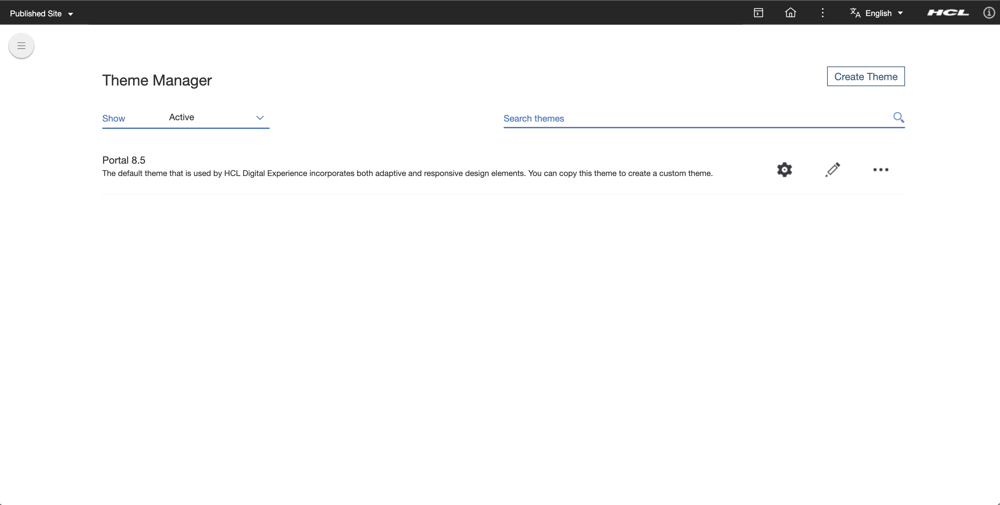
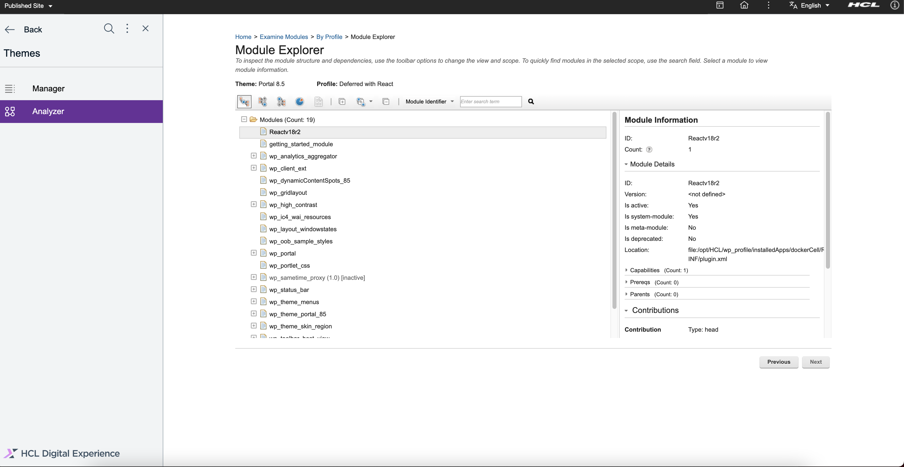

# How to Deploy JavaScript Libraries/Dependencies as a DX Module
This guide will provide a streamlined build process that will automate the creation of the EAR file of DX modules and provide a capability to upload it to the DX Websphere Application Server (WebSphere).

This Gradle Project includes the following areas of functionality:
- [Webpack](https://webpack.js.org/) build script to package JavaScript libraries into a Web Archive (WAR) file
- Replacement of names and labels in WebSphere deployment descriptors. (see:[config](src/main/config))
- Packaging of the WAR file into an Enterprise Application Archive (EAR) file
- Deployment of the DX Module (EAR file) to WebSphere via DXClient

# PreRequisites
### Java Runtime Engine
- Java Runtime Engine with a Long Term Support (LTS) version is needed to be able to run the embedded Gradle wrapper in this project. Java version 17 is recommended.
### Optional: DXClient
- An option is available for the built DX Module (EAR file) to be uploaded to WebSphere via DXClient. You may read the documentation for DXClient [here](https://help.hcltechsw.com/digital-experience/9.5/containerization/dxclient.html).

## DX Module Preparations
DX Modules are artifacts that may include bundled Javascript and Styling (CSS, SCSS) files that DX can inject into the HTML header of the DX Pages. Frontend modules are aggregated by DX and then cached by browsers by default and will deliver performance improvements to the loading of DX pages.

1. The sample gradle project included in this guide is capable of downloading and using its own set of node and npm executables for the build process. Update [gradle.properties](gradle.properties) with the node and npm version required. Set nodeInstall to false if the existing executables of the current environment is preferred.
```
   nodeInstall=true
   nodeVersion=16.16.0
   npmVersion=8.11.0
```
2. Update the [package.json](package.json) file manually or execute the npm i <package list> command to enumerate the libraries that will be added to the DX Module. (Note: don't forget to remove existing ones if they're in conflict)
```
  "dependencies": {
    "react": "^18.2.0",
    "react-dom": "^18.2.0",
    // note that the following is a 3rd-party lib that's only needed for this sample
    "smart-webcomponents-react": "^14.2.0"
  },
```
OR
```
    npm i react@18.2.0 react-dom@18.2.0 
    # note that the following is a 3rd-party lib that's only needed for this sample codes
    npm i smart-webcomponents-react@^14.2.0
```

3. Enumerate the Javascript libraries and components via import and export commands in [modules-index.js](modules-index.js). Provide descriptive aliases for the group of libraries and components that will be included.
```
    /* Import and Export Main Dependencies
    */
    import React from 'react';
    import ReactDOM from 'react-dom/client';
    export const ReactV18 = {
        React,
        ReactDOM,
    }
    
    /* Import and Export 3rd-Party Libraries
       sample:
            import { Table } from 'smart-webcomponents-react/table';
            import { Accordion, AccordionItem } from 'smart-webcomponents-react/accordion'
            export const SmartWebComponents = {
                Table, Accordion, AccordionItem
            }   
     */
    
    /* Export Custom Data and/or Services
       sample:
             export * as CommonData from './common/data/data';
     */
    
    /* Export index file for the styles (added here to be able to share the filename/alias of JS bundle in Webpack entry config). 
     */
    export * from './styles-index.css'
    
```
4. Enumerate the component styling (CSS, SCSS, etc.) files in the index file exported in the previous step: [styles-index.css](styles-index.css)
```
    /* sample import:
     *    @import 'smart-webcomponents-react/source/styles/smart.default.css';
    */
```
5. Update the rootProject.name in the [settings.gradle](settings.gradle) file. It will be used as the name of the DX Module (war file, ear file, etc.) and the names and ids in the deployment descriptors (web context path, etc.)
```
    rootProject.name = 'Reactv18r2'
```

## Building and Deployment of DX Module to WebSphere
1. To be able to upload the DX module via the gradle deploy commmand, the DXClient parameters in [gradle.properties](gradle.properties) needs to point to the target WebSphere endpoint and profile.
```
   dxProtocol=https
   dxHostname=localhost
   dxPort=10041
   dxProfileName=wp_profile
```
2. On the root directory, running the following command will build the DX module from the ground up and then deploy to WebSphere.

    - _Change the `{username}` and `{password}` in the following commands with the proper login credentials for the WebSphere that you have set up in the `gradle.properties`._

**With Gradle installed on your machine**
```
   gradle deployDxModule -DdxUsername={username} -DdxPassword={password}
```
**Without Gradle installed (use the embedded Gradle of the current project)**
- On non-Windows machine
```
    ./gradlew deployDxModule -DdxUsername={username} -DdxPassword={password}
```
- On Windows machine
```
    gradlew.bat deployDxModule -DdxUsername={username} -DdxPassword={password}
```
Sample successful log:

```
        > Task :npmInstallDXModule
        up to date, audited 167 packages in 837ms
        24 packages are looking for funding
          run `npm fund` for details
        found 0 vulnerabilities
        > Task :npmBuildDxModule
        > webapp-dx-module@1.0.0 build-dxmodules
        > webpack --config  webpack.dxmodules.js
        asset dxmodules.bundle.js 137 KiB [compared for emit] [minimized] (name: dxmodules) 1 related asset
        asset dxmodules.bundle.css 98 bytes [compared for emit] (name: dxmodules)
        Entrypoint dxmodules 137 KiB = dxmodules.bundle.css 98 bytes dxmodules.bundle.js 137 KiB
        orphan modules 2.89 KiB (javascript) 937 bytes (runtime) [orphan] 8 modules
        runtime modules 670 bytes 3 modules
        built modules 143 KiB (javascript) 97 bytes (css/mini-extract) [built]
          modules by path ./node_modules/ 142 KiB
            modules by path ./node_modules/react-dom/ 131 KiB 3 modules
            modules by path ./node_modules/react/ 6.94 KiB
              ./node_modules/react/index.js 190 bytes [built] [code generated]
              ./node_modules/react/cjs/react.production.min.js 6.75 KiB [built] [code generated]
            modules by path ./node_modules/scheduler/ 4.33 KiB
              ./node_modules/scheduler/index.js 198 bytes [built] [code generated]
              ./node_modules/scheduler/cjs/scheduler.production.min.js 4.14 KiB [built] [code generated]
          dll dxmodules 12 bytes [built] [code generated]
          ./modules-index.js 764 bytes [built] [code generated]
          css ./node_modules/css-loader/dist/cjs.js!./styles-index.css 97 bytes [built] [code generated]
        webpack 5.74.0 compiled successfully in 6166 ms
        > Task :deployDxModule
        cd build/libs/
        dxclient deploy-application --dxUsername **** --dxPassword **** --dxConnectUsername **** --dxConnectPassword **** --applicationFile Reactv18r2.ear --applicationName Reactv18r2 --dxProtocol https --hostname localhost --dxPort 10041 --dxProfileName wp_profile
        
        BUILD SUCCESSFUL in 2m 3s
        10 actionable tasks: 8 executed, 2 up-to-date

```
3. If the deployDxModule task returned an error, check the dxclient logs in [build/libs/store/logs/](build/libs/store/logs/) folder.

# Important Configuration Items to Note
1. Take note of the location of the generated DLL manifest as configured in the DllPlugin section of [webpack.dxmodules.js](webpack.dxmodules.js). The location and content of the manifest are critical as it is required to optimize and correctly build the dependent DX ScriptApps.
```
    entry: {
        dxmodules: './modules-index.js'
    },
    mode: "production",
    target: 'node',
    output: {
        filename: "[name].bundle.js",
        path: path.resolve(__dirname, "dist-dx-module"),
        library: "[name]_[fullhash]"
    },
    plugins: [
        new DllPlugin({
            name: "[name]_[fullhash]",
            path: path.resolve(__dirname, "./dx-dll-manifest.json"),
            format: true,
        }),
        new MiniCssExtractPlugin({
            filename: "[name].bundle.css",
        })
    ],
```
2. You may need to take note of the generated library name (with the added fullhash) and the exported component aliases in the generated DLL manifest ([dx-dll-manifest.json](src/main/webapp-dx-module/dx-dll-manifest.json)). Please keep in mind that even [minor edits in the DX module]() will result to a modified fullhash in the library name that [will then require the dependent DX ScriptApps to be rebuilt and redeployed](). It is recommended to keep the fullhash suffix in the webpack library name config mentioned in previous step.
```
    {
      "name": "dxmodules_95f93ddf879a86d4093f",
      "content": {
        "./modules-index.js": {
          "id": 635,
          "buildMeta": {
            "tsLoaderDefinitionFileVersions": [
              "node_modules/smart-webcomponents-react/table/table.d.ts@0",
              "node_modules/smart-webcomponents-react/index.d.ts@0",
              ...
              ...
              "common/data/data.js@0"
            ],
            "tsLoaderFileVersion": 0,
            "exportsType": "namespace"
          },
      "exports": [
        "CommonData",
        "ReactV18",
        "SmartWebComponents"
      ]
    }
```
3. Any change in the aliases in both the entry config or in the output filenames in webpack.dxmodules.js, will require corresponding changes to DX Module's deployment descriptor file [src/main/config/war/WEB-INF/plugin.xml](src/main/config/war/WEB-INF/plugin.xml). The Javascript and styling files in the output folder [src/main/webapp-dx-module/dist-dx-module](src/main/webapp-dx-module/dist-dx-module) must correspond to the files listed in the  deployment descriptor. All @@auto-replaced-with-rootProject.name@@ tokens are dynamically replaced by the rootProject.name value set in [settings.gradle](settings.gradle).
```
    ...
    <module id="@@auto-replaced-with-rootProject.name@@">
        <contribution type="head">
            <sub-contribution type="js">
                <uri value="res:{war:context-root}/dxmodules.bundle.js"/>
                <uri type="debug" value="res:{war:context-root}/dxmodules.bundle.js"/>
            </sub-contribution>
        </contribution>
        <contribution type="head">
            <sub-contribution type="css">
                <uri value="res:{war:context-root}/dxmodules.bundle.css"/>
                <uri type="debug" value="res:{war:context-root}/dxmodules.bundle.css"/>
            </sub-contribution>
        </contribution>
    </module>
    ...
```

# How To Verify A Successful Deployment and Link a DX Module to a DX Theme
1. To verify, login to the WebSphere console. Under the *Applications* tab, then the *Application Types* and then lastly in the *Business-level applications*, you can search for your application name in the table in the right-hand side.
   
2. To verify inside HCL Digital Experience:
   Click Theme button in Practitioner Studio Home Page
   
   Click the Menu button at the upper left most part of the screen
   
   Click the Manager Menu at the left side
   
   Click Pencil Button at the right side of the theme to be used (i.e. Portal 8.5)
   
   Go to profiles->profile_deferred_react.json then remove the 3 highlighted moduleIDs
   
   Add the new module to be added (i.e. Reactv18r2). Click on the Save button (disc icon) in the upper right area.
   
   Click the Analyzer Menu then click the Examine modules by profile
   
   Navigate to Examine modules by profile and click the module used then click Next button
   
   Expand Modules and the module uploaded must be there (i.e. Reactv18r2). Note: there must be no warning icon in the uploaded module.
   

# Optional: How to manually upload your EAR file to WebSphere
1. Running the following commands will build the whole project from ground up including the webpack script.
##### With Gradle installed on your machine

    gradle build

##### Without Gradle installed
- On non-Windows machine


    ./gradlew build

- On Windows machine


    gradlew.bat build
2. Check the EAR file generated in the [build/libs](build/libs) folder.
3. Login to your WebSphere console.
4. Navigate to the new application window by opening the Application tab in the left-hand side and then click the new application link.
   
5. Click the New Enterprise Application link
6. Click the Browse button to select the newly generated EAR file in the new directory `build/libs`
   
7. For now, you can click the next buttons as you go through the Install New Application process.
8. Click the Finish button when you arrive in the last step.
   
9. The upload progress will be shown next.
   
10. When it is done, click the Save link near the bottom.
    
11. Please read [Important Configuration Items to Note](#important-configuration-items-to-note).
12. For the next steps, please refer to [How To Verify A Successful Deployment and Link a DX Module to a DX Theme](#how-to-verify-a-successful-deployment-and-link-a-dx-module-to-a-dx-theme).

# File structure
```
📦02DependenciesAsModule
 ┣ 📂gradle                     - The files being used by the Gradle wrapper
 ┃ ┗ 📂wrapper
 ┃ ┃ ┣ 📜gradle-wrapper.jar
 ┃ ┃ ┗ 📜gradle-wrapper.properties
 ┣ 📂src
 ┃ ┗ 📂main
 ┃ ┃ ┗ 📂config
 ┃ ┃ ┃ ┣ 📂ear                  - Template files that will be used when building the EAR file which will be deployed to WebSphere. 
 ┃ ┃ ┃ ┃ ┗ 📂META-INF
 ┃ ┃ ┃ ┃ ┃ ┗ 📜WebSphere.policy
 ┃ ┃ ┃ ┗ 📂war                  - Template files that will be used when building the WAR file inside the EAR file.
 ┃ ┃ ┃ ┃ ┣ 📂WEB-INF
 ┃ ┃ ┃ ┃ ┃ ┣ 📜ibm-web-bnd.xmi
 ┃ ┃ ┃ ┃ ┃ ┣ 📜ibm-web-ext.xmi
 ┃ ┃ ┃ ┃ ┃ ┗ 📜plugin.xml
 ┃ ┃ ┃ ┃ ┗ 📜web.xml
 ┣ 📜.gitignore
 ┣ 📜README.MD
 ┣ 📜build.gradle               - This file is the build program being used to build the EAR file which will be deployed to the WebSphere.
 ┣ 📜gradle.properties          - The environment property variables being used by the Gradle program.
 ┣ 📜gradlew                    - The wrapper that you will be using to run the program without needing the Gradle installed on a non-Windows machine.
 ┣ 📜gradlew.bat                - The wrapper that you will be using to run the program without needing the Gradle installed on a Windows machine.
 ┣ 📜index.js                   - Exports the modules you are using; this is used by the webpack.
 ┣ 📜package-lock.json
 ┣ 📜package.json               - The usual package.json of NPM
 ┣ 📜settings.gradle            - The environment settings variables being used by the Gradle program.
 ┗ 📜webpack.dx-module.js       - This is the webpack profile configuration that is being used by package.json.
 ```

- ### build.gradle
This file is the build script being used to build the EAR file which will be deployed to WebSphere. This processes all the files in main server alongside with the related properties to be able to generate the EAR file which will be deployed into the WebSphere.
- ### gradle.properties
The environment settings variables being used by the Gradle program. This is where you need to set whether you want the NPM to be used is project wide or local instance. This also include the WebSphere settings you need to configure before being to leverage the automatic deployment properly.
- ### webpack.dx-module.js
This is the webpack profile configuration that is being used by package.json.
- ### index.js
This file is what references the modules you are building.
- ### package.json & package-lock.json
These are the usual files needed for the NPM to work.
- ### EAR
The files you are building for the EAR file alongside the WAR file which will also be built by the program.
- ### WAR/WEB-INF
The files needed by the webapp you are building.
- ### WAR/web.xml
The deployment descriptor of your webapp.
- ### gradlew & gradlew.bat
These are the wrappers that you will be using to run the program without needing the Gradle installed in your machine.
- ### build/libs
This is where the generated EAR file be placed. This is the EAR file that will be deployed in the WebSphere.
