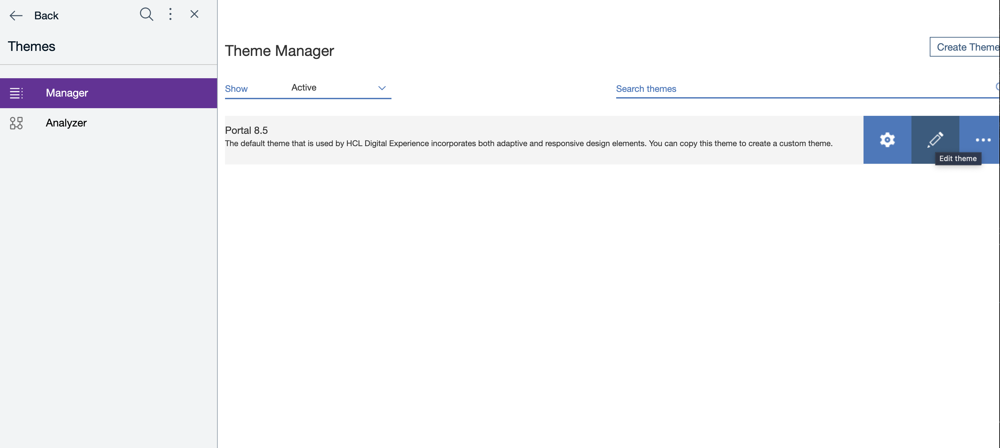

## Overview
This shows how to deploy a React Script App based on this [project](https://github.com/HCL-TECH-SOFTWARE/sample-react-script-application) excluding its dependencies. [Webpack](https://webpack.js.org/) is used to package the React Script App.

The project structure is as follows:

- **React App Script**
    - **build**
        - _Output folder._
    - **src**
        - **assets**
            - _Images etc._
        - **css**
            - _CSS Files_
        - **components**
            - _React Components_

## PreRequisites
1. Follow the online guide on how to install HCL DXClient [DX9.5](https://help.hcltechsw.com/digital-experience/9.5/containerization/dxclient.html). Please note that the DX and/or DXClient link provided here may be superseded, you may use a newer version if available.

2. Add the 'Script Application Library' to the list of visible libraries in your DX Library Explorer. Follow the series of links via the Web Content menu: Preferences -> Edit Shared Settings. Don't forget to click on the OK button.  
   
   
   

3. In case other theme or newly created theme will be used, make it sure that the following ModuleId exist:
    1. "wp_react_16_10_2",
    2. "wp_react_dom_16_10_2",
    3. "wp_react_router_dom_512"

   
   
   

## Setup

1. Run npm install at the root of the project to install Babel and its dependencies. You may need to run `npm install --legacy-peer-deps` and `npx -p npm@6 npm audit fix` to install the dependencies.

2. Update the project's [package.json](./sample-app/package.json) file to add the dxclient parameters and add the dx-deploy-app script with the call to dxclient command:

    ```
        {
            ...
            "config": {
                "dxclient": {
                    "wcmContentName": "SampleScriptApp",
                    "wcmSiteArea": "Portal Site/Content Root",
                    "mainHtmlFile": "index.html",
                    "contentRoot": "./build",
                    "dxProtocol": "https",
                    "dxPort": "10041"
                }
            },
            "scripts": {
                ...
                "dx-deploy-app": "dxclient deploy-scriptapplication push -dxUsername $dxUsername -dxPassword $dxPassword -wcmContentName \"$npm_package_dxclient_wcmContentName\" -wcmSiteArea \"$npm_package_dxclient_wcmSiteArea\" -mainHtmlFile $npm_package_dxclient_mainHtmlFile -contentRoot \"$npm_package_dxclient_contentRoot\" -dxProtocol $npm_package_dxclient_dxProtocol -dxPort $npm_package_dxclient_dxPort"
            }
            ...
        }
    ```

3. Install Webpack node modules externals by running `npm install webpack-node-externals -D`.

   For more information about the package Webpack Node Modules Externals click [here](https://www.npmjs.com/package/webpack-node-externals).

4. Include the package Webpack Node Modules Externals in the webpack [config](./sample-app/webpack.prod.js) for deployment.

    ```
        const nodeExternals = require('webpack-node-externals');
        ...
        module.exports = {
            ...
            externals: [nodeExternals()], // in order to ignore all modules in node_modules folder
            ...
        };
    ```

5. Make sure to install all the project's dependencies via npm:

   `npm install react react-dom --save`

6. Remove all external dependency CDN from [index.html](./sample-app/src/index.html) in order for us to use the node modules packages instead.
    ```
        <!DOCTYPE html>
        <html lang="en">
        <head>
            ...
            // For removal
            <script src="https://unpkg.com/react@16/umd/react.development.js" data-scriptportlet-theme-capability="react" crossorigin></script>
            <script src="https://unpkg.com/react-dom@16/umd/react-dom.development.js" data-scriptportlet-theme-capability="react" crossorigin></script>
            ...
        </head>
            ...
        </html>
    ```

7. Declare the node dependencies globally in the project's webpack [config](./sample-app/webpack.dev.js) for dev environment.

    ```
        const { ProvidePlugin } = require('webpack');
        ...
        module.exports = {
            ...
            plugins: [
                new ProvidePlugin({
                    React: 'react',
                    ReactDOM: 'react-dom',
                }),
            ], 
            ...
        };
    ```

8. How to run the project:

   ### * Development
        npm run start

   ### * Production Build
        npm install
        npm run build
   ### * Deploy bundled files
        npm install
        npm run build
        dxUsername=<username> dxPassword=<password> npm run dx-deploy-app
        # check the DXClient logs in ./store/logs/logger.log
            > sample-app@1.0.0 dx-deploy-app
            > dxclient deploy-scriptapplication push -dxUsername $dxUsername -dxPassword $dxPassword -wcmContentName "$npm_package_config_dxclient_wcmContentName" -wcmSiteArea "$npm_package_config_dxclient_wcmSiteArea" -mainHtmlFile $npm_package_config_dxclient_mainHtmlFile -contentRoot "$npm_package_config_dxclient_contentRoot" -dxProtocol $npm_package_config_dxclient_protocol -hostname $npm_package_config_dxclient_hostname -dxPort $npm_package_config_dxclient_port

            2022-08-11 14:08:24 : Begin content push to Portal.
            2022-08-11 14:08:24 : WCM content ID: .
            2022-08-11 14:08:24 : WCM Content Path: .
            2022-08-11 14:08:24 : WCM Content Title: .
            2022-08-11 14:08:24 : Main HTML file: index.html.
            2022-08-11 14:08:24 : PrebuiltZip path does not exist.
            2022-08-11 14:08:24 : Archive file: 

            /var/folders/mp/bcmnxk3s0rbbj1cbbl0875bw0000gn/T/tmp--74441-A0Psc2XcZMPo-.zip
            (12550 bytes in 6 files) 

            26516c43829f4d7710a6.png
            4fe75d5f9adb18067b85.ico
            index.html
            main.1830a589a2f6cffd9b59.bundle.js
            main.4b5be791ab288338c723.css
            sp-config.json.
            (node:74441) Warning: Setting the NODE_TLS_REJECT_UNAUTHORIZED environment variable to '0' makes TLS connections and HTTPS requests insecure by disabling certificate verification.
            (Use `node --trace-warnings ...` to show where the warning was created)
            2022-08-11 14:08:25 : Content push was successful.
            2022-08-11 14:08:25 : End content push to Portal.
            2022-08-11 14:08:25 : Body content: {"results":{"status":"success","importedFiles":{"file":[{"filename":"HTML/index.html"},{"filename":"JavaScript/main.1830a589a2f6cffd9b59.bundle.js"},{"filename":"CSS/main.4b5be791ab288338c723.css"},{"filename":"Images/26516c43829f4d7710a6.png"}]},"skippedFiles":"","message":"The file that you selected was imported successfully.","contentId":"6fa0b659-7b18-499d-a8de-090a0e9f8987"}}.

9. To check if the script is successfully loaded follow these steps, in this example we will use Woodburn Studio:
    1. Create a Sibling or Child page under Woodburn Studio:
       

    2. Enter a Page Title and choose Basic(Portal 8.5 Theme) then click the Create Page button:
       

    3. Right click the Menu button at the right of the page name;
       choose Open Page Settings
       Edit the Page Properties by clicking the pen button:
           
       

    4. Edit the theme settings in the Advanced tab, Theme(Portal 8.5) and Profile(Deferred with React) then click Save button:
       

    5. Click the Add page components and applications button:
       

    6. Click the Script Application icon:
       

    7. Check if the script is loaded successfully:
       

    8. Click the Add this content to the page button:
       

    9. Click the page name and check if the script is rendered correctly.
       
    10. Turn-off edit mode and check the page.

## Important note:
### Do not import or require external dependencies directly in the app.

❌ import React from 'react'

❌ const react = require('react');

✅ include the dependencies globally using webpack config see [Setup #6](#setup)
