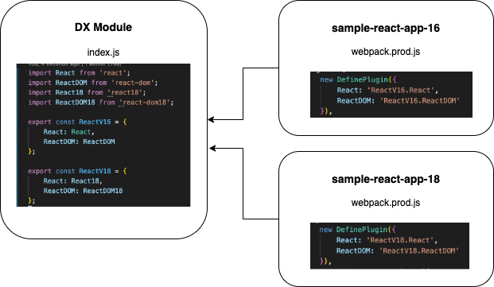

# How To Deploy Apps with Different Dependency Versions

## Overview
This shows how to deploy multiple React Script App with different version of React in order to avoid conflict on the same page. [Webpack](https://webpack.js.org/) is used to package the React Script App.

## Setup

1. Create a DX module with two different React Versions:
    * sample-react-app-16 = React 16
    * sample-react-app-18 = React 18

   Install the npm package with an alias using the command
   `npm install [alias]@npm:[packagename]@[version]`:


    Below is an example on how to install React 18:
        
        npm install react18@npm:react@^18.2.0 react-dom18@npm:react-dom@^18.2.0 --save


2. Import the nodes package in the [index.js](./dx-module-gradle/index.js). Recommended to form collection of packages under each version separately:

        import React from 'react'; // react version 16
        import ReactDOM from 'react-dom'; // react-dom version 16
        import React18 from 'react18'; // react version 18
        import ReactDOM18 from 'react-dom18'; // react-dom version 18
        
        export const ReactV16 = {
            React: React,
            ReactDOM: ReactDOM
        };
        
        export const ReactV18 = {
            React: React18,
            ReactDOM: ReactDOM18
        };

3. Refer to this [guide](../02DependenciesAsModule/README.MD) on how to build and deploy the module.

4. Declare the node dependencies globally in the project's webpack [config](./sample-react-app-18/webpack.dev.js) for dev environment.

    ```
        const { ProvidePlugin } = require('webpack');
        ...
        module.exports = {
            ...
            plugins: [
                new ProvidePlugin({
                    React: 'react',
                    ReactDOM: 'react-dom',
                }),
            ], 
            ...
        };
    ```

5. Update the project's webpack production [config](./sample-react-app-18/webpack.prod.js) for the global variables to be replaced on build using the webpack's [DefinePlugin](https://webpack.js.org/plugins/define-plugin/). In this case we will be replacing the react modules to ReactV18 and ReactV16. See the diagram below:

   

   ### sample-react-app-18

        const { DefinePlugin } = require('webpack');

        module.exports = merge(common, {
            ...
            plugins: [
                new DefinePlugin({
                    React: 'ReactV18.React',
                    ReactDOM: 'ReactV18.ReactDOM'
                }),
                ...
            ]
            ...
        });


6. Refer to this [guide](../03AppsExcludingDependencies/README.MD) on how to build and deploy script apps.

## Important note:
### Use a different ReactDOM render container for each script apps.

✅ Update sample-app-16's [index.html](./sample-react-app-16/src/index.html) and [index.jsx](./sample-react-app-16/src/index.jsx) different from sample-app-18.

❌ Using the same react entry point will cause a conflict to other script apps on the same page.


