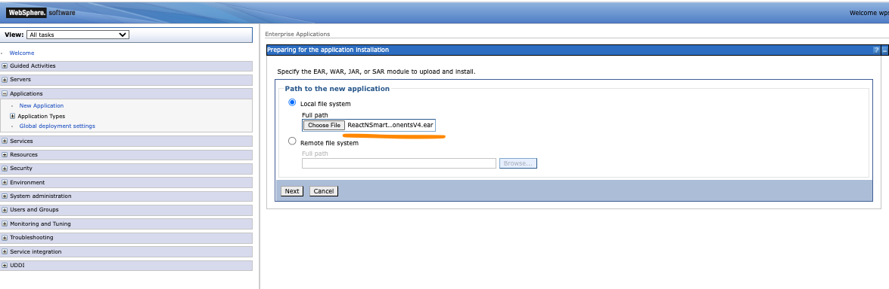
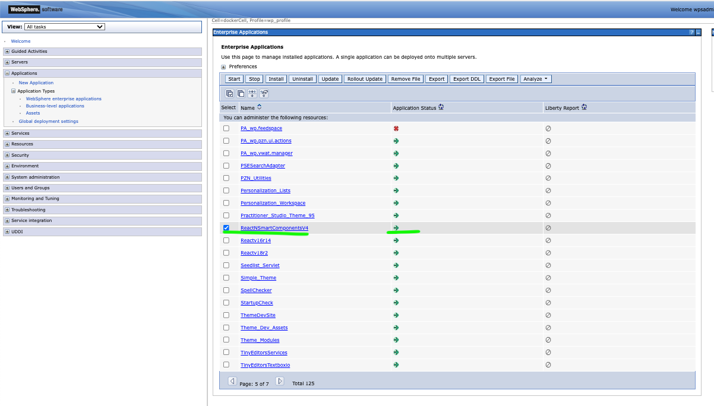

# How To Make ScriptApps Use Shared Components From Themes
# General Information
The steps needed to make DX ScriptApps use and share custom or 3rd-party components defined in DX Themes are detailed in this guide. The components are going to be bundled in a DX Module and will then be linked for use in a DX Theme.

The included sample codes combine NPM, Gradle and Webpack configuration to achieve the following:
- Be able to resolve all shared libraries or Node modules within Integrated Development Environments (IDEs i.e: Visual Studio Code and Intellij). Leverage on full features like autocompletion of properties and functions of components even if they are defined in a separate project for the bundled modules.
- Be able to debug and run the DX ScriptApps locally during development (i.e: npm start).
- Be able to deploy all DX ScriptApps and their shared DX Modules into the target DX Core instance (dev/staging/prod).
- Components bundled and deployed in DX Modules are only going to be loaded once during page rendering, even when used by multiple dependent DX ScriptApps.

# 3rd-Party Components Credits
The following components are used in the sample codes for this guide:
- HTMLElements Smart Table:
    - https://www.webcomponents.org/element/HTMLElements/smart-table
    - https://www.htmlelements.com/react/demos/table/overview/
- HTMLElements Smart Tabs:
    - https://www.webcomponents.org/element/HTMLElements/smart-tabs
    - https://www.htmlelements.com/react/demos/tabs/overview/

# Table of Contents
- [Requirements](#requirements)
- [Expert Section: Quick Deployment of Sample Code](#expert-section-quick-deployment-of-sample-code)
- [Prepare and Deploy Javascript Libraries/Dependencies and Shared Styling as a DX Module](#prepare-and-deploy-javascript-librariesdependencies-and-shared-styling-as-a-dx-module)
- [Prepare and Deploy a React App as a DX ScriptApp](#prepare-and-deploy-a-react-app-as-a-dx-scriptapp)

# Requirements
### Java Runtime Engine
- Java Runtime Engine with a Long Term Support (LTS) version is needed to be able to run the embedded Gradle wrapper in this project. Java version 17 is recommended.
### HCL DXClient
- HCL DXClient is required for deployments. Follow the online guide on how to install HCL DXClient [DX9.5](https://help.hcltechsw.com/digital-experience/9.5/containerization/dxclient.html). Please note that the DX and/or DXClient link provided here may be superseded, you may use a newer version if available.
### ScriptApp Placeholder
- Add the 'Script Application Library' to the list of visible libraries in your DX Library Explorer. Follow the series of links via the Web Content menu: Preferences -> Edit Shared Settings. Don't forget to click on the OK button.  
  
  
  

# Expert Section: Quick Deployment of Sample Code
1. To be able to upload the DX module via the gradle deploy command, the DXClient parameters in [gradle.properties](gradle.properties) needs to point to the target WebSphere endpoint and profile.
```
   dxProtocol=https
   dxHostname=localhost
   dxPort=10041
   dxProfileName=wp_profile
```
2. Invoke the deployAll task of the Gradle project.
``` 
    ./gradlew deployAll -DdxUsername=<username> -DdxPassword=<password>
    ...
    > Task :deployDxModule
    cd build/libs/
    dxclient deploy-application --dxUsername **** --dxPassword **** --dxConnectUsername **** --dxConnectPassword **** --applicationFile ReactNSmartComponentsV4.ear --applicationName ReactNSmartComponentsV4 --dxProtocol https --hostname localhost --dxPort 10041 --dxProfileName wp_profile
    ...
    ...
    > Task :deployAllScriptApps
     Task deployAllScriptApps Done
    
    > Task :deployAll
     Task deployAll Done
    
    BUILD SUCCESSFUL in 2m 17s
```
3. Use the ReactNSmartComponentsV4 module in the Theme's profile.
4. Add the EducSampleTabsComponent and EducSampleTableComponent as ScriptApps into any DX page.

# Prepare and Deploy Javascript Libraries/Dependencies and Shared Styling as a DX Module
This section details a streamlined build process that automates the creation of the artifacts for DX modules and provide a capability to upload it to the DX Websphere Application Server (WebSphere).

The Gradle Project includes the following areas of functionality:
- [Webpack](https://webpack.js.org/) build script to package JavaScript libraries into a Web Archive (WAR) file
- Replacement of names and labels in WebSphere deployment descriptors. (see:[config](src/main/config))
- Packaging of the WAR file into an Enterprise Application Archive (EAR) file
- Deployment of the DX Module (EAR file) to WebSphere via DXClient


## DX Module Preparations
DX Modules are artifacts that may include bundled Javascript and Styling (CSS, SCSS) files that DX can then inject into the HTML header of the DX Pages. Frontend modules are aggregated by DX and then cached by browsers by default and will deliver performance improvements to the loading of DX pages.

1. The sample gradle project included in this guide is capable of downloading and using its own set of node and npm executables for the build process. Update [gradle.properties](gradle.properties) with the node and npm version required. Set nodeInstall to false if the existing executables of the current environment is preferred.
```
   nodeInstall=true
   nodeVersion=16.16.0
   npmVersion=8.11.0
```
2. Update the [package.json](src/main/WebAppDXModule/package.json) file manually or execute the npm i <package list> command to enumerate the libraries that will be added to the DX Module. (Note: don't forget to remove existing ones if they're in conflict)
```
  "dependencies": {
    "react": "^18.2.0",
    "react-dom": "^18.2.0",
    // note that the following is a 3rd-party lib that's only needed for this sample
    "smart-webcomponents-react": "^14.2.0"
  },
```
OR
```
    npm i react@18.2.0 react-dom@18.2.0 
    # note that the following is a 3rd-party lib that's only needed for this sample codes
    npm i smart-webcomponents-react@^14.2.0
```

3. Enumerate the Javascript libraries and components via import and export commands in [src/main/WebAppDXModule/modules-index.js](src/main/WebAppDXModule/modules-index.js). Provide descriptive aliases for the group of libraries and components that will be included.
```
    /* Import and Export Main Dependencies
    */
    import React from 'react';
    import ReactDOM from 'react-dom/client';
    export const ReactV18 = {
        React,
        ReactDOM,
    }
    
    /* Import and Export 3rd-Party Libraries
     */
    import { Table } from 'smart-webcomponents-react/table';
    import { Accordion, AccordionItem } from 'smart-webcomponents-react/accordion'
    export const SmartWebComponents = {
        Table, Accordion, AccordionItem
    }
    
    /* Export Custom Data and/or Services
     */
    export * as CommonData from './common/data/data';
    
    /* Export index file for the styles (added here to be able to share the filename/alias of JS bundle in Webpack entry config). 
     */
    export * from './styles-index.css'
    
```
4. Enumerate the component styling (CSS, SCSS, etc.) files in the index file exported in the previous step: [styles-index.css](src/main/WebAppDXModule/styles-index.css)
```
    @import 'smart-webcomponents-react/source/styles/smart.default.css';
    @import 'smart-webcomponents-react/source/styles/components/smart.table.css';
    @import 'smart-webcomponents-react/source/styles/components/smart.accordion.css';
```
5. Update the rootProject.name in the [settings.gradle](settings.gradle) file. It will be used as the name of the DX Module (war file, ear file, etc.) and the names and ids in the deployment descriptors (web context path, etc.)
```
    rootProject.name = 'ReactNSmartComponentsV4'
```

## Build and Deploy DX Module to WebSphere
1. To be able to upload the DX module via the gradle deploy commmand, the DXClient parameters in [gradle.properties](gradle.properties) needs to point to the target WebSphere endpoint and profile.
```
   dxProtocol=https
   dxHostname=localhost
   dxPort=10041
   dxProfileName=wp_profile
```
2. On the root directory, running the following command will build the DX module from the ground up and then deploy to WebSphere.

    - _Change the `{username}` and `{password}` in the following commands with the proper login credentials for the WebSphere that you have set up in the `gradle.properties`._

**With Gradle installed on your machine**
```
   gradle deployDxModule -DdxUsername={username} -DdxPassword={password}
```
**Without Gradle installed**
- On non-Windows machine
```
    ./gradlew deployDxModule -DdxUsername={username} -DdxPassword={password}
```
- On Windows machine
```
    gradlew.bat deployDxModule -DdxUsername={username} -DdxPassword={password}
```
Sample successful log:

```
        > Task :npmInstallDXModule
        up to date, audited 168 packages in 1s
        24 packages are looking for funding
          run `npm fund` for details
        found 0 vulnerabilities
        > Task :npmBuildDxModule
        > WebAppDXModule@1.0.0 build-dxmodules
        > webpack --config  webpack.dxmodules.js
        assets by status 205 KiB [cached] 5 assets
        assets by status 2.65 MiB [compared for emit]
          asset dxmodules.bundle.css 1.56 MiB [compared for emit] (name: dxmodules)
          asset dxmodules.bundle.js 1.09 MiB [compared for emit] [minimized] (name: dxmodules) 1 related asset
        Entrypoint dxmodules 2.65 MiB = dxmodules.bundle.css 1.56 MiB dxmodules.bundle.js 1.09 MiB
        orphan modules 1.64 MiB (javascript) 205 KiB (asset) 1.01 KiB (runtime) [orphan] 27 modules
        runtime modules 670 bytes 3 modules
        built modules 1.17 MiB (javascript) 1.56 MiB (css/mini-extract) [built]
          javascript modules 1.17 MiB
            modules by path ./node_modules/ 1.09 MiB 9 modules
            dll dxmodules 12 bytes [built] [code generated]
            ./modules-index.js + 2 modules 69.5 KiB [built] [code generated]
            ./common/data/data.js 14.7 KiB [built] [code generated]
          css modules 1.56 MiB
            modules by path ./node_modules/smart-webcomponents-react/source/styles/components/*.css 310 KiB
              css ./node_modules/css-loader/dist/cjs.js!./node_modules/smart-webcomponents-react/source/styles/components/smart.table.css 300 KiB [built] [code generated]
              css ./node_modules/css-loader/dist/cjs.js!./node_modules/smart-webcomponents-react/source/styles/components/smart.accordion.css 10.4 KiB [built] [code generated]
            css ./node_modules/css-loader/dist/cjs.js!./node_modules/smart-webcomponents-react/source/styles/smart.default.css 1.26 MiB [built] [code generated]
            css ./node_modules/css-loader/dist/cjs.js!./styles-index.css 1 bytes [built] [code generated]
        webpack 5.74.0 compiled successfully in 17454 ms
        > Task :deployDxModule
        cd build/libs/
        dxclient deploy-application --dxUsername **** --dxPassword **** --dxConnectUsername **** --dxConnectPassword **** --applicationFile ReactNSmartComponentsV4.ear --applicationName ReactNSmartComponentsV4 --dxProtocol https --hostname localhost --dxPort 10041 --dxProfileName wp_profile
        
        BUILD SUCCESSFUL in 1m 31s
        10 actionable tasks: 6 executed, 4 up-to-date

```
3. If the deployDxModule task returned an error, check the dxclient logs in [build/libs/store/logs/](build/libs/store/logs/) folder.

# Important Configuration Items to Note
1. Take note of the location of the generated DLL manifest as configured in the DllPlugin section of [webpack.dxmodules.js](src/main/WebAppDXModule/webpack.dxmodules.js). The location and content of the manifest are critical as it is required to optimize and correctly [build](src/main/WebAppScriptApp01/webpack.dx-scriptapp.js) the dependent DX ScriptApps.
```
    entry: {
        dxmodules: './modules-index.js'
    },
    mode: "production",
    target: 'node',
    output: {
        filename: "[name].bundle.js",
        path: path.resolve(__dirname, "dist-dx-module"),
        library: "[name]_[fullhash]"
    },
    plugins: [
        new DllPlugin({
            name: "[name]_[fullhash]",
            path: path.resolve(__dirname, "./dx-dll-manifest.json"),
            format: true,
        }),
        new MiniCssExtractPlugin({
            filename: "[name].bundle.css",
        })
    ],
```
2. You may need to take note of the generated library name (with the added fullhash) and the exported component aliases in the generated DLL manifest ([dx-dll-manifest.json](src/main/WebAppDXModule/dx-dll-manifest.json)). Please keep in mind that even [minor edits in the DX module]() will result to a modified fullhash in the library name that [will then require the dependent DX ScriptApps to be rebuilt and redeployed](). It is recommended to keep the fullhash suffix in the webpack library name config mentioned in previous step.
```
    {
      "name": "dxmodules_95f93ddf879a86d4093f",
      "content": {
        "./modules-index.js": {
          "id": 635,
          "buildMeta": {
            "tsLoaderDefinitionFileVersions": [
              "node_modules/smart-webcomponents-react/table/table.d.ts@0",
              "node_modules/smart-webcomponents-react/index.d.ts@0",
              ...
              ...
              "common/data/data.js@0"
            ],
            "tsLoaderFileVersion": 0,
            "exportsType": "namespace"
          },
      "exports": [
        "CommonData",
        "ReactV18",
        "SmartWebComponents"
      ]
    }
```
3. Any change in the aliases in both the entry config or in the output filenames in webpack.dxmodules.js, will require corresponding changes to DX Module's deployment descriptor file [src/main/config/war/WEB-INF/plugin.xml](src/main/config/war/WEB-INF/plugin.xml). The Javascript and styling files in the output folder [src/main/WebAppDXModule/dist-dx-module](src/main/WebAppDXModule/dist-dx-module) must correspond to the files listed in the  deployment descriptor. All @@auto-replaced-with-rootProject.name@@ tokens are dynamically replaced by the rootProject.name value set in [settings.gradle](settings.gradle).
```
    ...
    <module id="@@auto-replaced-with-rootProject.name@@">
        <contribution type="head">
            <sub-contribution type="js">
                <uri value="res:{war:context-root}/dxmodules.bundle.js"/>
                <uri type="debug" value="res:{war:context-root}/dxmodules.bundle.js"/>
            </sub-contribution>
        </contribution>
        <contribution type="head">
            <sub-contribution type="css">
                <uri value="res:{war:context-root}/dxmodules.bundle.css"/>
                <uri type="debug" value="res:{war:context-root}/dxmodules.bundle.css"/>
            </sub-contribution>
        </contribution>
    </module>
    ...
```

# How To Verify A Successful Deployment and Link a DX Module to a DX Theme
1. To verify, login to the WebSphere console. Under the *Applications* tab, then the *Application Types* and then lastly in the *Business-level applications*, you can search for your application name in the table in the right-hand side. Make sure that the status of the module is started.
   
2. To verify inside HCL Digital Experience:
   Click the Themes option in the Applications Menu, then click the Menu button at the upper left part of the screen.
   
   Click the Manager Menu at the left side
   
   Click Pencil Button at the right side of the theme to be used (i.e. Portal 8.5)
   
   Go to profiles->profile_deferred_react.json then remove the 3 highlighted moduleIDs
   
   Add the new module to be added (i.e. ReactNSmartComponentsV4). Click on the Save button (disc icon) in the upper right area.
   
   Click the Analyzer Menu then click the Examine modules by profile
   
   Navigate to Examine modules by profile and click the module used then click Next button
   
   Expand Modules and the module uploaded must be there (i.e. ReactNSmartComponentsV4). Note: there must be no warning icon in the uploaded module.
   

# Optional: How to manually upload your EAR file to WebSphere
In case the manual upload of EAR file is preferred, continue with the following steps.
1. Run the following commands to build the bundle the DX Module into an EAR file.
##### With Gradle installed on your machine

    gradle build

##### Without Gradle installed
- On non-Windows machine


    ./gradlew build

- On Windows machine


    gradlew.bat build
2. Check the EAR file generated in the [build/libs](build/libs) folder.
3. Login to your WebSphere console.
4. Navigate to the new application window by opening the Application tab in the left-hand side. Double check if there's an existing module with the same name. If the module exists, you are required to manually uninstall first. Don't forget to click on the save link.
   
   
5. Click the new application link.
   
6. Click the New Enterprise Application link
7. Click the Browse button to select the newly generated EAR file in the new directory `build/libs`
   
8. For now, you can click the next buttons as you go through the Install New Application process.
9. Click the Finish button when you arrive in the last step.
   
10. The upload progress will be shown next.
    
11. When it is done, click the Save link near the bottom.
    
12. For manual uploads, the module needs to be started manually as well. Click on Application Types -> Websphere enterprise applications link. Find and select the new module and then click on the start button.
    
    
13. Please read [Important Configuration Items to Note](#important-configuration-items-to-note).
14. For the next steps, please refer to [How To Verify A Successful Deployment and Link a DX Module to a DX Theme](#how-to-verify-a-successful-deployment-and-link-a-dx-module-to-a-dx-theme).

# Prepare and Deploy a React App as a DX ScriptApp

## Overview

This section will describe the steps on how to bundle and deploy a React app to become a DX ScriptApp. The steps will describe the configuration necessary to utilize the DLL manifest generated during the build of the DX Module.

## Setup
1. Update the project package.json file ([sample](src/main/WebAppScriptApp01/package.json)).
    1.  Set the name of the project and the main JavaScript or TypeScript file.
    ```
       {
           "name": "educ-sample-tabs-component",
           ...
           "main": "./index.jsx",
           ...
       }
    ```
    2. Add the dxclient parameters as config. Double-check and update the config values as needed. Also, add the 2 deploy-dx-app lines as-is among the scripts. The variables in the scripts will automatically pick up the values from environment variables and config.)
    ```
       {
           ...
           "config": {
              "dxclient": {
                  "wcmContentName": "EducSampleTabsComponent",
                  "wcmSiteArea": "Script Application Library/Script Applications",
                  "mainHtmlFile": "index.html",
                  "contentRoot": "./dist-dx-scriptapp",
                  "protocol": "https",
                  "hostname": "localhost",
                  "port": "10041"
              }
           },
           "scripts": {
               ...
               "dx-deploy-app": "dxclient deploy-scriptapplication push -dxUsername $dxUsername -dxPassword $dxPassword -wcmContentName \"$npm_package_config_dxclient_wcmContentName\" -wcmSiteArea \"$npm_package_config_dxclient_wcmSiteArea\" -mainHtmlFile $npm_package_config_dxclient_mainHtmlFile -contentRoot \"$npm_package_config_dxclient_contentRoot\" -dxProtocol $npm_package_config_dxclient_protocol -hostname $npm_package_config_dxclient_hostname -dxPort $npm_package_config_dxclient_port",
               "dx-deploy-app-use-env": "dxclient deploy-scriptapplication push -dxUsername $dxUsername -dxPassword $dxPassword -wcmContentName \"$npm_package_config_dxclient_wcmContentName\" -wcmSiteArea \"$npm_package_config_dxclient_wcmSiteArea\" -mainHtmlFile $npm_package_config_dxclient_mainHtmlFile -contentRoot \"$npm_package_config_dxclient_contentRoot\" -dxProtocol $dxProtocol -hostname $dxHostname -dxPort $dxPort"
           },
           ...
       }
    ```
    3. Remove the dependencies that are redundant with the dxmodules' package.json (i.e: React, ReactDom). Create a dependency linking the folder of the dxmodule to the current project.
    ```
       {
           ...
             "dependencies": {
                 "dxmodules": "file:../WebAppDXModule"
             },
    ```
    4. Add all the dev dependencies for the webpack bundler and all its plugins.
    ```   
             "devDependencies": {
                 "@babel/core": "^7.18.10",
                 "@babel/preset-env": "^7.18.10",
                 "@babel/preset-react": "^7.18.6",
                 "babel-loader": "^8.2.5",
                 "clean-webpack-plugin": "^4.0.0",
                 "css-loader": "^6.7.1",
                 "css-minimizer-webpack-plugin": "^4.0.0",
                 "html-loader": "^4.1.0",
                 "html-webpack-plugin": "^5.5.0",
                 "mini-css-extract-plugin": "^2.6.1",
                 "mini-svg-data-uri": "^1.4.4",
                 "style-loader": "^3.3.1",
                 "ts-loader": "^9.3.1",
                 "typescript": "^4.7.4",
                 "webpack": "^5.74.0",
                 "webpack-cli": "^4.10.0",
                 "webpack-dev-server": "^4.9.3",
                 "webpack-merge": "^5.8.0"
             },
           ...
       }
    ```
2. In all the ScriptApps' JS and TS files, replace all imports of the libraries that are bundled in the DX Module with import of the [constants exported by the DX Module](src/main/WebAppDXModule/modules-index.js).
    ```
   // From
   import React from 'react';
   import ReactDOM from 'react-dom/client';
   import { Tabs, TabItem } from 'smart-webcomponents-react/tabs';
    ```
    ```
   // To
   import { ReactV18, SmartWebComponents } from 'dxmodules';
   const { React } = ReactV18;
   const { Tabs, TabItem } = SmartWebComponents;
    ```
3. Add or update the webpack.common.js file ([full sample](src/main/WebAppScriptApp01/webpack.common.js)). Set the main entry JS/TS file. Make sure to replace all old webpack bundlers (i.e: url-loader and file-loader) with the latest asset bundlers.
    ```
   module.exports = {
      entry: {
        main: "./index.jsx",
      },
      resolve: {
        preferRelative: true,
        extensions: [".js", ".jsx", ".module.scss"]
      },
      module: {
        rules: [
            ...
            {
                test: /\.svg/,
                type: 'asset/inline',
                generator: {
                    dataUrl: content => {
                        content = content.toString();
                        return svgToMiniDataURI(content);
                    }
                }
            },
            {
                test: /\.(png|jpg|jpeg|gif|woff|woff2|ttf|eot)$/,
                type: 'asset'
            },
        ],
      }
   };
    ```
4. Add or update a webpack.dev.js file ([full sample](src/main/WebAppScriptApp01/webpack.dev.js)). This configuration is intended for the development cycle only (via npm start) and will not be used for DX deployment.
    1. Add a separate build entry pointing to the styles index file of the DX Module. This will simulate the styling injection that will be done by DX in the HTML header of a DX page.
    ```
      entry: {
          dxmodulesstyles: path.resolve(__dirname, '../WebAppDXModule/styles-index.css'),
      },
    ```
    2. Configure the temporary output folder, make sure the folder is not the same as the one for the DX deployment build.
    ```
      output: {
        filename: "[name].bundle.js",
        path: path.resolve(__dirname, "dist-dev"),
      },
    ```  
    3. Configure the HTML wrapper and assets that will be used when running the ScriptApp via npm start:
    ```
      plugins: [
        new HTMLWebpackPlugin({
            template: "./public/index.html",
            filename: "./index.html",
            favicon: "./public/favicon.ico",
            manifest: "./public/manifest.json"
        }),
      ],
    ```   
5. Add or update the webpack.dx-scriptapp.js file ([full sample](src/main/WebAppScriptApp01/webpack.dx-scriptapp.js)). This is the main bundler configuration that will be used for building the DX ScriptApp.
    1. Set the folder path and filenames for the bundled files. Make sure the output folder is the same as the one defined as config.dxclient.contentRoot in the package.json file.
    ```
       output: {
        filename: "[name].[contenthash].bundle.js",
        path: path.resolve(__dirname, "dist-dx-scriptapp")
       },
    ```
    2. Add a minimizer for the optimization step.
    ```
       optimization: {
           minimizer: [
              new OptimizeCssAssetsPlugin(),
              new TerserPlugin(),
              new HTMLWebpackPlugin({
                template: "./public/index.html",
                filename: "./index.html",
                favicon: "./public/favicon.ico",
                manifest: "./public/manifest.json",
                minify: {
                    removeAttributeQuotes: true,
                    removeComments: true,
                    collapseWhitespace: false,
                }
              })
           ]
       },
    ```
    3. Add the DllReferencePlugin and MiniCSSExtractPlugin in the plugins section. Make sure the context and manifest points to the required DX Module.
    ```
       plugins: [
          ...
          new DllReferencePlugin({
            context: path.resolve(__dirname, '../WebAppDXModule'),
            manifest: require('../WebAppDXModule/dx-dll-manifest.json'),
          }),
          new MiniCssExtractPlugin({
            filename: "[name].[contenthash].css"
          }),
          ...
       ],
    ```
6. Add if not yet included in the project, a tsconfig.json file ([full sample](src/main/WebAppScriptApp01/tsconfig.json)).
    ```
   {
      "compilerOptions": {
        "outDir": "./dist/",
        "noImplicitAny": true,
        "module": "es6",
        "target": "es5",
        "allowJs": true,
        "moduleResolution": "node",
        "resolveJsonModule": true,
        "esModuleInterop": true
      }
   }
    ```
7. Before using the NPM commands in the succeeding steps, set the PATH environment variable to prioritize the npm executable downloaded by the gradle npm plugin. This is necessary to be consistent with the one used during the DX Module build.
    ```
   cd src/main/WebAppScriptApp01  
   export PATH=../../../.gradle/npm/npm-v8.15.0/bin/:$PATH
   npm -v
    ```
8. Install dependencies and build the ScriptApp using the following commands:
    ```
    npm install
    npm run build
    ```
9. Execute the npm script dx-deploy-app, pre-set with the DX admin username and password.
    ```
   dxUsername=<username> dxPassword=<password> npm run dx-deploy-app 
          > educ-sample-tabs-component@1.0.0 dx-deploy-app
          > dxclient deploy-scriptapplication push -dxUsername $dxUsername -dxPassword $dxPassword -wcmContentName "$npm_package_config_dxclient_wcmContentName" -wcmSiteArea "$npm_package_config_dxclient_wcmSiteArea" -mainHtmlFile $npm_package_config_dxclient_mainHtmlFile -contentRoot "$npm_package_config_dxclient_contentRoot" -dxProtocol $npm_package_config_dxclient_protocol -hostname $npm_package_config_dxclient_hostname -dxPort $npm_package_config_dxclient_port
    
          2022-08-15 15:57:19 : Begin content push to Portal.
          2022-08-15 15:57:19 : WCM content ID: .
          2022-08-15 15:57:19 : WCM Content Path: .
          2022-08-15 15:57:19 : WCM Content Title: .
          2022-08-15 15:57:19 : Main HTML file: index.html.
          2022-08-15 15:57:19 : PrebuiltZip path does not exist.
          2022-08-15 15:57:19 : Archive file:

          /var/folders/8x/4zt3nlmn6sg1574fb4pdz56w0000gp/T/tmp--2631-b5Vc23PQJq88-.zip
          (16323 bytes in 5 files) 

          4fe75d5f9adb18067b85.ico
          6cba51a855ac42711282.json
          favicon.ico
          index.html
          main.ce2c561935021a18d7f2.bundle.js.
          (node:2631) Warning: Setting the NODE_TLS_REJECT_UNAUTHORIZED environment variable to '0' makes TLS connections and HTTPS requests insecure by disabling certificate verification.
          (Use `node --trace-warnings ...` to show where the warning was created)
          2022-08-15 15:57:20 : Content push was successful.
          2022-08-15 15:57:20 : End content push to Portal.
          2022-08-15 15:57:20 : Body content: {"results":{"status":"success","importedFiles":{"file":[{"filename":"HTML/index.html"},{"filename":"JavaScript/main.ce2c561935021a18d7f2.bundle.js"},{"filename":"Other/6cba51a855ac42711282.json"}]},"skippedFiles":"","message":"The file that you selected was imported successfully.","contentId":"1c704266-d465-4b93-8808-3c8019963cef"}}.     
    ```
10. Check the DXClient logs in [store/logs/logger.log](store/logs/logger.log)

11. To check if the script is successfully loaded, follow these steps:
    1. Create a Sibling or Child page (Sample: Woodburn Studio page):
       

    2. Enter a Page Title and choose the DX Theme that includes the DX Module that contains the dependencies for this ScriptApp, then click the Create Page button:
       

    3. Right click the Menu button at the right of the page name;
       choose Open Page Settings.
       

    4. Edit the Page Properties by clicking the pen button:
       

    5. Edit the theme settings in the Advanced tab, Theme(Portal 8.5) and Profile(Deferred with React) then click Save button:
       

    6. Select the target page (i.e: Test) then click the Add page components and applications button near the upper left corner:
       

    7. Click the Script Application icon:
       

    8. Click the Add this content to the page button:
       

    9. Click the page name and check if the script is rendered correctly. Try to turn-off edit mode and recheck the page.
       

    10. Do the same steps above to load the 2nd ScriptApp.
        
     


