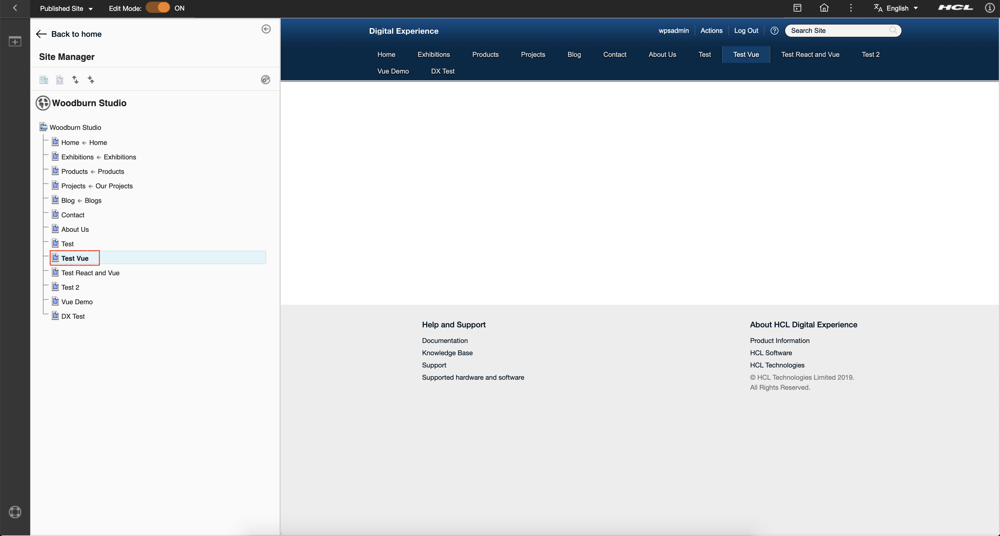
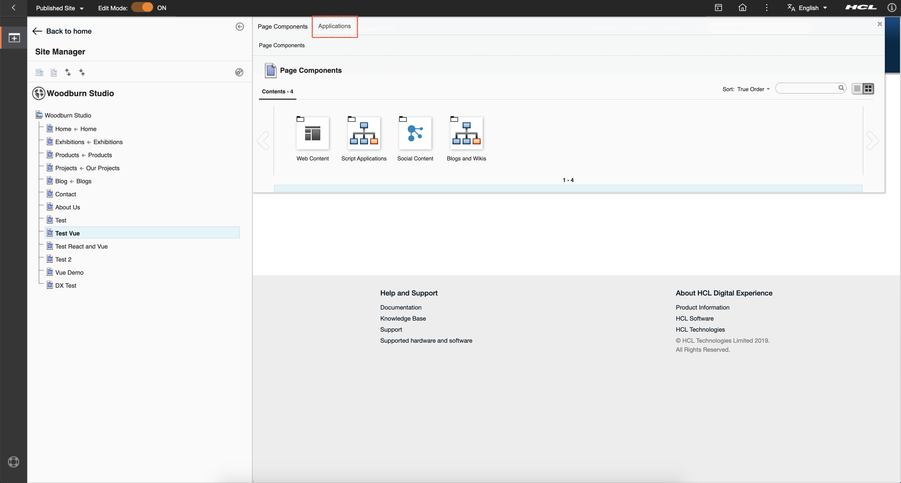
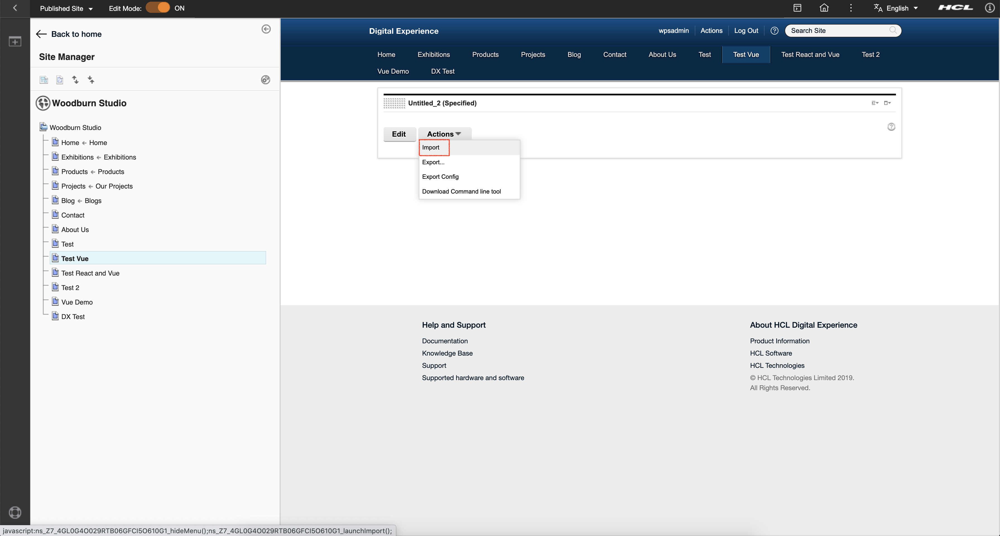
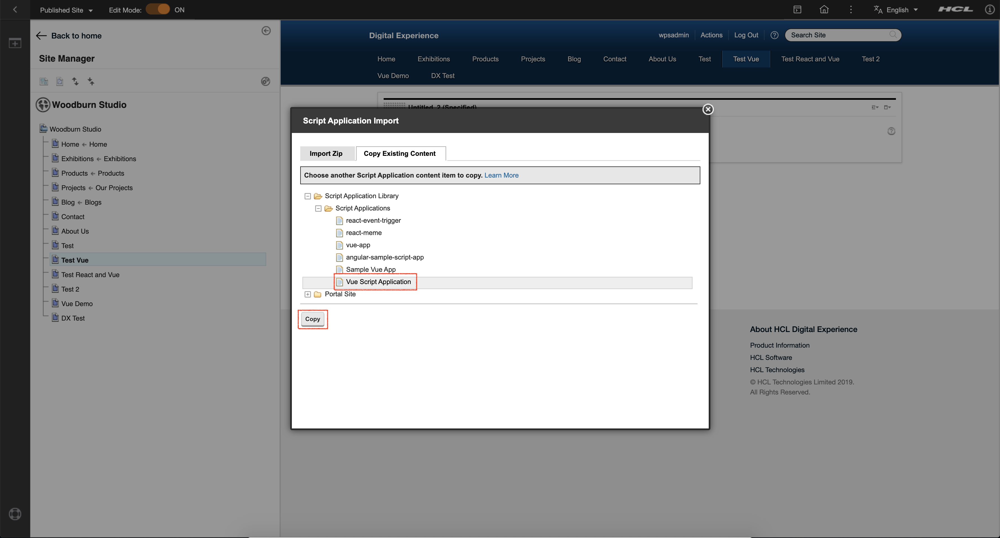
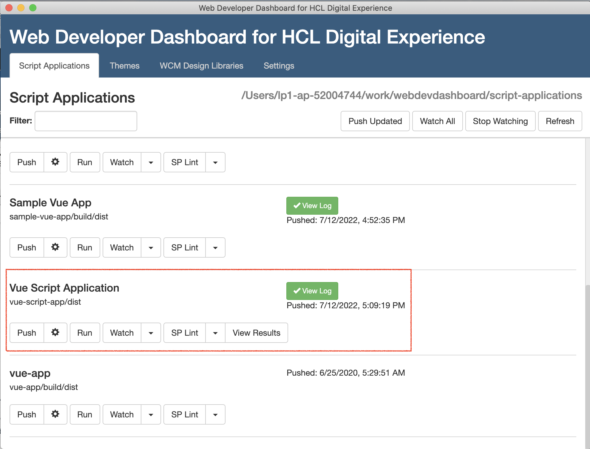
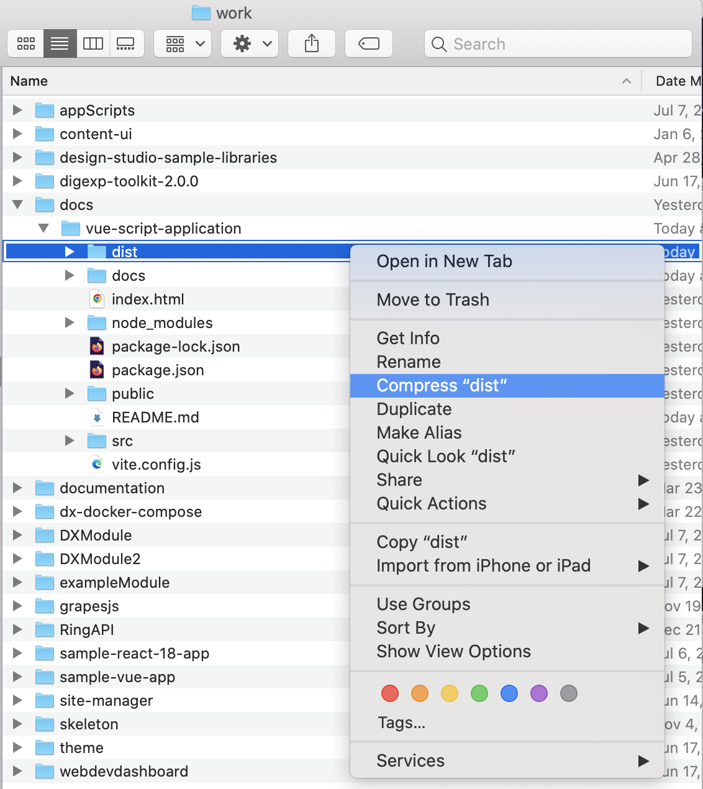
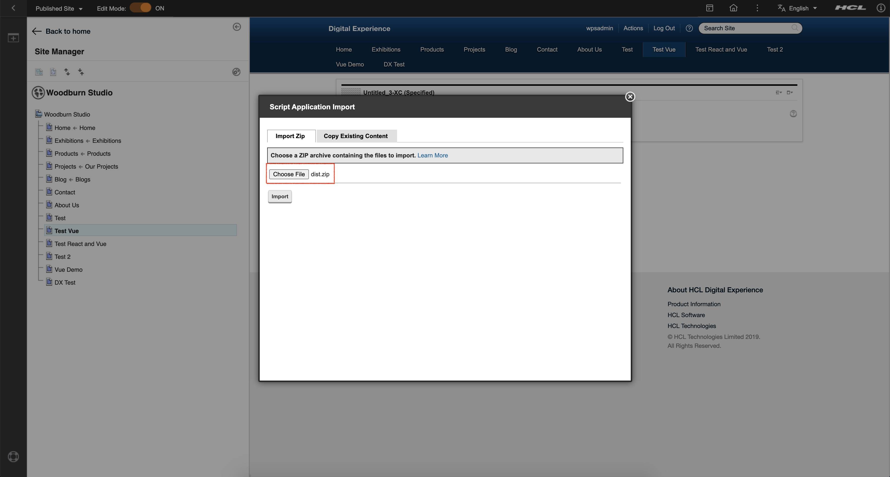
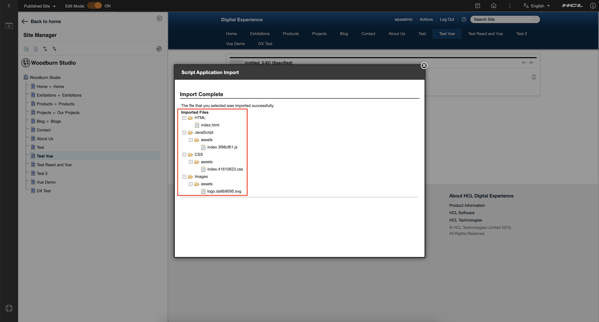
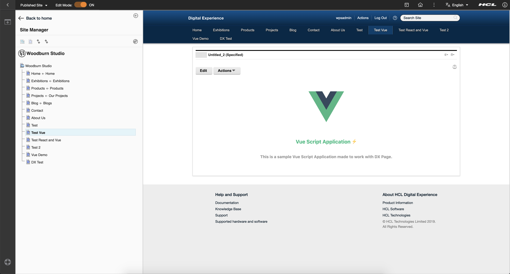

# How to Deploy a React App to DX as a ScriptApp
## Overview
This documentation demonstrates how to include a Vue Script Application Portlet in a DX Page with ViteJS Bundler from scratch.

## Setup
1. Run `npm init vue@latest` to scaffold a vue project. https://vuejs.org/guide/quick-start.html#with-build-tools

2. Run `npm install`

3. Open `vite.config.(ts or js)`. Add the `base: ""` config:
    ```js
    export default defineConfig({
        // Defaults to "/". By setting this to an empty string, it'll prevents urls to 
        // have initial "/" (i.e. `/assets/index.123456.js` -> `assets/index.123456.js`)
        base: ""
    })
    ```

4. Run `npm run build`. The `dist/` directory will be created.

5. Now go to Woodburn Studio and create a DX Page. Any Theme and any Profile will do. In this example, we're going to use **"Profile 8.5"** as the _Theme_ and **"Deferred"** as the _Profile_.
   

6. Add a Script Application Portlet inside the DX Page. This is where we will include our app. Just follow these steps:

    1. Click the plus icon on the left.
       

    2. Click the **_"Application"_** tab and search for **_"Script Application"_**.
       

    3. Drag the **_"Script Application"_** inside your page.
       

7. Upload the `dist/` directory to the Script Application Library in DX. There are **three(3) ways**:

    <details open>
    <summary>Using `dxclient` (recommended)</summary>

    1. Make sure that you have successfully installed `dxclient`:
        ```bash
        $ dxclient -V
        1.14.0
        ```
    2. On your `package.json`, include the following configs and scripts:
        ```json
        {
          ...
          "config": {
            "dxclient": {
              "wcmContentName": "Vue Script Application",
              "wcmSiteArea": "Script Application Library/Script Applications/",
              "mainHtmlFile": "index.html",
              "contentRoot": "./dist",
              "protocol": "https",
              "hostname": "localhost",
              "port": "10041"
            }
          },
          ...
          "scripts": {
            ...
            "dx-deploy-app": "dxclient deploy-scriptapplication push -dxUsername $dxUsername -dxPassword $dxPassword -wcmContentName \"$npm_package_config_dxclient_wcmContentName\" -wcmSiteArea \"$npm_package_config_dxclient_wcmSiteArea\" -mainHtmlFile $npm_package_config_dxclient_mainHtmlFile -contentRoot \"$npm_package_config_dxclient_contentRoot\" -dxProtocol $npm_package_config_dxclient_protocol -hostname $npm_package_config_dxclient_hostname -dxPort $npm_package_config_dxclient_port"
            ...
          },
          ...
        }
        ```
    3. Run the following command on your terminal:
        ```bash
        $ dxUsername=<username> dxPassword=<password> npm run dx-deploy-app
        ```

    4. If successful, it should prompt something like this:
        ```bash
        dxUsername=<username> dxPassword=<username> npm run dx-deploy-app

        > dx-deploy-app
        > dxclient deploy-scriptapplication push -dxUsername $dxUsername -dxPassword $dxPassword -wcmContentName "$npm_package_config_dxclient_wcmContentName" -wcmSiteArea "$npm_package_config_dxclient_wcmSiteArea" -mainHtmlFile $npm_package_config_dxclient_mainHtmlFile -contentRoot "$npm_package_config_dxclient_contentRoot" -dxProtocol $npm_package_config_dxclient_protocol -hostname $npm_package_config_dxclient_hostname -dxPort $npm_package_config_dxclient_port

        2022-07-19 20:01:42 : Begin content push to Portal.
        2022-07-19 20:01:42 : WCM content ID: .
        2022-07-19 20:01:42 : WCM Content Path: .
        2022-07-19 20:01:42 : WCM Content Title: .
        2022-07-19 20:01:42 : Main HTML file: index.html.
        2022-07-19 20:01:42 : PrebuiltZip path does not exist.
        2022-07-19 20:01:42 : Archive file:

            /var/folders/sm/pkgpc5952dl3cjc7j9fdt1xh0000gn/T/tmp--7409-VxmpEzHerpEU-.zip
            (23565 bytes in 5 files)

            assets/index.3f98cf61.js
            assets/index.41610623.css
            assets/logo.da9b9095.svg
            favicon.ico
            index.html.
        (node:7409) Warning: Setting the NODE_TLS_REJECT_UNAUTHORIZED environment variable to '0' makes TLS connections and HTTPS requests insecure by disabling certificate verification.
        (Use `node --trace-warnings ...` to show where the warning was created)
        2022-07-19 20:01:49 : Content push was successful.
        2022-07-19 20:01:49 : End content push to Portal.
        2022-07-19 20:01:49 : Body content: {"results":{"status":"success","importedFiles":{"file":[{"filename":"HTML/index.html"},{"filename":"JavaScript/assets/index.3f98cf61.js"},{"filename":"CSS/assets/index.41610623.css"},{"filename":"Images/assets/logo.da9b9095.svg"}]},"skippedFiles":"","message":"The file that you selected was imported successfully.","contentId":"4dc05bea-695b-4db0-a554-79206acf3261"}}.
        ```

    4. In the Script Application on your page, go to "**_Actions_** > **_Import_** > **_Copy Existing Content_**" and then find your application.
       
       We then click **"Copy"** button to get the content of the script application.
       
    </details>


    <details>
    <summary>Using Web Developer Dashboard</summary>

    1. Install `vite-plugin-static-copy` library.
        ```bash
        npm install -D vite-plugin-static-copy
        ```
    
    2. We need to create an `sp-config.json` in `src/` folder. It looks something like this:
        ```js
        // src/sp-config.json
        {
            "wcmContentName": "Vue Script Application"
        }
        ```

    3. Open `vite.config.(ts or js)`. Add the following code inside the `plugin` config array. We need this to copy the `sp-config.json` from the `src/` folder to the `dist/` folder.
        ```js
          import { viteStaticCopy } from 'vite-plugin-static-copy'

          // we copy the sp-config from src/ to the build/ directory
          viteStaticCopy({
            targets: [
                {
                    src: 'src/sp-config.json',
                    dest: '.'
                }
            ]
          }),
        ```
    
    4. Create a symbolic link to the build folder from the scripts directory
    
        **_Linux / MAC OS_**
        ```shell
        ln -s ~/path/to/vue-script-application/dist ~/path/to/dxdashboard/script/vue-script-app
        ```

        **_Windows:_**
        - Click the Start button
        - Type CMD in the Start Search box
        - Press and hold down [Ctrl]+[Shift]+[Enter] to start in administrator mode
        - Run the mklink command.
          
          ```
          mklink /D C:\path\to\dxdashboard\script\vue-script-app C:\path\to\vue-script-application\dist
          ```

    5. Run `npm run build` to build to the build folder. If the folder is properly linked into the script folder of the Dashboard, it will show on the list of Script Applications. Click **"Push"** to push your app in the DX Server.
    

    6. In the Script Application on your page, go to "**_Actions_** > **_Import_** > **_Copy Existing Content_**" and then find your application.
    
    We then click **"Copy"** button to get the content of the script application.
    
    </details>

    <details>
    <summary>Using "Import Zip File" from DX</summary>

    1. Compress your `dist/` folder in a zip file.
    

    2. In the Script Application on your page, go to "**_Actions_** > **_Import_** > **_Import Zip_**" and then choose your compressed `dist/` file.
    

    3. If imported successfully, it should look something like this:
    
    </details>

8. Lastly, verify if your Script Application works.
   

## Notes
As of the moment, this Vue Script Application does not leverage DX modular themes aggregator capability to provide Vue and its dependencies. This app's dependencies is tightly bundled with the generated js files of vite.

This means that if you have two (2) Vue Script Applications inside a DX Page, Vue dependency (along with the app's dependencies) will be loaded twice.
