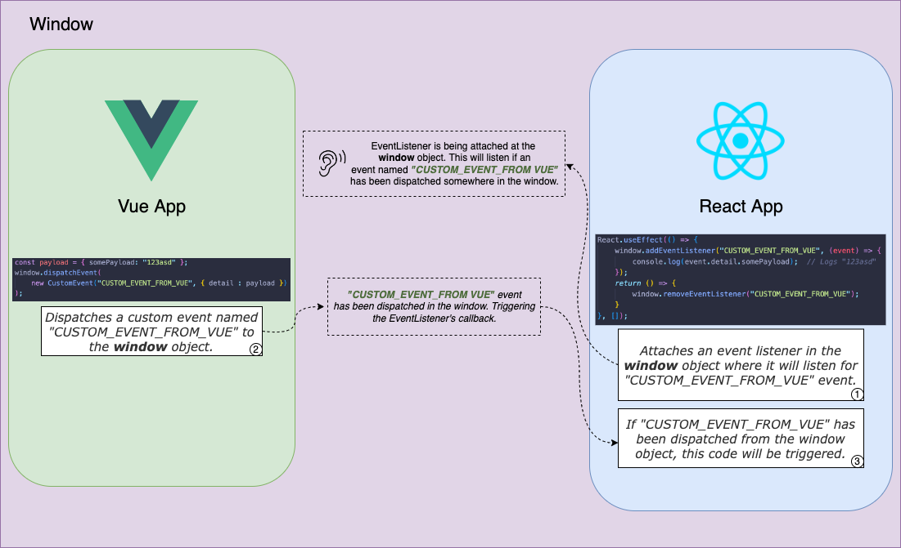
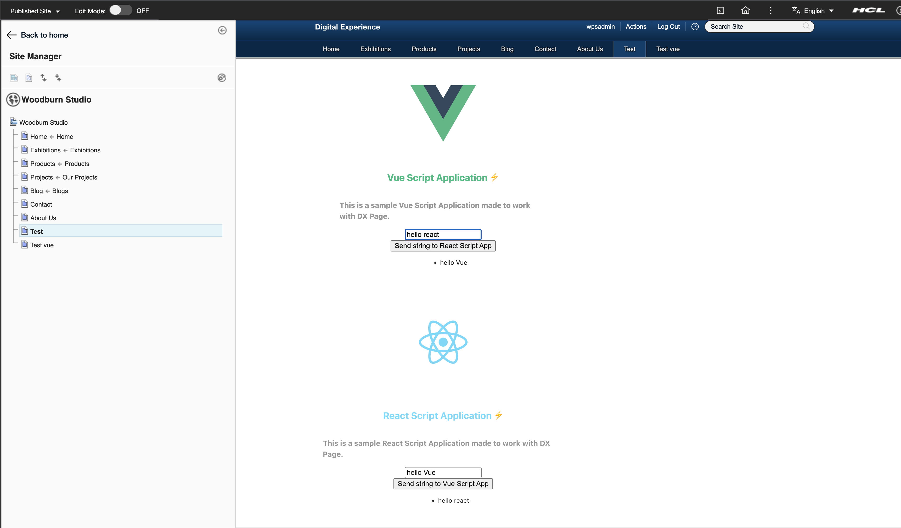

# How to Make React and Vue Apps Communicate via Events
## Overview
This documentation demonstrates how a React Script Application portlet can communicate to a Vue Script Application Portlet in a DX Page using window events.

## Under the hood
At the top level, we are attaching an event listener in the window object. Then, we dispatch "custom events" from a script application. When these custom events are triggered, the event listener will capture it, allowing us to pass payloads along the way. See the diagram below:



In this example, Vue Script Application is trying to pass some data (`{ somePayload: '123asd' }`) to React Script Application.

On React, we attached an event listener in the window object, stating that we are listening for any events that happens within its boundary with the name of `"CUSTOM_EVENT_FROM_VUE"`. We then get the payload from the event object.

On Vue, we then dispatch the custom event named `"CUSTOM_EVENT_FROM_VUE"` on the window and we also pass a payload on the `event.detail` object. See more [about `event.detail` property here](https://developer.mozilla.org/en-US/docs/Web/Events/Creating_and_triggering_events#adding_custom_data_%E2%80%93_customevent).

Since an event named "CUSTOM_EVENT_FROM_VUE" has been dispatched on a window, our event listener will trigger it's callback. In the diagram above, it will log `123asd`.

The same procedure goes with React to Vue communication. The only difference is where to put event listeners on React or Vue.

> **Note**: It is also important that you remove the event listeners using [`window.removeEventListener`](https://developer.mozilla.org/en-US/docs/Web/API/EventTarget/removeEventListener) once the component has unmounted or destroyed to avoid any memory leaks.

## Prerequisites
This document assumes that you already have a React Script Application and Vue Script Application setup already and is currently on a DX Page together. If not, please see the following links before proceeding:

- [React Script Application Setup](https://git.cwp.pnp-hcl.com/roquejr-almodiel/dx-scriptapps-education/tree/main/01WebpackWithDependencies#setup)
- [Vue Script Application Setup](https://git.cwp.pnp-hcl.com/roquejr-almodiel/dx-scriptapps-education/blob/main/09VueViteJS/README.MD#setup)

## Adding Event Listeners...
### On React
The best place to add event listeners in React Apps is thru `React.useEffect` [with its dependency array set to an empty array "`[]`"](https://reactjs.org/docs/hooks-effect.html#tip-optimizing-performance-by-skipping-effects).
```js
const CUSTOM_VUE_EVENT = "VUE_ON_SEND_CLICK_EVENT";

React.useEffect(() => {
    // adding event listener on window once the component is mounted
    window.addEventListener(CUSTOM_VUE_EVENT, (event) => {
        // unpacking any payload that Vue Script App has sent
        const payload = event.detail.somePayload;
        console.log(payload);
    });

    // remove the listener once the component has been unmounted to prevent any memory leaks
    return () => {
        window.removeEventListener(CUSTOM_VUE_EVENT);
    }
}, []);
```

### On Vue
The best place to add event listeners in Vue Apps is on [`onMounted()` lifecycle hook](https://vuejs.org/api/composition-api-lifecycle.html#onmounted).
```js
import { ref, onMounted, onUnmounted } from 'vue';

const CUSTOM_REACT_EVENT = "REACT_ON_SEND_CLICK_EVENT";

// adding event listener on window once the component is mounted
onMounted(() => {
    window.addEventListener(CUSTOM_REACT_EVENT, (event) => {
    // unpacking any payload that React Script App has sent
    const payload = event.detail.somePayload;
    console.log(payload);
  });
})

// remove the listener once the component has been unmounted to prevent any memory leaks
onUnmounted(() => {
  window.removeEventListener(CUSTOM_REACT_EVENT);
});
```

## Dispatching Event...
### On React
We dispatch events via [CustomEvent API](https://developer.mozilla.org/en-US/docs/Web/API/CustomEvent/CustomEvent) where we can create our own event, and pass payload thru [`detail` option](https://developer.mozilla.org/en-US/docs/Web/API/CustomEvent/detail).
```js
const CUSTOM_REACT_EVENT = "REACT_ON_SEND_CLICK_EVENT";

function sendToVue() {
  const payload = { somePayload: '123asd' };
  window.dispatchEvent(new CustomEvent(CUSTOM_REACT_EVENT, { detail : somePayload }));
}

// later...
<button onClick={sendToVue}>Send to React</button>
```

### On Vue
The procedure is the same as how we dispatch event in React.
```js
const CUSTOM_VUE_EVENT = "VUE_ON_SEND_CLICK_EVENT";

function sendToReact() {
  const payload = { somePayload: '123asd' };
  window.dispatchEvent(new CustomEvent(CUSTOM_VUE_EVENT, { detail : somePayload }));
}

// later...
<button @click="sendToReact()">Send to React</button>
```
## Verification

