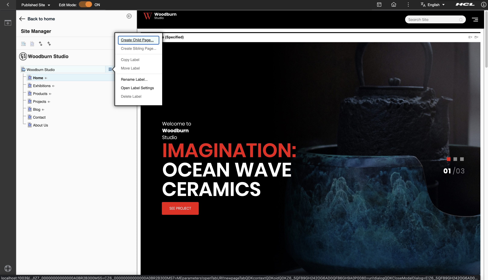

# Prepare a Page for Your Script Application

1. **If you have an existing target page for the Script Application, then skip to step #3**. Otherwise, you may create a sibling or child page under the Woodburn Studio site to have a temporary test page:
   

2. Enter a Page Title and choose the theme (in this case "Basic (Portal 8.5 Theme)") then click the Create Page button:
   

3. Right-click the menu button at the right of the target page and choose Open Page Settings.
   Edit the Page Properties by clicking the pen button:
   
    Open page settings

   
    Select edit page properties

4. Edit the theme settings in the Advanced tab. Select Theme(Portal 8.5) and Profile(Deferred with React) then click Save button.  
   
