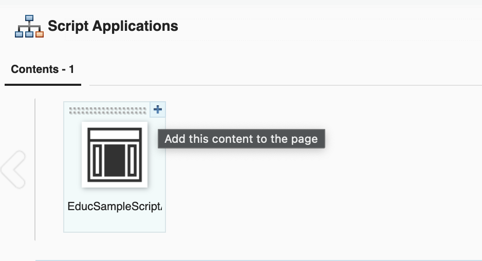

# Deploy DX ScriptApps without its dependencies

## Overview
This guide will detail the steps on how to deploy DX ScriptApps bundled without its dependencies. [Webpack](https://webpack.js.org/) is used to package the React Script App.

## PreRequisites
1. Follow the online guide on how to install HCL DXClient [DX9.5](https://help.hcltechsw.com/digital-experience/9.5/containerization/dxclient.html). Please note that the DX and/or DXClient link provided here may be superseded, you may use a newer version if available.  If you have replaced the default context root of your DX installation, you should update the [config.json](https://help.hcltechsw.com/digital-experience/9.5/containerization/dxclient.html) file of your DXClient accordingly.
    ```
    "dxContextRoot":"/wps",
    "contenthandlerPath": "/wps/mycontenthandler",
    "xmlConfigPath": "/wps/config",
    ```
2. The full deployment of the sample DX Module described in the guide [How To Deploy JavaScript Libraries/Dependencies as a DX Module](./02DependenciesAsModule.md) must be first completed. The generated DLL Manifest(i.e: dx-dll-manifest.json) in the DX Module folder is going to be referenced in this guide's instructions.

3. Add the 'Script Application Library' to the list of visible libraries in your DX Library Explorer. Follow the series of links via the Web Content menu: Preferences -> Edit Shared Settings. Don't forget to click on the OK button.  
   
   
   

## How To Bundle and Deploy DX ScriptApps Without Its Dependencies

1. Update the React app's package.json file.

    1. Set the name of the project and the main JavaScript or TypeScript file.
    ```
       {
           "name": "sample-app",
           ...
           "main": "./index.js",
           ...
       }
    ```
    2. Add the dxclient parameters as config. Double-check and update the config values as needed. Also, add the 2 deploy-dx-app lines as-is among the scripts. The variables in the scripts will automatically pick up the values from environment variables and config.)
    ```
       {
           ...
           "config": {
              "dxclient": {
                  "wcmContentName": "EducSampleApp",
                  "wcmSiteArea": "Script Application Library/Script Applications",
                  "mainHtmlFile": "index.html",
                  "contentRoot": "./dist-dx-scriptapp",
                  "protocol": "https",
                  "hostname": "localhost",
                  "port": "10041"
              }
           },
           "scripts": {
               ...
               "dx-deploy-app": "dxclient deploy-scriptapplication push -dxUsername $dxUsername -dxPassword $dxPassword -wcmContentName \"$npm_package_config_dxclient_wcmContentName\" -wcmSiteArea \"$npm_package_config_dxclient_wcmSiteArea\" -mainHtmlFile $npm_package_config_dxclient_mainHtmlFile -contentRoot \"$npm_package_config_dxclient_contentRoot\" -dxProtocol $npm_package_config_dxclient_protocol -hostname $npm_package_config_dxclient_hostname -dxPort $npm_package_config_dxclient_port",
               "dx-deploy-app-use-env": "dxclient deploy-scriptapplication push -dxUsername $dxUsername -dxPassword $dxPassword -wcmContentName \"$npm_package_config_dxclient_wcmContentName\" -wcmSiteArea \"$npm_package_config_dxclient_wcmSiteArea\" -mainHtmlFile $npm_package_config_dxclient_mainHtmlFile -contentRoot \"$npm_package_config_dxclient_contentRoot\" -dxProtocol $dxProtocol -hostname $dxHostname -dxPort $dxPort"
           },
           ...
       }
    ```
    3. Remove the dependencies that are redundant with the DX Module's scope(i.e: React, ReactDom). Create a dependency linking the folder of the DX Module to the current project.
    ```
             "dependencies": {
                 "dxmodules": "file:../../02DependenciesAsModule"
             },
    ```
    4. Add all the dev dependencies for the webpack bundler and all its plugins.
    ```   
             "devDependencies": {
                 "@babel/core": "^7.18.10",
                 "@babel/preset-env": "^7.18.10",
                 "@babel/preset-react": "^7.18.6",
                 "babel-loader": "^8.2.5",
                 "clean-webpack-plugin": "^4.0.0",
                 "copy-webpack-plugin": "^10.2.4",
                 "css-loader": "^6.7.1",
                 "css-minimizer-webpack-plugin": "^4.0.0",
                 "html-loader": "^4.1.0",
                 "html-webpack-plugin": "^5.5.0",
                 "mini-css-extract-plugin": "^2.6.1",
                 "mini-svg-data-uri": "^1.4.4",
                 "style-loader": "^3.3.1",
                 "ts-loader": "^9.3.1",
                 "typescript": "^4.7.4",
                 "webpack": "^5.74.0",
                 "webpack-cli": "^4.10.0",
                 "webpack-dev-server": "^4.9.3",
                 "webpack-merge": "^5.8.0"
             },
           ...
       }
    ```
2. Before using the NPM commands in the succeeding steps, set the PATH environment variable to prioritize the npm executable downloaded by the gradle npm plugin of the DX Module. This is necessary to be consistent with the one used during the DX Module build.
    ```
      cd <app-folder>
      export PATH=../../02DependenciesAsModule/.gradle/npm/npm-v8.15.0/bin/:$PATH
      which npm
      npm -v
    ```
3. Execute the npm install command.
    ```
      cd <app-folder>
      npm install
    ```
4. Find all the React Apps' JS and TS files (i.e: index.jsx, App.jsx, etc.), divert all imports of the libraries that are bundled in the DX Module (i.e: React, ReactDOM) to use the dxmodules alias set in package.json.
    ```
   // From
   import React from 'react';
   import ReactDOM from 'react-dom/client';
    ```
    ```
   // To
   import { ReactV18 } from 'dxmodules';
   const { React, ReactDOM } = ReactV18;
    ```
5. Add or update the webpack.common.js file. Set the main entry JS/TS file. Make sure to replace all old webpack bundlers (i.e: url-loader and file-loader) with the latest asset bundlers.
   ```
   const MiniCssExtractPlugin = require("mini-css-extract-plugin");
   const svgToMiniDataURI = require('mini-svg-data-uri');
   
   module.exports = {
       entry: {
           main: "./src/index.jsx",
       },
       resolve: {
           preferRelative: true,
           extensions: [".js", ".jsx", ".module.scss"]
       },
       module: {
           rules: [
               {
                   test: /\.(js|mjs|jsx|ts|tsx)$/,
                   exclude: /(node_modules|bower_components)/,
                   use: {
                       loader: 'babel-loader',
                       options: {
                           presets: ['@babel/preset-env','@babel/preset-react'],
                           cacheDirectory: true,
                       }
                   }
               },
               {
                   test: /\.(htm|html)$/,
                   use: ['html-loader'],
               },
               {
                   test: /\.(js|mjs|jsx|ts|tsx)$/,
                   use: 'ts-loader',
                   exclude: /node_modules/,
               },
               {
                   test: /\.s[ac]ss$/i,
                   use: [MiniCssExtractPlugin.loader, "css-loader", "sass-loader"],
               },
               {
                   test: /\.css$/,
                   use: ['style-loader', 'css-loader'],
               },
               {
                   test: /\.svg/,
                   type: 'asset/inline',
                   generator: {
                       dataUrl: content => {
                           content = content.toString();
                           return svgToMiniDataURI(content);
                       }
                   }
               },
               {
                   test: /\.(png|jpg|jpeg|gif|woff|woff2|ttf|eot)$/,
                   type: 'asset'
               },
           ],
   
       }
   };
   
   ```
6. Add or update a webpack.dev.js file. This configuration is intended for the development cycle only (via npm start) and will not be used for DX deployment.
   ```
   const path = require('path');
   const common = require('./webpack.common');
   const { merge } = require('webpack-merge'); // New import based on the 5.0.3 changelog
   const HTMLWebpackPlugin = require('html-webpack-plugin');
   
   module.exports = merge (common, {
       mode: "development",
       devtool: 'eval',
       entry: {
           // Note: point this to the DX Module project
           dxmodulesstyles: path.resolve(__dirname, '../../02DependenciesAsModule/styles-index.css'),
       },
       output: {
           filename: "[name].bundle.js",
           path: path.resolve(__dirname, "dist-dev"),
       },
       plugins: [
           new HTMLWebpackPlugin({
               template: "./src/index.html"
           })
       ],
       module: {
           rules: [
           ]
       }
   });
   ```
    1. Add a separate build entry pointing to the styles index file of the DX Module. This will simulate the styling injection that will be done by DX in the HTML header of a DX page.
    ```
      entry: {
        // Note: point this to the DX Module project
        dxmodulesstyles: path.resolve(__dirname, '../../02DependenciesAsModule/styles-index.css'),
      },
    ```
    2. Configure the temporary output folder, make sure the folder is not the same as the one for the DX deployment build.
    ```
      output: {
        filename: "[name].bundle.js",
        path: path.resolve(__dirname, "dist-dev"),
      },
    ```  
    3. Configure the HTML wrapper and assets that will be used when running the ScriptApp via npm start:
    ```
      plugins: [
        new HTMLWebpackPlugin({
            template: "./src/index.html"
        }),
      ],
    ```   
7. Add or update the webpack.dx-scriptapp.js file. This is the main bundler configuration that will be used for building the DX ScriptApp.
   ```
   const path = require("path");
   const common = require("./webpack.common");
   const webpack = require('webpack');
   const { merge } = require('webpack-merge');
   const {CleanWebpackPlugin} = require("clean-webpack-plugin");
   const MiniCssExtractPlugin = require("mini-css-extract-plugin");
   const OptimizeCssAssetsPlugin = require("css-minimizer-webpack-plugin");
   const TerserPlugin = require("terser-webpack-plugin");
   const { DllReferencePlugin } = require('webpack');
   const HTMLWebpackPlugin = require('html-webpack-plugin');
   const CopyPlugin = require("copy-webpack-plugin");
   
   module.exports = merge(common, {
       mode: "production",
       output: {
           filename: "[name].[contenthash].bundle.js",
           path: path.resolve(__dirname, "dist-dx-scriptapp")
       },
       optimization: {
           minimizer: [
               new OptimizeCssAssetsPlugin(),
               new TerserPlugin(),
               new HTMLWebpackPlugin({
                   template: "./src/index.html",
                   minify: {
                       removeAttributeQuotes: true,
                       removeComments: true,
                       collapseWhitespace: false,
                   }
               })
           ]
       },
       plugins: [
           new CopyPlugin({
               patterns: [
                   './src/sp-config.json',
               ]
           }),
           new webpack.IgnorePlugin({
               resourceRegExp: /dxmodules\//,
           }),
           new DllReferencePlugin({
               // Note: important to point to the DX Module folder that has the needed dependencies
               context: path.resolve(__dirname, '../../02DependenciesAsModule'),
               manifest: require('../../02DependenciesAsModule/dx-dll-manifest.json'),
           }),
           new MiniCssExtractPlugin({
               filename: "[name].[contenthash].css"
           }),
           new CleanWebpackPlugin(),
       ],
       module: {
           rules: [
           ]
       },
   });
   ```
    1. Set the folder path and filenames for the bundled files. Make sure the output folder (dist-dx-scriptapp) is the same as the one defined as config.dxclient.contentRoot in the package.json file.
    ```
       output: {
        filename: "[name].[contenthash].bundle.js",
        path: path.resolve(__dirname, "dist-dx-scriptapp")
       },
    ```
    2. Add a minimizer for the optimization step.
    ```
       optimization: {
           minimizer: [
              new OptimizeCssAssetsPlugin(),
              new TerserPlugin(),
              new HTMLWebpackPlugin({
                template: "./src/index.html",
                minify: {
                    removeAttributeQuotes: true,
                    removeComments: true,
                    collapseWhitespace: false,
                }
              })
           ]
       },
    ```
    3. Add the DllReferencePlugin and MiniCSSExtractPlugin in the plugins section. Make sure the context and manifest points to the required DX Module.
    ```
       plugins: [
          ...
          new DllReferencePlugin({
            // Note: important to point to the DX Module folder that has the needed dependencies
            context: path.resolve(__dirname, '../../02DependenciesAsModule'),
            manifest: require('../../02DependenciesAsModule/dx-dll-manifest.json'),
          }),
          new MiniCssExtractPlugin({
            filename: "[name].[contenthash].css"
          }),
          ...
       ],
    ```
9. Add if not yet included in the project, a tsconfig.json file.
    ```
   {
      "compilerOptions": {
        "outDir": "./dist/",
        "noImplicitAny": true,
        "module": "es6",
        "target": "es5",
        "allowJs": true,
        "moduleResolution": "node",
        "resolveJsonModule": true,
        "esModuleInterop": true
      }
   }
    ```
10. Test the app locally.
     ```
       cd <app-folder>
       npm start
     ```
11. Build the ScriptApp using the following commands:
     ```
       cd <app-folder>
       npm run build
     ```
12. Execute the npm script dx-deploy-app, pre-set with the DX admin username and password.
```
   dxUsername=<username> dxPassword=<password> npm run dx-deploy-app 
       > sample-app@1.0.0 dx-deploy-app
       > dxclient deploy-scriptapplication push -dxUsername $dxUsername -dxPassword $dxPassword -wcmContentName "$npm_package_config_dxclient_wcmContentName" -wcmSiteArea "$npm_package_config_dxclient_wcmSiteArea" -mainHtmlFile $npm_package_config_dxclient_mainHtmlFile -contentRoot "$npm_package_config_dxclient_contentRoot" -dxProtocol $npm_package_config_dxclient_protocol -hostname $npm_package_config_dxclient_hostname -dxPort $npm_package_config_dxclient_port
    
       2022-08-19 22:57:36 : Begin content push to Portal.
       2022-08-19 22:57:36 : WCM content ID: .
       2022-08-19 22:57:36 : WCM Content Path: .
       2022-08-19 22:57:36 : WCM Content Title: .
       2022-08-19 22:57:36 : Main HTML file: index.html.
       2022-08-19 22:57:36 : PrebuiltZip path does not exist.
       2022-08-19 22:57:36 : Archive file:
    
               /var/folders/8x/4zt3nlmn6sg1574fb4pdz56w0000gp/T/tmp--31802-W4L6zoRtZi5a-.zip
               (13834 bytes in 4 files) 
    
               4fe75d5f9adb18067b85.ico
               index.html
               main.bfc69d9380a37f7c3db2.bundle.js
               sp-config.json.
       (node:31802) Warning: Setting the NODE_TLS_REJECT_UNAUTHORIZED environment variable to '0' makes TLS connections and HTTPS requests insecure by disabling certificate verification.
       (Use `node --trace-warnings ...` to show where the warning was created)
       2022-08-19 22:57:39 : Content push was successful.
       2022-08-19 22:57:39 : End content push to Portal.
       2022-08-19 22:57:39 : Body content: {"results":{"status":"success","importedFiles":{"file":[{"filename":"HTML/index.html"},{"filename":"JavaScript/main.bfc69d9380a37f7c3db2.bundle.js"}]},"skippedFiles":"","message":"The file that you selected was imported successfully.","contentId":"8ce2958e-86b0-4700-b6f1-ef7542c10f86"}}. 
```
11. If there's a deployment error, check the DXClient logs in the &lt;app-folder&gt;/store/logs/logger.log file.
12. Prepare your target DX page that will host the ScriptApp. ([Guide](#how-to-prepare-a-dx-page-for-dx-scriptapps))
13. Add the ScriptApp (matching the wcmContentName in the package.json config) into the target DX page. ([Guide](#how-to-add-a-deployed-dx-scriptapp-into-a-dx-page))

## How to Prepare a DX Page for DX ScriptApps
1. If you have an existing target page for the ScriptApp skip to step #3. Otherwise, you may create a sibling or child page under Woodburn Studio site to have a temporary test page:
   

2. Enter a Page Title and choose Basic(Portal 8.5 Theme) then click the Create Page button:
   

3. Right-click the menu button at the right of the target page.
   Choose Open Page Settings.
   Edit the Page Properties by clicking the pen button:
       
   

4. Edit the theme settings in the Advanced tab, Theme(Portal 8.5) and Profile(Deferred with React) then click Save button:
   

## How To Add a Deployed DX ScriptApp into a DX Page
1. Click the [+] Add page components and applications icon near the upper left-most side:
   

2. Click the Script Application icon:
   

3. Check if the script is loaded successfully:
   

4. Click the Add this content to the page [+] button:
   

5. Click the page name and check if the script is rendered correctly.
   
6. Turn-off edit mode and check the page.
