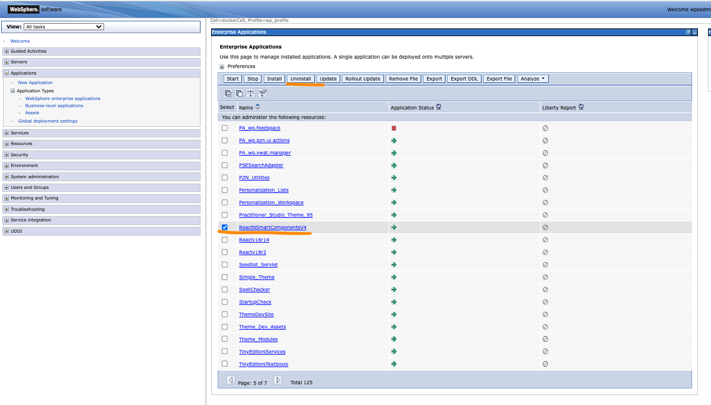
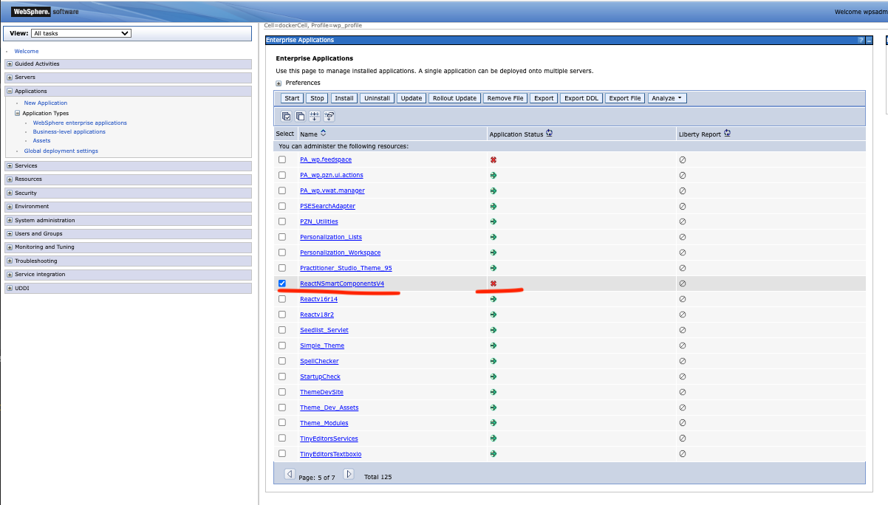
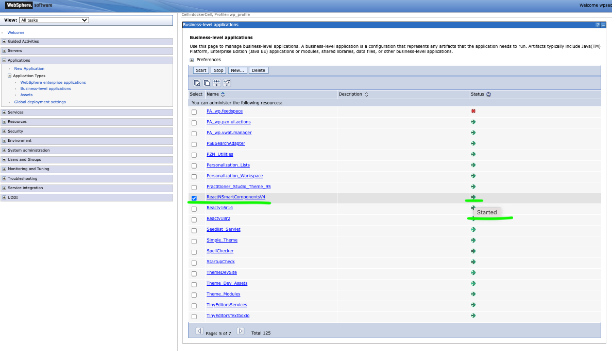
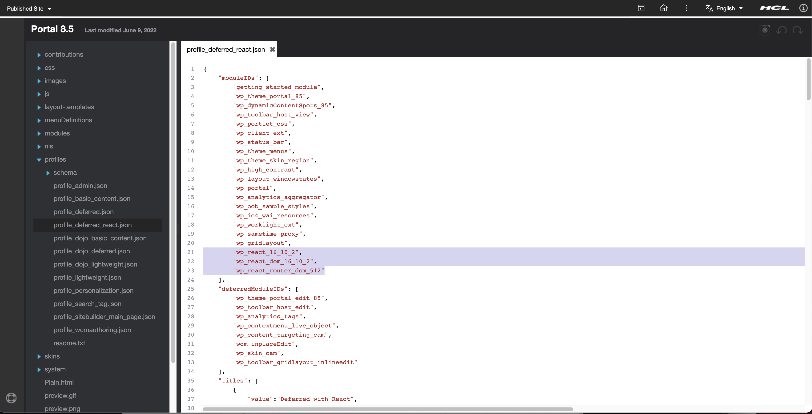
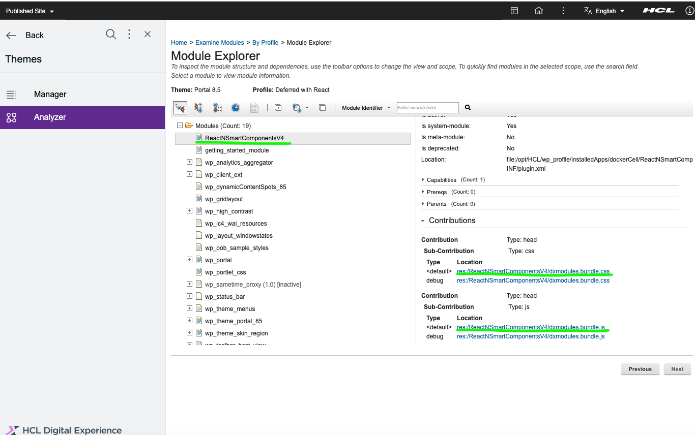
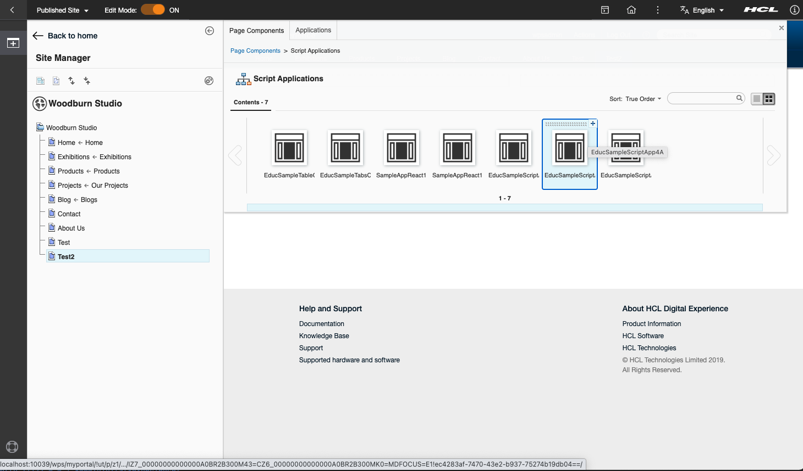
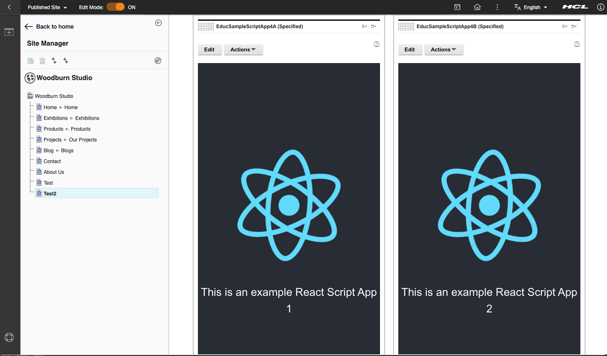

# Deploy multiple DX ScriptApps with shared dependencies

# General Information
The steps needed to make DX ScriptApps use and share dependencies are detailed in this guide. The dependencies are going to be bundled in a DX Module and will then be linked for use in a DX Page. The ScriptApps will then be bundled and deployed without its dependencies, will reference and reuse the dependencies in the DX Module.

The included sample codes combine NPM, Gradle and Webpack configuration to achieve the following:
- Be able to resolve all shared libraries or Node modules within Integrated Development Environments (IDEs i.e: Visual Studio Code and Intellij). Leverage on full features like autocompletion of properties and functions of components even if they are defined in a separate project for the bundled modules.
- Be able to debug and run the DX ScriptApps locally during development (i.e: npm start).
- Be able to deploy all DX ScriptApps and their shared DX Modules into the target DX Core instance (dev/staging/prod).
- Components bundled and deployed in DX Modules are only going to be loaded once during page rendering, even when used by multiple dependent DX ScriptApps.

# Table of Contents
- [Requirements](#requirements)
- [How To Bundle and Deploy Javascript Libraries/Dependencies and Shared Styling as a DX Module](#how-to-bundle-and-deploy-javascript-librariesdependencies-and-shared-styling-as-a-dx-module)
- [How To Bundle and Deploy DX ScriptApps Without Its Dependencies](#how-to-bundle-and-deploy-dx-scriptapps-without-its-dependencies)

# Requirements
### Java Runtime Engine
- Java Runtime Engine with a Long Term Support (LTS) version is needed to be able to run the embedded Gradle wrapper in this project. Java version 17 is recommended.
### HCL DXClient
- HCL DXClient is required for deployments. Follow the online guide on how to install HCL DXClient [DX9.5](https://help.hcltechsw.com/digital-experience/9.5/containerization/dxclient.html). Please note that the DX and/or DXClient link provided here may be superseded, you may use a newer version if available. If you have replaced the default context root of your DX installation, you should update the [config.json]() file of your DXClient accordingly.
    ```
    "dxContextRoot":"/wps",
    "contenthandlerPath": "/wps/mycontenthandler",
    "xmlConfigPath": "/wps/config",
    ```

### ScriptApp Placeholder
- Add the 'Script Application Library' to the list of visible libraries in your DX Library Explorer. Follow the series of links via the Web Content menu: Preferences -> Edit Shared Settings. Don't forget to click on the OK button.  
  
  
  

# How To Bundle and Deploy Javascript Libraries/Dependencies and Shared Styling as a DX Module
This section details a streamlined build process that automates the creation of the artifacts for DX modules and provide a capability to upload it to the DX Websphere Application Server (WebSphere).

The Gradle Project includes the following areas of functionality:
- [Webpack](https://webpack.js.org/) build script to package JavaScript libraries into a Web Archive (WAR) file
- Replacement of names and labels in WebSphere deployment descriptors. 
- Packaging of the WAR file into an Enterprise Application Archive (EAR) file
- Deployment of the DX Module (EAR file) to WebSphere via DXClient

## How To Create a Gradle Project To Bundle The Common Dependencies of ScriptApps into a DX Module
DX Modules are artifacts that may include bundled Javascript and Styling (CSS, SCSS) files that DX can then inject into the HTML header of the DX Pages. Frontend modules are aggregated by DX and then cached by browsers by default and will deliver performance improvements to the loading sequence of DX pages.

1. Add gradle wrapper scripts and library to your project.
   - Copy files from existing gradle projects. Recreate the folder structure in your new project.
      - gradle/wrapper/gradle-wrapper.jar
      - gradle/wrapper/gradle-wrapper.properties
      - gradlew
      - gradlew.bat
   - OR [install gradle](https://gradle.org/install/) and run [gradle wrapper](https://docs.gradle.org/current/userguide/gradle_wrapper.html#sec:adding_wrapper).
2. Create a gradle.properties file and set the node and npm version required. Set nodeInstall to false if the existing executables of the current environment is preferred. The gradle project included in this guide is going to be capable of downloading and using its own set of node and npm executables for the build process.
    ```
    nodeInstall=true
    nodeVersion=16.17.0
    npmVersion=8.15.0
    ```
   Add the details of the DX deployment target. They will be relayed as parameters whenever the DXClient executable is called by the deploy tasks.
    ```
    dxProtocol=https
    dxHostname=localhost
    dxPort=10041
    dxProfileName=wp_profile
    ```
3. Create or update the src/main/WebAppDxModule/package.json file to enumerate the libraries that will be added to the DX Module.
    ```
    {
      "name": "WebAppDxModule",
      "version": "1.0.0",
      "description": "",
      "main": "modules-index.js",
      "scripts": {
        "test": "echo \"Error: no test specified\" && exit 1",
        "build-dxmodules": "webpack --config  webpack.dxmodules.js"
      },
      "author": "",
      "license": "ISC",
      "dependencies": {
        "react": "^18.2.0",
        "react-dom": "^18.2.0"
      },
      "devDependencies": {
        "css-loader": "^6.7.1",
        "file-loader": "^6.2.0",
        "mini-css-extract-plugin": "^2.6.0",
        "mini-svg-data-uri": "^1.4.4",
        "terser-webpack-plugin": "^5.3.3",
        "ts-loader": "^9.3.1",
        "typescript": "^4.7.4",
        "webpack": "^5.73.0",
        "webpack-cli": "^4.10.0"
      },
      "overrides": {}
    }
    ```
   Make sure to set the main file to modules-index.js
    ```
    "main": "modules-index.js",
    ```
   Make sure to add the build-dx-modules among the scripts:
    ```
    "scripts": {
      ...
      "build-dxmodules": "webpack --config  webpack.dxmodules.js"
    },
    ```

4. Add a src/main/WebAppDxModule/module-index.js file. Enumerate the Javascript libraries and components via import and export commands in the file. Provide descriptive aliases for the group of libraries and components that will be included.
    ```
    /* Import and Export Main Libraries
     */
    import React from 'react';
    import ReactDOM from 'react-dom/client';
    export const ReactV18 = {
        React,
        ReactDOM,
    }
    
    /* Import and Export 3rd-Party Libraries
       Sample:
    
            import { Table } from 'smart-webcomponents-react/table';
            import { Tabs, TabItem, TabItemsGroup } from 'smart-webcomponents-react/tabs';
    
            export const SmartWebComponents = {
                Table, Tabs, TabItem, TabItemsGroup
            }
     */
    
    /* Export Custom Data and/or Services
       Sample:
            export * as CommonData from './common/data/data';
     */
    
    /* Export index file for the styles (added here to be able to share the filename of JS bundle's alias in Webpack entry config).
     */
    export * from './styles-index.css'
    ```
5. Add a src/main/WebAppDxModule/styles-index.css file. Enumerate via import statements the component styling (CSS, SCSS, etc.) required that are not yet imported by any JS nor HTML files in the modules-index.js. Leave it empty if no imports are needed at the moment.
    ```
    /* sample import:
     *    @import 'smart-webcomponents-react/source/styles/smart.default.css';
    */
    ```
6. Add a settings.gradle file. Set the value of the rootProject.name. It will be used as the name of the DX Module (war file, ear file, etc.) and the names and ids in the deployment descriptors (web context path, etc.).
    ```
    rootProject.name = 'ReactNReactDOMv18r2'
    ```
7. Add a build.gradle file with the following content:
    ```
    plugins {
        id 'ear'
        id 'war'
        id "com.github.node-gradle.node" version "3.4.0"
    }
    
    group 'com.company.dx.module.custom'
    //version '1.0-SNAPSHOT'
    
    sourceCompatibility=11
    targetCompatibility=11
    
    repositories {
        mavenLocal()
        mavenCentral()
        maven {
            url "https://plugins.gradle.org/m2/"
        }
    }
    
    dependencies {
        deploy files(war)
    }
    
    task npmInstallDXModule(type: NpxTask) {
        workingDir = file("${project.projectDir}/src/main/WebAppDXModule")
        command = 'npm'
        args = ['install']
    }
    
    task npmBuildDxModule (type: NpxTask, dependsOn: 'npmInstallDXModule'){
        workingDir = file("${project.projectDir}/src/main/WebAppDXModule")
        command = 'npm'
        args = ['run','build-dxmodules']
    }
    
    //Processing the template files with proper data.
    task deleteWebXml{
        delete(file("build/tmp/war/web.xml"))
    }
    
    task prepareWebXml (type: Copy, dependsOn: 'deleteWebXml'){
        from 'src/main/config/war/web.xml'
        into 'build/tmp/war/'
        filter { it.replaceAll('@@auto-replaced-with-rootProject.name@@', rootProject.name) }
    }
    
    war {
        dependsOn npmBuildDxModule, prepareWebXml
        webAppDirectory = file('src/main/WebAppDXModule/static/')
        webXml = file('build/tmp/war/web.xml')
        from ('src/main/config/war/WEB-INF/') {
            include '*'
            into 'WEB-INF'
            filter { it.replaceAll('@@auto-replaced-with-rootProject.name@@', rootProject.name) }
        }
        from ('src/main/WebAppDXModule/dist-dx-module') {
            include '*'
            into '/'
        }
        manifest {
            attributes 'Manifest-Version': 1
            attributes 'Created-By': rootProject.name
        }
    }
    
    ear {
        setLibDirName(null)
        deploymentDescriptor {
            setDisplayName(rootProject.name)
            webModule(rootProject.name+'.war', '/'+rootProject.name)
            setVersion('1.4')
        }
        from ('src/main/config/ear/META-INF/') {
            include '*'
            into 'META-INF'
        }
        manifest {
            attributes 'Manifest-Version': 1
            attributes 'Created-By': rootProject.name
        }
    }
    
    def getParamValue(String paramName){
        if (project.hasProperty(paramName)){
            return project.getProperty(paramName)
        }
        if (System.getProperties().containsKey(paramName)){
            return System.getProperty(paramName)
        }
        return ""
    }
    
    def checkRequiredParam(String paramName){
        if (getParamValue(paramName).trim()==""){
            throw new GradleException("#### Required gradle parameter or env value: -D$paramName=<****> OR -P$paramName=<****> ")
        }
    }
    
    task deployDxModule(type:Exec, dependsOn:'ear') {
        doFirst{
            checkRequiredParam("dxUsername")
            checkRequiredParam("dxPassword")
            logger.quiet('cd build/libs/')
            logger.quiet('dxclient deploy-application'+
                    ' --dxUsername ****'+
                    ' --dxPassword ****'+
                    ' --dxConnectUsername ****'+
                    ' --dxConnectPassword ****'+
                    ' --applicationFile '+ rootProject.name+'.ear'+
                    ' --applicationName '+ rootProject.name+
                    ' --dxProtocol '+ project.getProperty("dxProtocol")+
                    ' --hostname '+ project.getProperty("dxHostname")+
                    ' --dxPort '+ project.getProperty("dxPort")+
                    ' --dxProfileName '+ project.getProperty("dxProfileName"));
        }
        workingDir './build/libs'
        commandLine 'dxclient', 'deploy-application',
                    '--dxUsername', getParamValue("dxUsername"),
                    '--dxPassword', getParamValue("dxPassword"),
                    '--dxConnectUsername', getParamValue("dxUsername"),
                    '--dxConnectPassword', getParamValue("dxPassword"),
                    '--applicationFile', rootProject.name+'.ear',
                    '--applicationName', rootProject.name,
                    '--dxProtocol', project.getProperty("dxProtocol"),
                    '--hostname', project.getProperty("dxHostname"),
                    '--dxPort', project.getProperty("dxPort"),
                    '--dxProfileName', project.getProperty("dxProfileName")
        standardOutput = new ByteArrayOutputStream()
        ext.output = {
            return standardOutput.toString()
        }
    }
    
    def scriptApps = ['WebAppScriptApp01', 'WebAppScriptApp02']
    def allScriptAppsTasks = []
    
    scriptApps.each{ scriptApp ->
        def appName = scriptApp.replaceAll('WebApp','').replaceAll('webapp','').replaceAll('-','').replaceAll('_','');
        allScriptAppsTasks.add (
            tasks.create( 'npmInstall'+appName, NpxTask) {
                shouldRunAfter = ['deployDxModule']
                workingDir = file("${project.projectDir}/src/main/${scriptApp}")
                command = 'npm'
                args = ['install']
            });
        allScriptAppsTasks.add (
            tasks.create( 'npmBuild'+appName, NpxTask) {
                dependsOn = ['npmInstall'+appName]
                shouldRunAfter = ['deployDxModule']
                workingDir = file("${project.projectDir}/src/main/${scriptApp}")
                command = 'npm'
                args = ['run', 'build']
            });
        allScriptAppsTasks.add (
            tasks.create( 'deploy'+appName, NpxTask) {
                dependsOn = ['npmBuild'+appName]
                shouldRunAfter = ['deployDxModule']
                environment = ['dxUsername':getParamValue("dxUsername"),
                               'dxPassword':getParamValue("dxPassword"),
                               'dxProtocol':project.getProperty("dxProtocol"),
                               'dxHostname':project.getProperty("dxHostname"),
                               'dxPort':project.getProperty("dxPort")]
                workingDir = file("${project.projectDir}/src/main/${scriptApp}")
                command = 'npm'
                args = ['run', 'dx-deploy-app-use-env']
            });
    }
    
    task deployAllScriptApps(type:Exec, dependsOn: allScriptAppsTasks){
        // an array named allScriptAppsTasks was dynamically generated from the scriptApps array to contain all build tasks
        // all tasks needed were invoked via dependsOn parameter
        commandLine 'echo',' Task deployAllScriptApps Done'
    }
    
    task deployAll(type:Exec, dependsOn: ['deployDxModule', 'deployAllScriptApps']){
        // all tasks needed were invoked via dependsOn parameter
        commandLine 'echo',' Task deployAll Done'
    }
    
    if (project.hasProperty("nodeInstall")) {
        // Workaround node grade plugin not working on apple silicon https://github.com/node-gradle/gradle-node-plugin/issues/154
        OperatingSystem os = org.gradle.nativeplatform.platform.internal.DefaultNativePlatform.getCurrentOperatingSystem()
        Architecture arch = org.gradle.nativeplatform.platform.internal.DefaultNativePlatform.getCurrentArchitecture()
        Boolean downloadNode = !os.isMacOsX() || arch.isAmd64()
        node {
            version = project.getProperty("nodeVersion")
            npmVersion = project.getProperty("npmVersion")
            download = downloadNode
        }
    
        // Copy local node and npm to a fixed location for npmw
        def fixedNode = tasks.register("fixedNode", Copy) {
            from nodeSetup
            into 'build/node'
        }
        tasks.named("nodeSetup").configure { finalizedBy fixedNode }
    
        def fixedNpm = tasks.register("fixedNpm", Copy) {
            from npmSetup
            into 'build/node'
        }
        tasks.named("npmSetup").configure { finalizedBy fixedNpm }
    }
    ```

   Update the list of ScriptApps in this following array in the build.gradle file so that they may be included in the apps to be built and deployed during the deployAll or deployAllScriptApps gradle task.
    ```
    def scriptApps = ['WebAppScriptApp01', 'WebAppScriptApp02']
    ```
   Update the workingDir base path accordingly in the task creation portion above needed for the ScriptApps.
    ```
                ...
                tasks.create( 'npmInstall'+appName, NpxTask) {
                    ...
                    workingDir = file("${project.projectDir}/src/main/${scriptApp}")
                ...
                tasks.create( 'npmBuild'+appName, NpxTask) {
                    ...
                    workingDir = file("${project.projectDir}/src/main/${scriptApp}")
                ...
                tasks.create( 'deploy'+appName, NpxTask) {
                    ...
                    workingDir = file("${project.projectDir}/src/main/${scriptApp}")
                ...
    ```
9. Add a src/main/WebAppDxModule/webpack.dxmodules.js file.
    ```
    const path = require("path");
    const TerserPlugin = require("terser-webpack-plugin");
    const MiniCssExtractPlugin = require('mini-css-extract-plugin');
    const { DllPlugin } = require('webpack');
    const svgToMiniDataURI = require('mini-svg-data-uri');
    
    module.exports = {
        entry: {
            dxmodules: './modules-index.js'
        },
        mode: "production",
        target: 'node',
        output: {
            filename: "[name].bundle.js",
            path: path.resolve(__dirname, "dist-dx-module"),
            library: "[name]_[fullhash]"
        },
        plugins: [
            new DllPlugin({
                name: "[name]_[fullhash]",
                path: path.resolve(__dirname, "./dx-dll-manifest.json"),
                format: true,
            }),
            new MiniCssExtractPlugin({
                filename: "[name].bundle.css",
            })
        ],
        resolve: {
            extensions: ['.ts', '.js', '.json']
        },
        optimization: {
            minimizer: [
                new TerserPlugin(),
            ]
        },
        module: {
            rules: [
                {
                    test: /\.(js|mjs|jsx|ts|tsx)$/,
                    use: 'ts-loader',
                    exclude: /node_modules/,
                },
                {
                    test: /\.css$/,
                    use: [
                        MiniCssExtractPlugin.loader,
                        'css-loader'
                    ],
                    exclude: [
                        /smart-/
                    ]
                },
                {
                    test: /\.scss$/,
                    use: [
                        MiniCssExtractPlugin.loader,
                        'css-loader',
                        'sass-loader'
                    ],
                },
                {
                    test: /\.svg/,
                    type: 'asset/inline',
                    generator: {
                        dataUrl: content => {
                            content = content.toString();
                            return svgToMiniDataURI(content);
                        }
                    }
                },
                {
                    test: /\.(png|jpg|jpeg|gif|woff|woff2|ttf|eot)$/,
                    type: 'asset'
                },
            ]
        },
    };
    ```

10. Create the was.policy file in the src/main/config/ear/META-INF folder:
     ```
     //
     // Template policy file for enterprise application.
     // Extra permissions can be added if required by the enterprise application.
     //
     // NOTE: Syntax errors in the policy files will cause the enterprise application FAIL to start.
     //       Extreme care should be taken when editing these policy files. It is advised to use
     //       the policytool provided by the JDK for editing the policy files
     //       (WAS_HOME/java/jre/bin/policytool). 
     //
    
     grant codeBase "file:${application}" {
         permission java.security.AllPermission;
     };
    
     grant codeBase "file:${jars}" {
         permission java.security.AllPermission;
     };
    
     grant codeBase "file:${connectorComponent}" {
         permission java.security.AllPermission;
     };
    
     grant codeBase "file:${webComponent}" {
         permission java.security.AllPermission;
     };
    
     grant codeBase "file:${ejbComponent}" {
         permission java.security.AllPermission;
     };
    
     ```
11. Create the ibm-web-bnd.xmi file in the src/main/config/war/WEB-INF folder:
    ```
    <?xml version="1.0" encoding="UTF-8"?>
    <webappbnd:WebAppBinding xmi:version="2.0" xmlns:xmi="http://www.omg.org/XMI" xmlns:webappbnd="webappbnd.xmi" xmi:id="WebAppBinding_1203959801006" virtualHostName="default_host">
      <webapp href="WEB-INF/web.xml#@@auto-replaced-with-rootProject.name@@"/>
    </webappbnd:WebAppBinding>
    ```
12. Create the ibm-web-ext.xmi file in the src/main/config/war/WEB-INF folder:
    ```
    <?xml version="1.0" encoding="UTF-8"?>
    <webappext:WebAppExtension xmi:version="2.0" xmlns:xmi="http://www.omg.org/XMI" xmlns:webappext="webappext.xmi" xmi:id="WebAppExtension_1203959801006" reloadInterval="3" reloadingEnabled="true" additionalClassPath="" fileServingEnabled="true" directoryBrowsingEnabled="false" serveServletsByClassnameEnabled="false" preCompileJSPs="false">
      <webApp href="WEB-INF/web.xml#@@auto-replaced-with-rootProject.name@@"/>
      <jspAttributes xmi:id="JSPAttribute_1" name="jdkSourceLevel" value="15"/>
      <jspAttributes xmi:id="JSPAttribute_2" name="keepgenerated" value="false"/>
    </webappext:WebAppExtension>
    ```
13. Create the plugin.xml file in the src/main/config/war/WEB-INF folder:
    ```
    <?xml version="1.0" encoding="UTF-8" standalone="yes"?>
    <?eclipse version="3.0"?>
    <plugin id="@@auto-replaced-with-rootProject.name@@" name="@@auto-replaced-with-rootProject.name@@" version="1.0.0" provider-name="IBM">
    
        <extension point="com.ibm.portal.resourceaggregator.module" id="@@auto-replaced-with-rootProject.name@@">
            <module id="@@auto-replaced-with-rootProject.name@@">
                <contribution type="head">
                    <sub-contribution type="js">
                        <uri value="res:{war:context-root}/dxmodules.bundle.js"/>
                        <uri type="debug" value="res:{war:context-root}/dxmodules.bundle.js"/>
                    </sub-contribution>
                </contribution>
                <contribution type="head">
                    <sub-contribution type="css">
                        <uri value="res:{war:context-root}/dxmodules.bundle.css"/>
                        <uri type="debug" value="res:{war:context-root}/dxmodules.bundle.css"/>
                    </sub-contribution>
                </contribution>
            </module>
        </extension>
    </plugin>
    ```
14. Create the template web.xml file in the src/main/config/war folder:
    ```
    <?xml version="1.0" encoding="UTF-8"?>
    <web-app id="@@auto-replaced-with-rootProject.name@@" version="2.4" xmlns="http://java.sun.com/xml/ns/j2ee" xmlns:xsi="http://www.w3.org/2001/XMLSchema-instance" xsi:schemaLocation="http://java.sun.com/xml/ns/j2ee http://java.sun.com/xml/ns/j2ee/web-app_2_4.xsd">
        <display-name>@@auto-replaced-with-rootProject.name@@</display-name>
        <context-param>
            <description>A regular expression that defines which of the resources in the war file can be served by the portal res datasource.</description>
            <param-name>com.ibm.portal.resource.whitelist</param-name>
            <param-value>.*</param-value>
        </context-param>
        <context-param>
            <description>A regular expression that defines which of the resources in the war file cannot be served by the portal res datasource.</description>
            <param-name>com.ibm.portal.resource.blacklist</param-name>
            <param-value>WEB-INF/.*</param-value>
        </context-param>
    </web-app>
    ```
15. Add a src/main/WebAppDxModule/tsconfig.json file:
    ```
    {
      "compilerOptions": {
        "outDir": "./dist/",
        "noImplicitAny": true,
        "module": "es6",
        "target": "es5",
        "allowJs": true,
        "moduleResolution": "node",
        "resolveJsonModule": true,
        "esModuleInterop": true
      }
    }
    ```

## How To Build and Deploy DX Modules
1. Build and deploy the DX module with the following command. Change the `{username}` and `{password}` with the proper admin credentials. If you wish to manually upload the EAR file, use the _npmBuildDxModule_ task (without the -D parameters) instead of the _deployDxModule_ in the commands below.

   **For Uploads via DXClient:**

   - On non-Windows machine
   ```
    ./gradlew deployDxModule -DdxUsername={username} -DdxPassword={password}
   ```
   - On Windows machine
   ```
    gradlew.bat deployDxModule -DdxUsername={username} -DdxPassword={password}
   ```
   Sample successful _deployDxModule_ log:
   ```
        > Task :npmInstallDXModule
        up to date, audited 167 packages in 932ms
        24 packages are looking for funding
          run `npm fund` for details
        found 0 vulnerabilities
        > Task :npmBuildDxModule
        > webapp-dx-module@1.0.0 build-dxmodules
        > webpack --config  webpack.dxmodules.js
        asset dxmodules.bundle.js 137 KiB [compared for emit] [minimized] (name: dxmodules) 1 related asset
        asset dxmodules.bundle.css 97 bytes [compared for emit] (name: dxmodules)
        Entrypoint dxmodules 137 KiB = dxmodules.bundle.css 97 bytes dxmodules.bundle.js 137 KiB
        orphan modules 2.89 KiB (javascript) 937 bytes (runtime) [orphan] 8 modules
        runtime modules 670 bytes 3 modules
        built modules 143 KiB (javascript) 96 bytes (css/mini-extract) [built]
          modules by path ./node_modules/ 142 KiB
            modules by path ./node_modules/react-dom/ 131 KiB 3 modules
            modules by path ./node_modules/react/ 6.94 KiB
              ./node_modules/react/index.js 190 bytes [built] [code generated]
              ./node_modules/react/cjs/react.production.min.js 6.75 KiB [built] [code generated]
            modules by path ./node_modules/scheduler/ 4.33 KiB
              ./node_modules/scheduler/index.js 198 bytes [built] [code generated]
              ./node_modules/scheduler/cjs/scheduler.production.min.js 4.14 KiB [built] [code generated]
          dll dxmodules 12 bytes [built] [code generated]
          ./modules-index.js 764 bytes [built] [code generated]
          css ./node_modules/css-loader/dist/cjs.js!./styles-index.css 96 bytes [built] [code generated]
        webpack 5.74.0 compiled successfully in 9087 ms
        > Task :deployDxModule
        cd build/libs/
        dxclient deploy-application --dxUsername **** --dxPassword **** --dxConnectUsername **** --dxConnectPassword **** --applicationFile Reactv18r2.ear --applicationName Reactv18r2 --dxProtocol https --hostname localhost --dxPort 10041 --dxProfileName wp_profile
        BUILD SUCCESSFUL in 1m 41s
        10 actionable tasks: 6 executed, 4 up-to-date
   ```
   **To prepare for manual uploads:**

   - On non-Windows machine
   ```
    ./gradlew npmBuildDxModule
   ```
   - On Windows machine
   ```
    gradlew.bat npmBuildDxModule
   ```
   Sample successful _npmBuildDxModule_ log:
   ```
        > Task :npmInstallDXModule
        up to date, audited 167 packages in 979ms
        24 packages are looking for funding
          run `npm fund` for details
        found 0 vulnerabilities
        > Task :npmBuildDxModule
        > webapp-dx-module@1.0.0 build-dxmodules
        > webpack --config  webpack.dxmodules.js
        asset dxmodules.bundle.js 137 KiB [compared for emit] [minimized] (name: dxmodules) 1 related asset
        asset dxmodules.bundle.css 97 bytes [compared for emit] (name: dxmodules)
        Entrypoint dxmodules 137 KiB = dxmodules.bundle.css 97 bytes dxmodules.bundle.js 137 KiB
        orphan modules 2.89 KiB (javascript) 937 bytes (runtime) [orphan] 8 modules
        runtime modules 670 bytes 3 modules
        built modules 143 KiB (javascript) 96 bytes (css/mini-extract) [built]
          modules by path ./node_modules/ 142 KiB
            modules by path ./node_modules/react-dom/ 131 KiB 3 modules
            modules by path ./node_modules/react/ 6.94 KiB
              ./node_modules/react/index.js 190 bytes [built] [code generated]
              ./node_modules/react/cjs/react.production.min.js 6.75 KiB [built] [code generated]
            modules by path ./node_modules/scheduler/ 4.33 KiB
              ./node_modules/scheduler/index.js 198 bytes [built] [code generated]
              ./node_modules/scheduler/cjs/scheduler.production.min.js 4.14 KiB [built] [code generated]
          dll dxmodules 12 bytes [built] [code generated]
          ./modules-index.js 764 bytes [built] [code generated]
          css ./node_modules/css-loader/dist/cjs.js!./styles-index.css 96 bytes [built] [code generated]
        webpack 5.74.0 compiled successfully in 10093 ms
        BUILD SUCCESSFUL in 52s
        6 actionable tasks: 4 executed, 2 up-to-date
   ```
2. If you intend to manually upload the EAR file, follow this [guide](#optional-how-to-manually-upload-the-ear-file-to-websphere) and skip the next step below.
3. In case the _deployDxModule_ task returned an error, check the DXClient logs in the build/libs/store/logs/ folder.
4. Please read the [Important Configuration Items to Note](#important-configuration-items-to-note).
5. Verify and link the DX Module to a DX Theme. Follow this [guide](#how-to-verify-a-successful-deployment-and-link-a-dx-module-to-a-dx-theme).

## Optional: How to manually upload the EAR file to WebSphere
1. Check the EAR file generated in the build/libs folder.
2. Login to your WebSphere console.
3. Navigate to the new application window by opening the Application tab in the left-hand side. Double check if there's an existing module with the same name. If the module exists, you are required to manually uninstall first. Don't forget to click on the save link.
   
   
4. Click the new application link.
   
5. Click the New Enterprise Application link
6. Click the Browse button to select the newly generated EAR file in the new directory `build/libs`
   
7. For now, you can click the next buttons as you go through the Install New Application process.
8. Click the Finish button when you arrive in the last step.
   
9. The upload progress will be shown next.
   
10. When it is done, click the Save link near the bottom.
    
11. For manual uploads, the module needs to be started manually as well. Click on Application Types -> Websphere enterprise applications link. Find and select the new module and then click on the start button.
    
    

# Important Configuration Items to Note
1. Take note of the location of the generated DLL manifest as configured in the DllPlugin section of src/main/WebAppDxModule/webpack.dxmodules.js The location and content of the manifest are critical as it is required to optimize and correctly build the dependent DX ScriptApps.
```
    entry: {
        dxmodules: './modules-index.js'
    },
    mode: "production",
    target: 'node',
    output: {
        filename: "[name].bundle.js",
        path: path.resolve(__dirname, "dist-dx-module"),
        library: "[name]_[fullhash]"
    },
    plugins: [
        new DllPlugin({
            name: "[name]_[fullhash]",
            path: path.resolve(__dirname, "./dx-dll-manifest.json"),
            format: true,
        }),
        new MiniCssExtractPlugin({
            filename: "[name].bundle.css",
        })
    ],
```
2. You may need to take note of the generated library name (with the added fullhash) and the exported component aliases in the generated DLL manifest src/main/WebAppDxModule/dx-dll-manifest.json. Please keep in mind that even _minor edits in the DX module_ will result to a modified fullhash in the library name that _will then require the dependent DX ScriptApps to be rebuilt and redeployed_. It is recommended to keep the fullhash suffix in the webpack library name config mentioned in previous step.
```
    {
      "name": "dxmodules_95f93ddf879a86d4093f",
      "content": {
        "./modules-index.js": {
          "id": 635,
          "buildMeta": {
            "tsLoaderDefinitionFileVersions": [
              "node_modules/smart-webcomponents-react/table/table.d.ts@0",
              "node_modules/smart-webcomponents-react/index.d.ts@0",
              ...
              ...
              "common/data/data.js@0"
            ],
            "tsLoaderFileVersion": 0,
            "exportsType": "namespace"
          },
      "exports": [
        "CommonData",
        "ReactV18",
        "SmartWebComponents"
      ]
    }
```
3. Any change in the aliases in both the entry config or in the output filenames in webpack.dxmodules.js, will require corresponding changes to DX Module's deployment descriptor file src/main/config/war/WEB-INF/plugin.xml. The Javascript and styling files in the output folder src/main/WebAppDXModule/dist-dx-module must correspond to the files listed in the  deployment descriptor. All @@auto-replaced-with-rootProject.name@@ tokens are dynamically replaced by the rootProject.name value set in settings.gradle.
```
    ...
    <module id="@@auto-replaced-with-rootProject.name@@">
        <contribution type="head">
            <sub-contribution type="js">
                <uri value="res:{war:context-root}/dxmodules.bundle.js"/>
                <uri type="debug" value="res:{war:context-root}/dxmodules.bundle.js"/>
            </sub-contribution>
        </contribution>
        <contribution type="head">
            <sub-contribution type="css">
                <uri value="res:{war:context-root}/dxmodules.bundle.css"/>
                <uri type="debug" value="res:{war:context-root}/dxmodules.bundle.css"/>
            </sub-contribution>
        </contribution>
    </module>
    ...
```

# How To Verify A Successful Deployment and Link a DX Module to a DX Theme
1. To verify, login to the WebSphere console. Under the *Applications* tab, then the *Application Types* and then lastly in the *Business-level applications*, you can search for your application name in the table in the right-hand side. Make sure that the status of the module is started.
   
2. To verify inside HCL Digital Experience:
   Click the Themes option in the Applications Menu, then click the Menu button at the upper left part of the screen.
   
   Click the Manager Menu at the left side
   
   Click Pencil Button at the right side of the theme to be used (i.e. Portal 8.5)
   
   Go to profiles->profile_deferred_react.json then remove the 3 highlighted moduleIDs
   
   Add the new module to be added (i.e. ReactNReactDOMv18r2). Click on the Save button (disc icon) in the upper right area.
   
   Click the Analyzer Menu then click the Examine modules by profile
   
   Navigate to Examine modules by profile and click the module used then click Next button
   
   Expand Modules and the module uploaded must be there (i.e. ReactNReactDOMv18r2). Note: there must be no warning icon in the uploaded module.
   

## How to Prepare a DX Page for DX ScriptApps
1. If you have an existing target page for the ScriptApp skip to step #3. Otherwise, you may create a sibling or child page under Woodburn Studio site to have a temporary test page:
   

2. Enter a Page Title and choose Basic(Portal 8.5 Theme) then click the Create Page button:
   

3. Right-click the menu button at the right of the target page.
   Choose Open Page Settings.
   Edit the Page Properties by clicking the pen button:
       
   

4. Edit the theme settings in the Advanced tab, Theme(Portal 8.5) and Profile(Deferred with React) then click Save button:
   

## How To Add a Deployed DX ScriptApp into a DX Page
1. Click the [+] Add page components and applications icon near the upper left-most side:
   

2. Click the Script Application icon:
   

3. Click the [+] _Add this content to the page_ button at the upper-right portion of the ScriptApp icon. You may also drag-and-drop the icon to the specific section of the DX page.
   
4. Click the page name and check if the script is rendered correctly.
   

5. Repeat steps #1 to #3 for the remaining ScriptApps.

6. Turn-off edit mode and check the page.

## How To Bundle and Deploy DX ScriptApps Without Its Dependencies

This section will describe the steps on how to bundle and deploy a React app to become a DX ScriptApp. The steps will include the use of the DLL manifest generated during the build of the DX Module to be able to exclude the dependencies in the deployment bundle.

1. Create a separate folder for each of the ScriptApp in the src/main/ folder (i.e: src/main/WebAppScriptApp01/, src/main/WebAppScriptApp02/)
2. Create or update each of the ScriptApp's package.json file.
   1.  Set the name of the project and the main JavaScript or TypeScript file.
    ```
       {
           "name": "sample-app-4a",
           ...
           "main": "./src/index.jsx",
           ...
       }
    ```
   2. Add the dxclient parameters as config. Double-check and update the config values as needed. Also, add the 2 deploy-dx-app lines as-is among the scripts. The variables in the scripts will automatically pick up the values from environment variables and config.)
    ```
       {
           ...
           "config": {
              "dxclient": {
                  "wcmContentName": "EducSampleApp",
                  "wcmSiteArea": "Script Application Library/Script Applications",
                  "mainHtmlFile": "index.html",
                  "contentRoot": "./dist-dx-scriptapp",
                  "protocol": "https",
                  "hostname": "localhost",
                  "port": "10041"
              }
           },
           "scripts": {
               ...
               "dx-deploy-app": "dxclient deploy-scriptapplication push -dxUsername $dxUsername -dxPassword $dxPassword -wcmContentName \"$npm_package_config_dxclient_wcmContentName\" -wcmSiteArea \"$npm_package_config_dxclient_wcmSiteArea\" -mainHtmlFile $npm_package_config_dxclient_mainHtmlFile -contentRoot \"$npm_package_config_dxclient_contentRoot\" -dxProtocol $npm_package_config_dxclient_protocol -hostname $npm_package_config_dxclient_hostname -dxPort $npm_package_config_dxclient_port",
               "dx-deploy-app-use-env": "dxclient deploy-scriptapplication push -dxUsername $dxUsername -dxPassword $dxPassword -wcmContentName \"$npm_package_config_dxclient_wcmContentName\" -wcmSiteArea \"$npm_package_config_dxclient_wcmSiteArea\" -mainHtmlFile $npm_package_config_dxclient_mainHtmlFile -contentRoot \"$npm_package_config_dxclient_contentRoot\" -dxProtocol $dxProtocol -hostname $dxHostname -dxPort $dxPort"
           },
           ...
       }
    ```
   3. Remove the dependencies that are redundant with the dxmodules' scope(i.e: React, ReactDom). Create a dependency linking the folder of the dxmodule to the current project.
    ```
       {
           ...
             "dependencies": {
                 "dxmodules": "file:../WebAppDXModule"
             },
    ```
   4. Add all the dev dependencies for the webpack bundler and all its plugins.
    ```   
             "devDependencies": {
                 "@babel/core": "^7.18.10",
                 "@babel/preset-env": "^7.18.10",
                 "@babel/preset-react": "^7.18.6",
                 "babel-loader": "^8.2.5",
                 "clean-webpack-plugin": "^4.0.0",
                 "css-loader": "^6.7.1",
                 "css-minimizer-webpack-plugin": "^4.0.0",
                 "html-loader": "^4.1.0",
                 "html-webpack-plugin": "^5.5.0",
                 "mini-css-extract-plugin": "^2.6.1",
                 "mini-svg-data-uri": "^1.4.4",
                 "style-loader": "^3.3.1",
                 "ts-loader": "^9.3.1",
                 "typescript": "^4.7.4",
                 "webpack": "^5.74.0",
                 "webpack-cli": "^4.10.0",
                 "webpack-dev-server": "^4.9.3",
                 "webpack-merge": "^5.8.0"
             },
           ...
       }
    ```
3. Before using the NPM commands in the succeeding steps, set the PATH environment variable to prioritize the npm executable downloaded by the gradle npm plugin of the DX Module. This is necessary to be consistent with the one used during the DX Module build.
    ```
    cd src/main/<app-folder>
    export PATH=../.gradle/npm/npm-v8.15.0/bin/:$PATH
    which npm
    npm -v
    ```
4. Execute the npm install command.
     ```
     cd src/main/<app-folder>
     npm install
     ```
5. Find all the React Apps' JS and TS files (i.e: index.jsx, App.jsx, etc.), divert all imports of the libraries that are bundled in the DX Module (i.e: React, ReactDOM) to use the dxmodules alias set in package.json.
    ```
   // From
   import React from 'react';
   import ReactDOM from 'react-dom/client';
   import { Tabs, TabItem } from 'smart-webcomponents-react/tabs';
    ```
    ```
   // To
   import { ReactV18, SmartWebComponents } from 'dxmodules';
   const { React, ReactDOM } = ReactV18;
   const { Tabs, TabItem } = SmartWebComponents;
    ```

6. Assign a unique id for each of the root html tags of the ScriptApps.
   1. src/main/WebAppScriptApp01/src/index.html
    ```
        <div id="scriptapp01-root"></div>
    ```
   2. src/main/WebAppScriptApp01/src/index.jsx
    ```
        const root = ReactDOM.createRoot(document.getElementById('scriptapp01-root'));
    ```
   3. src/main/WebAppScriptApp02/public/index.html
    ```
        <div id="scriptapp02-root"></div>]()
    ```
   4. src/main/WebAppScriptApp02/index.jsx
    ```
        const root = ReactDOM.createRoot(document.getElementById('scriptapp02-root'));
    ```

7. Add or update the webpack.common.js file to each of the ScriptApps (i.e: src/main/WebAppScriptApp01/webpack.common.js, src/main/WebAppScriptApp02/webpack.common.js). Set the main entry JS/TS file. Make sure to replace all old webpack bundlers (i.e: url-loader and file-loader) with the latest asset bundlers.
    ```
    const MiniCssExtractPlugin = require("mini-css-extract-plugin");
    const svgToMiniDataURI = require('mini-svg-data-uri');
    
    module.exports = {
        entry: {
            main: "./src/index.jsx",
        },
        resolve: {
            preferRelative: true,
            extensions: [".js", ".jsx", ".module.scss"]
        },
        module: {
            rules: [
                {
                    test: /\.(js|mjs|jsx|ts|tsx)$/,
                    exclude: /(node_modules|bower_components)/,
                    use: {
                        loader: 'babel-loader',
                        options: {
                            presets: ['@babel/preset-env','@babel/preset-react'],
                            cacheDirectory: true,
                        }
                    }
                },
                {
                    test: /\.(htm|html)$/,
                    use: ['html-loader'],
                },
                {
                    test: /\.(js|mjs|jsx|ts|tsx)$/,
                    use: 'ts-loader',
                    exclude: /node_modules/,
                },
                {
                    test: /\.s[ac]ss$/i,
                    use: [MiniCssExtractPlugin.loader, "css-loader", "sass-loader"],
                },
                {
                    test: /\.css$/,
                    use: ['style-loader', 'css-loader'],
                },
                {
                    test: /\.svg/,
                    type: 'asset/inline',
                    generator: {
                        dataUrl: content => {
                            content = content.toString();
                            return svgToMiniDataURI(content);
                        }
                    }
                },
                {
                    test: /\.(png|jpg|jpeg|gif|woff|woff2|ttf|eot)$/,
                    type: 'asset'
                },
            ],
    
        }
    };
    
    ```
8. Add or update a webpack.dev.js file to each of the ScriptApps (i.e: src/main/WebAppScriptApp01/webpack.dev.js, src/main/WebAppScriptApp02/webpack.dev.js). This configuration is intended for the development cycle only (via npm start) and will not be used for DX deployment.
   ```
   const path = require('path');
   const common = require('./webpack.common');
   const { merge } = require('webpack-merge'); // New import based on the 5.0.3 changelog
   const HTMLWebpackPlugin = require('html-webpack-plugin');
   
   module.exports = merge (common, {
       mode: "development",
       devtool: 'eval',
       entry: {
           // Note: point this to the DX Module project
           dxmodulesstyles: path.resolve(__dirname, '../../02DependenciesAsModule/styles-index.css'),
       },
       output: {
           filename: "[name].bundle.js",
           path: path.resolve(__dirname, "dist-dev"),
       },
       plugins: [
           new HTMLWebpackPlugin({
               template: "./src/index.html"
           })
       ],
       module: {
           rules: [
           ]
       }
   });
   ```
   - Configure the build entry pointing to the styles index file of the DX Module. This will simulate the styling injection that will be done by DX in the HTML header of a DX page.
    ```
      entry: {
        // Note: point this to the DX Module project
        dxmodulesstyles: path.resolve(__dirname, '../WebAppDXModule/styles-index.css'),
      },
    ```
   - Configure the temporary output folder, make sure the folder is not the same as the one for the DX deployment build.
    ```
      output: {
        filename: "[name].bundle.js",
        path: path.resolve(__dirname, "dist-dev"),
      },
    ```  
   - Configure the HTML wrapper and assets that will be used when running the ScriptApp via npm start:
    ```
      plugins: [
        new HTMLWebpackPlugin({
            template: "./src/index.html"
        }),
      ],
    ```   
9. Add or update the webpack.dx-scriptapp.js file to each of the ScriptApps (i.e: src/main/WebAppScriptApp01/webpack.dx-scriptapp.js, src/main/WebAppScriptApp02/webpack.dx-scriptapp.js). This is the main bundler configuration that will be used for building the DX ScriptApp.
    ```
    const path = require("path");
    const common = require("./webpack.common");
    const webpack = require('webpack');
    const { merge } = require('webpack-merge');
    const {CleanWebpackPlugin} = require("clean-webpack-plugin");
    const MiniCssExtractPlugin = require("mini-css-extract-plugin");
    const OptimizeCssAssetsPlugin = require("css-minimizer-webpack-plugin");
    const TerserPlugin = require("terser-webpack-plugin");
    const { DllReferencePlugin } = require('webpack');
    const HTMLWebpackPlugin = require('html-webpack-plugin');
    const CopyPlugin = require("copy-webpack-plugin");
    
    module.exports = merge(common, {
        mode: "production",
        output: {
            filename: "[name].[contenthash].bundle.js",
            path: path.resolve(__dirname, "dist-dx-scriptapp")
        },
        optimization: {
            minimizer: [
                new OptimizeCssAssetsPlugin(),
                new TerserPlugin(),
                new HTMLWebpackPlugin({
                    template: "./src/index.html",
                    minify: {
                        removeAttributeQuotes: true,
                        removeComments: true,
                        collapseWhitespace: false,
                    }
                })
            ]
        },
        plugins: [
            new CopyPlugin({
                patterns: [
                    './src/sp-config.json',
                ]
            }),
            new webpack.IgnorePlugin({
                resourceRegExp: /dxmodules\//,
            }),
            new DllReferencePlugin({
                context: path.resolve(__dirname, '../WebAppDxModule'),
                manifest: require('../WebAppDxModule/dx-dll-manifest.json'),
            }),
            new MiniCssExtractPlugin({
                filename: "[name].[contenthash].css"
            }),
            new CleanWebpackPlugin(),
        ],
        module: {
            rules: [
            ]
        },
    });
    
    ```
   - Set the folder path and filenames for the bundled files. Make sure the output folder is the same as the one defined as config.dxclient.contentRoot in the package.json file.
    ```
       output: {
        filename: "[name].[contenthash].bundle.js",
        path: path.resolve(__dirname, "dist-dx-scriptapp")
       },
    ```
   - Add a minimizer for the optimization step.
    ```
       optimization: {
           minimizer: [
              new OptimizeCssAssetsPlugin(),
              new TerserPlugin(),
              new HTMLWebpackPlugin({
                template: "./public/index.html",
                filename: "./index.html",
                favicon: "./public/favicon.ico",
                manifest: "./public/manifest.json",
                minify: {
                    removeAttributeQuotes: true,
                    removeComments: true,
                    collapseWhitespace: false,
                }
              })
           ]
       },
    ```
   3. Add the DllReferencePlugin and MiniCSSExtractPlugin in the plugins section. Make sure the context and manifest points to the required DX Module.
    ```
       plugins: [
          ...
          new DllReferencePlugin({
            context: path.resolve(__dirname, '../WebAppDXModule'),
            manifest: require('../WebAppDXModule/dx-dll-manifest.json'),
          }),
          new MiniCssExtractPlugin({
            filename: "[name].[contenthash].css"
          }),
          ...
       ],
    ```
10. Add if not yet included in the project, a tsconfig.json file to each of the ScriptApps (i.e: src/main/WebAppScriptApp01/tsconfig.json, src/main/WebAppScriptApp02/tsconfig.json).
     ```
    {
       "compilerOptions": {
         "outDir": "./dist/",
         "noImplicitAny": true,
         "module": "es6",
         "target": "es5",
         "allowJs": true,
         "moduleResolution": "node",
         "resolveJsonModule": true,
         "esModuleInterop": true
       }
    }
     ```
12. Test the app locally.
     ```
     cd src/main/<sample-app>
     npm start
     ```
13. Install dependencies and build the ScriptApp using the following commands:
     ```
     cd src/main/<sample-app>
     npm run build
     ```
14. Execute the npm script dx-deploy-app, pre-set with the DX admin username and password.
```
   dxUsername=<username> dxPassword=<password> npm run dx-deploy-app 
          > educ-sample-tabs-component@1.0.0 dx-deploy-app
          > dxclient deploy-scriptapplication push -dxUsername $dxUsername -dxPassword $dxPassword -wcmContentName "$npm_package_config_dxclient_wcmContentName" -wcmSiteArea "$npm_package_config_dxclient_wcmSiteArea" -mainHtmlFile $npm_package_config_dxclient_mainHtmlFile -contentRoot "$npm_package_config_dxclient_contentRoot" -dxProtocol $npm_package_config_dxclient_protocol -hostname $npm_package_config_dxclient_hostname -dxPort $npm_package_config_dxclient_port
    
          2022-08-15 15:57:19 : Begin content push to Portal.
          2022-08-15 15:57:19 : WCM content ID: .
          2022-08-15 15:57:19 : WCM Content Path: .
          2022-08-15 15:57:19 : WCM Content Title: .
          2022-08-15 15:57:19 : Main HTML file: index.html.
          2022-08-15 15:57:19 : PrebuiltZip path does not exist.
          2022-08-15 15:57:19 : Archive file:

          /var/folders/8x/4zt3nlmn6sg1574fb4pdz56w0000gp/T/tmp--2631-b5Vc23PQJq88-.zip
          (16323 bytes in 5 files) 

          4fe75d5f9adb18067b85.ico
          6cba51a855ac42711282.json
          favicon.ico
          index.html
          main.ce2c561935021a18d7f2.bundle.js.
          (node:2631) Warning: Setting the NODE_TLS_REJECT_UNAUTHORIZED environment variable to '0' makes TLS connections and HTTPS requests insecure by disabling certificate verification.
          (Use `node --trace-warnings ...` to show where the warning was created)
          2022-08-15 15:57:20 : Content push was successful.
          2022-08-15 15:57:20 : End content push to Portal.
          2022-08-15 15:57:20 : Body content: {"results":{"status":"success","importedFiles":{"file":[{"filename":"HTML/index.html"},{"filename":"JavaScript/main.ce2c561935021a18d7f2.bundle.js"},{"filename":"Other/6cba51a855ac42711282.json"}]},"skippedFiles":"","message":"The file that you selected was imported successfully.","contentId":"1c704266-d465-4b93-8808-3c8019963cef"}}.     
```
11. If there's a deployment error, check the DXClient logs in the src/main/&lt;app-folder&gt;/store/logs/logger.log file.
12. Prepare your target DX page that will host the ScriptApp. ([Guide](#how-to-prepare-a-dx-page-for-dx-scriptapps))
13. Add the ScriptApp (matching the wcmContentName in the package.json config) into the target DX page. ([Guide](#how-to-add-a-deployed-dx-scriptapp-into-a-dx-page))
