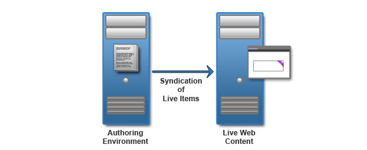
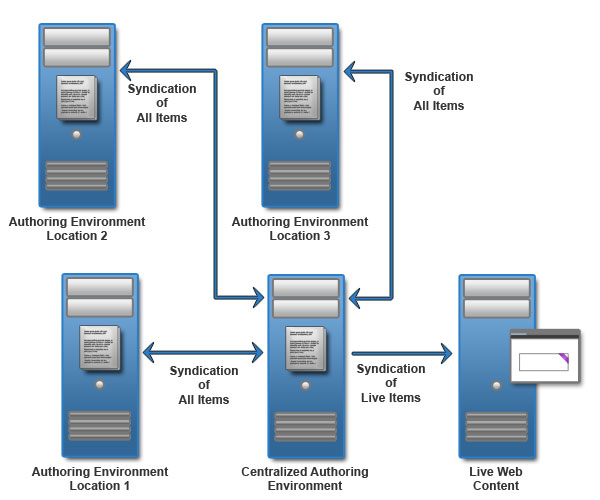

# Web content authoring environments 

An authoring environment is used to create and manage web content and is used by your content authors and website designers.

Most HCLWeb Content Manager sites need to support many content authors. A clustered server solution is the best solution for this scenario.

## Standard authoring environment

A standard authoring environment consists of a single authoring cluster that syndicates directly to either a staging or delivery environment. The following topology depicts an authoring environment that is configured to syndicate live items to the live production environment. The production server hosts the live site that visitors browse. Live items include published and expired items. The authoring environment is depicted as a stand-alone server, however it might be clustered.

The following activities occur in the authoring environment:

-   Create drafts
-   Approve drafts
-   Test changes
-   Publish changes

## Authoring environment with testing

Add a test environment to run user acceptance testing on your content management system and website. The test environment provides an extra layer of validation before content and design changes are pushed to the live website.

In the following topology, all items are syndicated from the authoring environment to the testing environment. After the content is tested, only live items are syndicated back to the authoring environment. Then, live items are syndicated to the production server.

In the diagram, the following activities happen on each server.

-   **Authoring environment**

    -   Create drafts
    -   Approve drafts
    -   Test changes
    -   Syndicate all items to test environment
    -   Syndicate live items to live site
-   **Testing environment**

    -   Publish changes
    -   Test changes
    -   Syndicate live items to authoring environment

In addition, theme changes might be pushed to testing environment to validate that the content elements and design elements integrate as expected. Design integration elements are not included in the topology diagram.

## Decentralized authoring environments

If your content authors are at different locations, or you have different groups of content authors, consider deploying a set of decentralized authoring clusters. This scenario works best if the decentralized content authors work with separate content stored in different content libraries.

For example, if you have users that are in different locations, it might be more efficient to set up a local authoring environment at each location. Two-way syndication is used between all authoring environments with a centralized authoring environment. The centralized authoring environment provides an integrated view of all changes from the different authoring environments.

In the diagram, the following activities happen on each server.

-   **Authoring environments 1, 2, and 3**

    -   Create drafts
    -   Approve drafts
    -   Test changes
    -   Syndicate all items to central authoring environment
-   **Centralized authoring environment**

    -   Receive all items from authoring environments
    -   Syndicate all items to authoring environment
    -   Syndicate live items to testing environment \(not shown\)
    -   Syndicate live items to the live website

Decentralized authoring creates the risk of conflicting updates between authoring environments. To reduce the risk of conflicts, you can allocate different sites, or different sections of a site, to each authoring environment. You can also use different authoring environments for different user roles. For example, content authors might use a different authoring environment than presentation template designers.

Access to each decentralized authoring environment is controlled with a combination of authoring portlet access controls and item security settings. For example, only users that require access to the local authoring environment would be granted access to the local authoring portlet. Users would be given "Read" access to all items, but only "Edit" access to items they are required to update.

**Parent topic:**[HCL Web Content Manager \(WCM\) environments](../wcm/wcm_deploy.md)

**Related information**  

[HCL Web Content Manager \(WCM\) environments](../wcm/wcm_deploy.md)

