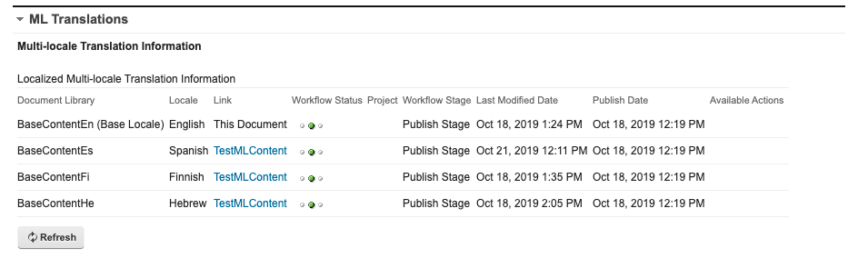

# Web Content Manager Multilingual Solution API

This set of APIs allow you to retrieve information about the configured Multilingual Solution \(MLS\) libraries and also to retrieve the translated content items for a given default language content ID \(for example, from English content find translated French and Spanish strings\).

In the user interface of the WCM Authoring Portlet, one can see the linked translated content and this API gives a similar aggregated view:



The following MLS APIs are available \(as of HCL Digital Experience 9.5 Container Update CF192 and later\):

-   MLS Library Configuration API
-   Translated Content API

## MLS Library Configuration API

-   **Endpoint**

    **GET request to:**

    http://host:port/wps/mycontenthandler/wcmrest/mlsConfig/<UUID of the base library\>

    **JSON:**

    For JSON add ?mime-type=application/json

    **Sample URL:**

    http://localhost:10039/wps/mycontenthandler/!ut/p/digest!-qnYtpJ-Sz3gh0FSR\_oeyA/wcmrest/mlsConfig/bf855b83-8387-47a2-a909-953fef58b0af


-   **Expected Body**

    The body can have the basic WCM structure:

    ```
    <?xml version="1.0" encoding="UTF-8"?>
    <feed xmlns="http://www.w3.org/2005/Atom" xmlns:wcm="http://www.ibm.com/xmlns/wcm/8.0">
    </feed>
    ```


-   **Expected Headers**

    LTPA token of the user.


-   **Query Parameters**

    None.


-   **Limitations**

    None.


-   **Return Body**

    The base library and translated libraries.

    Sample:

    ```
    <?xml version="1.0" encoding="UTF-8"?><feed xmlns="http://www.w3.org/2005/Atom" xmlns:wcm="http://www.ibm.com/xmlns/wcm/8.0">
        <id>d2b01f11-6f42-45e7-b6ee-df4d483d7c67</id>
        <title>ML Configuration</title>
        <updated>2021-02-16T18:24:57.479Z</updated>
        <entry>
            <content type="application/vnd.ibm.wcm+xml">
                <wcm:MLConfig xmlns="http://www.ibm.com/xmlns/wcm/8.0" xmlns:atom="http://www.w3.org/2005/Atom" id="d2b01f11-6f42-45e7-b6ee-df4d483d7c67">
                    <libraries>
                        <atom:baseLibrary>false</atom:baseLibrary>
                        <atom:id>f151de89-9e15-4f6e-9283-cb2792734e44</atom:id>
                        <atom:enabled>true</atom:enabled>
                        <atom:name>basecontentfi</atom:name>
                        <atom:language>fi</atom:language>
                    </libraries>
                    <libraries>
                        <atom:baseLibrary>true</atom:baseLibrary>
                        <atom:id>bf855b83-8387-47a2-a909-953fef58b0af</atom:id>
                        <atom:enabled>true</atom:enabled>
                        <atom:name>basecontenten</atom:name>
                        <atom:language>en</atom:language>
                    </libraries>
                    <libraries>
                        <atom:baseLibrary>false</atom:baseLibrary>
                        <atom:id>90f03801-5f4d-4f4c-89e5-c1fe88377162</atom:id>
                        <atom:enabled>true</atom:enabled>
                        <atom:name>basecontenthe</atom:name>
                        <atom:language>he</atom:language>
                    </libraries>
                    <libraries>
                        <atom:baseLibrary>false</atom:baseLibrary>
                        <atom:id>d73f6494-4d0d-4e61-a21e-bd9c9802fb4f</atom:id>
                        <atom:enabled>true</atom:enabled>
                        <atom:name>basecontentes</atom:name>
                        <atom:language>es</atom:language>
                    </libraries>
                    <type>LOCALIZE</type>
                    <baseLibrary>
                        <atom:baseLibrary>true</atom:baseLibrary>
                        <atom:id>bf855b83-8387-47a2-a909-953fef58b0af</atom:id>
                        <atom:enabled>true</atom:enabled>
                        <atom:name>basecontenten</atom:name>
                        <atom:language>en</atom:language>
                    </baseLibrary>
                </wcm:MLConfig>
            </content>
        </entry>
    </feed>
    ```


## Translated Content API

-   **Endpoint for GET**

    **GET request to:**

    http://host:port/wps/mycontenthandler/wcmrest/translations/<UUID of the base language content item\>

    **JSON:**

    For JSON add ?mime-type=application/json

    **Sample URL:**

    http://localhost:10039/wps/mycontenthandler/!ut/p/digest!-qnYtpJ-Sz3gh0FSR\_oeyA/wcmrest/translations/2b287d10-d60a-43c7-9600-ec66907e635e?allAvailableLang=true&amp;allElements=true


-   **Endpoint for PUT \(From CF193 and higher\)**

    **PUT request to:**

    http://host:port/wps/mycontenthandler/wcmrest/translations/<UUID of the base language content item\>

    **JSON:**

    For JSON add ?mime-type=application/json

    **Sample URL:**

    http://localhost:10039/wps/mycontenthandler/!ut/p/digest!-qnYtpJ-Sz3gh0FSR\_oeyA/wcmrest/translations/2b287d10-d60a-43c7-9600-ec66907e635e?allAvailableLang=true&amp;allElements=true


-   **Expected Body for GET**

    The body can have the basic WCM structure:

    ```
    <?xml version="1.0" encoding="UTF-8"?>
    <feed xmlns="http://www.w3.org/2005/Atom" xmlns:wcm="http://www.ibm.com/xmlns/wcm/8.0">
    </feed>
    ```


-   **Expected Body for PUT \(From CF193 and higher\)**

    The body for PUT is same as the result of the GET


-   **Expected Headers**

    LTPA token of the user.


-   **Query Parameters**

    -   `allAvailableLang=true`- to return all languages
    -   `lang=... - e.g. lang=en` - to return only a specific language
    -   `allElements=true|false` - to return elements that are not text \(like images\)

-   **Limitations**

    None.


-   **Return Body**

    The list of languages and the content of each item in the base language and the translated languages.

    Sample:

    ```
    <?xml version="1.0" encoding="UTF-8"?><entry xmlns="http://www.w3.org/2005/Atom" xmlns:wcm="http://www.ibm.com/xmlns/wcm/8.0">
        <content>
            <data>
                <source_language>en</source_language>
                <translated_language>fi</translated_language>
                <translated_language>en</translated_language>
                <translated_language>iw</translated_language>
                <translated_language>es</translated_language>
                <translated_items>
                    <source_content>
                        <elements>
                            <wcm:element wcm:name="Body">
                                <wcm:title xml:lang="en">Body</wcm:title>
                                <wcm:type>RichTextComponent</wcm:type>
                                <wcm:data type="text/html"><![CDATA[<p dir="ltr">This is the body text for TestMLContent which lives in BaseContentEn/Articles</p>]]></wcm:data>
                            </wcm:element>
                            <wcm:element wcm:name="image">
                                <wcm:title xml:lang="en">image</wcm:title>
                                <wcm:type>ImageComponent</wcm:type>
                                <wcm:data type="application/vnd.ibm.wcm+xml">
                                    <wcm:image xmlns="http://www.ibm.com/xmlns/wcm/8.0">
                                        <dimension height="" width="" border="0"/>
                                        <altText></altText>
                                        <tagName></tagName>
                                        <renditionList/>
                                    </wcm:image>
                                </wcm:data>
                            </wcm:element>
                        </elements>
                        <uuid>2b287d10-d60a-43c7-9600-ec66907e635e</uuid>
                        <locale>en</locale>
                    </source_content>
                    <translated_content>
                        <elements>
                            <wcm:element wcm:name="Body">
                                <wcm:title xml:lang="fi">Body</wcm:title>
                                <wcm:type>RichTextComponent</wcm:type>
                                <wcm:data type="text/html"><![CDATA[<p dir="ltr">Tämä on TestMLContentin rungoteksti, joka asuu BaseContentEn / Artikkelit -sivustossa</p>
    ]]></wcm:data>
                            </wcm:element>
                        </elements>
                        <uuid>43970b4e-c66f-46a3-b612-0665c7494918</uuid>
                        <locale>fi</locale>
                    </translated_content>
                    <translated_content>
                        <elements>
                            <wcm:element wcm:name="Body">
                                <wcm:title xml:lang="es">Body</wcm:title>
                                <wcm:type>RichTextComponent</wcm:type>
                                <wcm:data type="text/html"><![CDATA[<p dir="ltr">This is the the Spanish translated text for TestMLContent which lives in BaseContentEn/Articles</p>
    ]]></wcm:data>
                            </wcm:element>
                        </elements>
                        <uuid>e110f518-5943-411b-b6aa-f21b8a69491a</uuid>
                        <locale>es</locale>
                    </translated_content>
                    <translated_content>
                        <elements>
                            <wcm:element wcm:name="Body">
                                <wcm:title xml:lang="he">Body</wcm:title>
                                <wcm:type>RichTextComponent</wcm:type>
                                <wcm:data type="text/html"><![CDATA[<p dir="ltr">זהו הטקסט לגוף של TestMLContent שחי ב- BaseContentEn / Articles</p>
    ]]></wcm:data>
                            </wcm:element>
                        </elements>
                        <uuid>39ec8ba1-d6b3-47b5-8c57-1d78489820bd</uuid>
                        <locale>iw</locale>
                    </translated_content>
                    <translated_content>
                        <elements/>
                        <uuid>39ec8ba1-d6b3-47b5-8c57-1d78489820bd</uuid>
                        <locale>iw</locale>
                    </translated_content>
                </translated_items>
            </data>
        </content>
    </entry>
    ```


