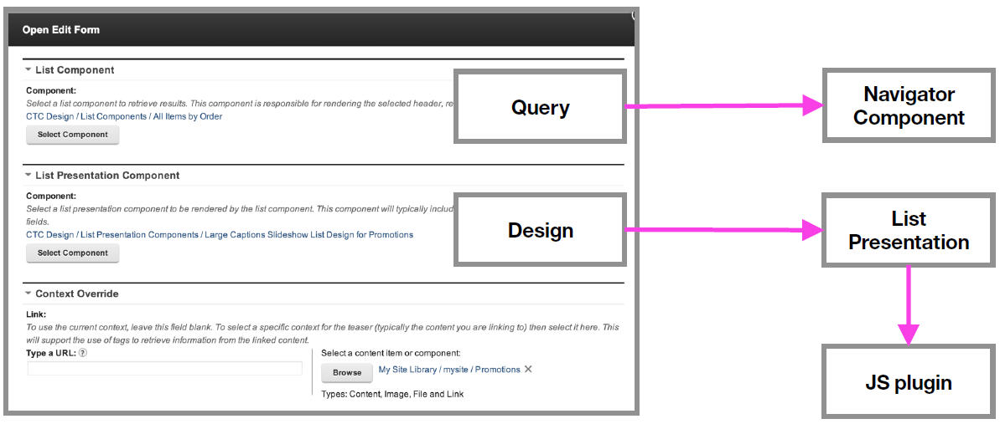

# How a page is built by using Content Template Catalog 

This is the landing page for the Internet site that is included with the Content Template Catalog and is an example of how Content Template Catalog is used to build a page.

## Deconstructing the landing page

The landing page is made from a set of page components, including:

-   A slideshow displaying a list of promotions.
-   A list of features.
-   A block page component displaying "teaser" text.
-   A second list of features.
-   A list of child pages.

## Deconstructing the slideshow

Each page component is constructed from a set of Web Content Manager components, content items, CSS, and related files. This slideshow is an example of a single page component:

Each page component is linked to a Web Content Manager content item that stores configuration parameters for the page component. The slideshow itself includes references to:

-   A list component that defines the items that are displayed in the slideshow.
-   A list presentation that defines the layout of the slideshow.

## Deconstructing the list presentation

The list presentation itself is built by using separate designs for a header, result, and footer. These designs are themselves constructed from multiple Web Content Manager components.

**Parent topic:**[A Content Template Catalog roadmap for site developers ](../ctc/ctc_gs_site_devs.md)

