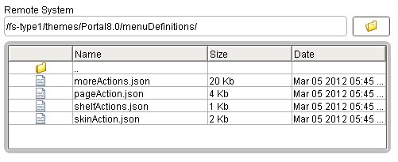

# Server-side framework 

A plug-in receives HTTP requests for specific menus from a client and responds with the menu feed in JSON format. The response is marked as content type application/JSON.

The request URL for the menu feed provider is under the /wps/contenthandler or /wps/mycontenthandler URLs, depending on whether the request is coming from a currently-logged-in user context. The request URL might carry portal URL navigational state, but does require a specific query string to access the menu feed provider. The specific query string to get to the default JSON feed provider is:

```
?uri=menu:<specific menu name\>&navID=<navigation node OID or custom unique name\>
[&windowID=<portlet window control ID on the page\> ]
```

where:

-   **navID**

    This parameter is either the serialized string-format ObjectID or the custom unique name of a portal navigation node \(a portal page\), which is being displayed when the menu is being requested. This parameter provides a context for the menu feed provider to use when you build the menu, so we know which theme to use, because the theme is tied to the page either explicitly or by inheritance.

-   **windowID**

    This parameter is optional and is the serialized string-format ObjectID of a portlet window control on the page that is specified by `navID`. This parameter is only necessary for menus that contain portlet-level actions, in other words, `skin menus`. This parameter must be a serialized ObjectID. A custom unique name does not work for the portlet window ID.


HCL Portal provides three ready-to-use menu definition files with the Portal 8.5 Optimized Theme:

-   pageAction
-   skinAction
-   moreActions

These files exist in WebDAV, under a `menuDefinitions` directory within the root for the theme root. The root is set in theme metadata under the metadata entry name `com.ibm.portal.theme.template.ref`. Other files in that directory are JSON syntax but are not used by the JSON menu framework



**New starting in version 8.0.0.1:** It is possible to name a menu ID \(the specific menu name after the `?uri=menu:` in the request\) which does not exist. Before 8.0.0.1, this menuID would result in an error message about an invalid or non-existent menu name being requested. In 8.0.0.1 and later, this menuID is treated as though a menu file with that name did exist, with the contents being an empty array \("\[ \]"\). A menu feed response is then generated that consists only of processing of the dynamic menu contributions or JSON subcontributions for the current theme profile, which are tagged with a `ref-id` matching the menu name on the request.

**Important:** The order of the items that are dynamically added to a menu is not controlled or guaranteed in any way. Although in testing the order was consistent between server restarts on the same system, it was found to be inconsistent across different operating systems. Especially between IBM® JVMs and those not from IBM. If it is necessary to strictly control the order of the menu items, then use the explicit `"type":"ModuleRef"` entry in a menu definition file to explicitly insert the menu item, rather than relying on the dynamic contribution mechanism.

## JSON menu definition file syntax

For more information about JSON itself, see the JSON home page.

The JSON syntax of a menu definition file consists of an array of JSON objects, where the array is indicated by outer enclosing opening and closing brackets `[ ]`. Each JSON object is enclosed in braces \(\{ \}\) and separated by commas:

```
[
   // optional one-line comment 
   {
     JSON object 1 (first menu item)
   },
   /*
     optional multi-line comment
   */
   {
     JSON object 2 (second menu item)
   },
   ...
]
```

You can add comments in this file by using a portal-specific extension to JSON syntax.

**Note:** The minimum valid JSON menu definition file consists of an opening and closing array bracket \(\[\]\). An empty file results in an illegal syntax exception.

The final object in the array does not have a comma between its curly brace and the ending array closing bracket.

The order of the objects in the array within the menu definition file determines the order of appearance of the items in the menu on the client.

Each object within the array is an individual self-contained menu item definition, or a reference to a theme optimization module that can provide more in-line JSON menu definition file markup. This contributed JSON is included in-line as though it was in the menu file itself.

Each object consists of multiple comma-separated JSON members, each of which has a name and a value that are separated by a colon. The member name is always a string in quotation marks. The values can be strings, Booleans, nested objects, or arrays, depending on the member name. Some member names can have only certain values, as defined in the following list.

Each menu item definition must have a `type` entry, which defines that particular menu entry item.

**Important:** All entry names are case-sensitive.

The following menu item names and values are acceptable values for the type entry.

-   **`"type" : "Header"`**

    Defines a label for subsequent entries in the menu. Typically displayed on the client UI as highlighted and outdented, although this menu item is controlled by the style that is applied to the menu items. A header in the menu is typically not clickable.

    More title object entries, within the titles value, for other languages can be added.

    An itemClass member can be added for controlling the appearance of the header.

    ```
    {
    "type" : "Header",
    "titles" : [{"lang":"en","value":"<English text>"}, {"lang":"de", "value" : "German text"},...]
    }
    ```

-   **`"type" : "Separator"`**

    Defines a separator between menu items. A separator might show as a space, a line, or other appearance, depending on the style that is applied to the menu.

    A separator does not typically need any other members, although an `itemClass` can be added for appearance control.

    ```
    {
    "type" : "Separator",
    }
    ```

-   **`"type" : "DynamicMenuitem"`**

    Potentially clickable and having an action the `DynamicMenuitem` item has an `id` member whose value is a plug-in name. The menu feed provider uses this ID to retrieve an instance of the named operation, which is then queried for sufficient information to build the menu feed content for this `menuitem`. Several plug-ins are supplied ready-to-use by HCL Portal for use in the default menu definitions, and these can be reused by custom-written menus and themes.

    This plug-in provides its own indicator of whether it is active, including access control permission for the current user, and provides its own localized title and optionally a description, and an actionHttpMethod value, for the menu feed provider to use when you build the menu for this item. The OperationURI for this operation plug-in becomes the actionUrl in the corresponding menu entry. Other object members are allowed as well, including actionFn, actionHttpMethod, visibilityFn, itemClass, and metadata. A markupID member can be added to create an ID on the html tag for the resulting menu item.

    If the isActive\(\) method returns false when called by the menu feed provider code, the menu item is present in the menu feed, but has a `"visibility" : false` boolean member added to the feed. This boolean member indicates to the client-side code to not present this operation to the user, and the client-side code does not include this item in the final rendered menu.

    Optionally, a moduleArgs member might also be specified. This member is a string of query parameter-format names and values that are separated by ampersands \(&\). If present, these arguments are passed to the plug-in when the feed provider accesses the plug-in to build the current menu entry.

    ```
    {
    "type" : "DynamicMenuitem",
    "id" : "operations.framework.plugin.name"
    }
    ```

-   **`"type" : "StaticMenuitem"`**

    Potentially clickable and having an action. This item is typically used to insert a menu item that has a client-side implementation, rather than a server-side implementation.

    Allows the menu feed definition file author to completely specify an arbitrary menu item entry. All necessary information must be provided by the menu definition file, because there is no corresponding operation for a `StaticMenuitem`. The id parameter is optional and is ignored by the menu feed provider code for a `StaticMenuitem`, although it is not flagged as a syntax error if it is present.

    Other optional members might be added as needed.

    ```
    {
    "type" : "StaticMenuitem",
     "titles" : [{"lang" : "en", "value" : "My English menu item text"},
            {"lang" : "de", "value" : "Mein menu item text auf Deutsch"},
             ...
            ],
    "descriptions" : [{"lang" : "en", "value" : "My English menu item longer description flowing beautiful prose"},
                 {"lang" : "de", "value" : "Mein menu item longer description flowing beautiful prose auf Deutsch"},
                 ...
                 ],
    "actionUrl" : "http://www.cntserv_exmp.com/wps/myportal/some_useful_url",
    "actionHttpMethod" : "POST",
    "actionFn" : "client_method_to_override_actionUrl",
    "metadata" : {
            "navID" : "${navID}",
            "some_name" : "some_value",
            "some_other_name" : "${SubVar_From_Request_Query_Parms}"
            }
    "markupId" : "my.item.markupId"
    }
    ```

-   **`"type" : "ModuleRef"`**

    A menu definition file has an id member whose value is the name of a plug-in. This plug-in must have a contribution of the menu type, and a subcontribution of the JSON type. The menu feed provider uses the value of the id member in this JSON object to retrieve a reference to the JSON subcontribution within the menu contribution for that module. This JSON subcontribution must be valid stand-alone JSON menu definition markup, including the surrounding array opening and closing brackets. The menu feed provider strips the array opening and closing brackets and inserts this contributed markup in-line into the menu feed response as though it is included in the main definition file.

    Points by name at a plug-in that provides more JSON format and menu definition file syntax markup, which the feed provider places inline in the menu feed and that replaces the `ModuleRef` entry.

    Optionally, a `moduleArgs` member can be added. If present, the value of the `moduleArgs` member is passed as arguments to retrieve the JSON menu definition file markup from the plug-in.

    ```
    {
    "type" : "ModuleRef",
    "id" : "Theme Optimization Framework module name"
    }
    ```

-   **`"type" : "Submenu"`**

    Defines a placeholder in the current menu where a new sublevel menu is attached. This item allows for multiple tiered menus. There is no enforced limit to the nesting level. The submenu is retrieved by an independent additional menu request to the JSON menu feed provider when the submenu entry in the displayed menu is hovered over.

    The menu is appended to the one side as screen position dictates. A submenu is fetched in a separate subsequent request by the client.

    A submenu names the source of its menu content with either an `id` or a `moduleId` member, and must have a `titles` member to provide the text for the placeholder menu item, and might optionally have a `descriptions` member.

    The only difference between these two members is how the next request is processed, when the submenu is expanded and the client code retrieves the expansion menu feed in a new HTTP request:

    -   For an `id`, the next request is treated as naming a menu definition file where the `id` value is the file name and the extension is .json.
    -   For a `moduleId`, the next request is treated as naming a plug-in that provides the necessary JSON markup. This request is accessed as though a menu definition file specified it.

        ```
        {
        "type" : "ModuleRef",
        "id" : "moduleId_value"
        }
        ```

    A `moduleArgs` member might also be added. If present with a `moduleRef` member within a `SubMenu` entry, the value of the `moduleArgs` member is appended to the URL that is built as the ID of the menu item. This value is used as the menu reference from the client for retrieving the menu markup for the cascaded submenu.

    ```
        {
        "type" : "SubMenu",
        "id" : "name_of_submenu_definition_JSON_file",
         "titles" : [{"lang" : "en", "value" : "My English sub-menu item text"},
              {"lang" : "de", "value" : "Mein sub-menu item text auf Deutsch"},
              ...
              ],
        "descriptions" : [{"lang" : "en", "value" : "My English sub-menu item longer description flowing beautiful prose"},
              {"lang" : "de", "value" : "Mein sub-menu item longer description flowing beautiful prose auf Deutsch"},
              ...
              ]
         }
        or
         {
        "type" : "SubMenu",
        "moduleId" : "name_of_theme_opt_framework_module_which_contributes_submenu_definition_JSON_",
        ...
        }  
    ```


## Valid members in a JSON menu definition file

|Member name|Value and example `syntax`|Comments|
|-----------|--------------------------|--------|
|type|"Header", "Separator", "DynamicMenuitem", "StaticMenuitem", "ModuleRef", Submenu"|Determines the type of menu item that is created by this menu definition file object|
|`id`|String|For a `DynamicMenuitem` or a `ModuleRef`, the id member is required. For a Submenu, either `id` or `moduleId` is required.-   **DynamicMenuitem**

The ID is the name of the plug-in that is accessed by the menu feed provider to get the `actionUrl` \(which is the OperationURI of the operation\), the localized title and description, and the `isActive` method of the operation, which indicates whether the action is active and also accessible by the current user. The `actionUrl` is sent to the server in a separate request if the user clicks this menu item in the rendered menu.

-   **ModuleRef**

The ID is the name of the plug-in that is accessed to retrieve more menu file definition markup.

-   **Submenu**

The `id` is present, it is the name of the menu that is requested by the client in an HTTP menu request to create the submenu list of items.


|
|`titles`|Array of objects, each of which has these members: a "lang" defines the language for that title entry, and a "value" contains the string for that language for the title.

`"titles" : [ {"lang":"en", "value":"Title in English"}, {"lang":"de", "value":"Title auf Deutsch"}, ... ]`

|Required for header, `StaticMenuitem`, and Submenu entries. The list of languages that are provided covers only the necessary languages that the users of a portal might need. Can also be used for a `DynamicMenuitem`. A `DynamicMenuitem` retrieves the title from the corresponding plug-in. The plug-in is required to implement the Localized interface, and provide localized strings for appropriate languages. You can override the titles and description by using the corresponding elements in the JSON. However, the override applies to all languages. You cannot select specific languages to override. A Separator has no text that is associated with it. A `ModuleRef` is replaced by other markup.|
|`descriptions`|Same as titles. `"descriptions" : [ {"lang":"en", "value":"Title in English"}, {"lang":"de", "value":"Title auf Deutsch"}, ... ]`|Optional for all types. If present, this member is interpreted by the default client code as hover help text over the menu item.|
|`itemClass`|String|Optional for all types. This member is the style class name that is applied to the menu item. If present, this is a class name that is present in the style sheet that is associated with the theme for the menu.|
|`enabled`|Boolean true or false|Optional for all types. Defaults to true. This member indicates whether the menu item is clickable on the client side. True equates to active, false equates to not active.|
|`enableFn`|String|Optional for all types. If present, this member is the name of a JavaScript™ function to execute on the client to determine whether this menu item is active. The complete menu feed JSON object for this menu item is passed as an argument to the function. The result from this function call overrides the "enabled" setting.

|
|`actionUrl`|String|For a `StaticMenuitem`, either the `actionUrl` or the `actionFn` must be present. If `actionUrl` is present, it might be an absolute URL or a relative URL, or a query string that is appended to the current request URL or tag value. Not required for a `DynamicMenuitem`. Not useful for any other type.Invoking the `actionFn` takes precedence over an `actionUrl` if both are present.

|
|`actionHttpMethod`|String, with normal HTTP values "GET", "POST", "PUT", "DELETE" and other values.|Defaults to "GET". Optional for all object types. If present on a `DynamicMenuitem`, this overrides any action that is provided by the Operation Framework plug-in.|
|`actionFn`|String|For a `StaticMenuitem`, either the `actionUrl` or the `actionFn` must be present. If `actionFn` is present, this member is the name of a JavaScript function to execute on the client when the menu item is clicked. The complete menu feed JSON object for this menu item is passed as an argument to the function. Invoking the `actionFn` takes precedence over an `actionUrl` if both are present.|
|`visibilityFn`|String|Optional for all types, but not useful for Separator or `ModuleRef`. For a `DynamicMenuitem` or `StaticMenuitem`, if `visibilityFn` is present, this member is the name of a JavaScript function to execute on the client to determine whether this menu item is active. The complete menu feed JSON object for this menu item is passed as an argument to the function.|
|`metadata`|Embedded object, where the only value types are Strings. Ex: `"metadata": { "name1" : "value1", "name2" : "${substitution-variable}", ... }`

For version 8.0.0.1: Embedded object, where the members can be String values, boolean values, or numeric values, or other nested objects. There is no enforced limit on the nesting level. There are only 2 restrictions on metadata:

-   No arrays can be used within metadata
-   No member within a metadata object can have the name "metadata". This results in an IllegalSyntaxException.

Prior to version 8.0.0.1, metadata was restricted to only String types with no embedded nesting.

|Optional for all types. If present, this member must be a simple embedded object with only String values. No deeper object nesting or arrays are allowed as values. If substitution variables are present, in the form `${variableName}`, then these values are substituted from query parameters on the received menu request. Multiple query parameters can be in a string, but only one pass is made through the string.

Optional for all types. If present, the members within must observe the restrictions that are listed for the appropriate version. If substitution variables are present in any String value within the metadata object, at any nesting level, in the form `${variableName}`, then these values are substituted from query parameters on the received menu request \(`...&variableName=value...`\). Multiple replacement variables can be contained in a metadata value string, but only one pass is made through the string. Any replacement variables that are found for which there are no substitutions found in the query parameters from the request, remain unchanged in the metadata that is passed to the client as part of the JSON feed response.

For example:

```
[
  {
    ....
    "metadata" : {
           "a" : "something",
           "b" : true,
           "c" : 123,
           "thisIsNestedMetadata" : {
                 "a" : "something nested",
                 "d" : "This is a substitution:  ${subVar}"
           }
      }
      ...
  }
]
```

|
|`moduleId`|String|Optional for a Submenu, but only applicable for a Submenu. If present instead of an ID in a Submenu entry, this member is the name of a module like the `id` of a `ModuleRef` that is accessed by the client in a separate direct request if the Submenu item is expanded by the user. The format of the menu item that is built by this is `{"type":"Submenu", "id" : "moduleRef:", ... }`. The client code makes a request to the server by using this ID that is a variation of the normal menu request: `?uri=menu:moduleRef:"`. The feed provider code handles this request by starting the named module as though there were a menu feed definition file that contained a `ModuleRef` with that ID.|
|`moduleArgs`|String, in the format of an HTTP request query parameter set, but without a leading ampersand \(the menu feed provider prepends an ampersand\). If there are multiple query parameters, insert an ampersand between each parameter after the first. Example: ```
foo=bar&foo2=bar2&... 
```

|Optional for a Submenu, but only applicable for a Submenu. If present with a moduleId, then the URI built by the menu feed provider for the Submenu entry in the feed looks like `{"type" : "Submenu", "id" : "moduleRef:moduleId\_value&moduleArgs\_value", ... }`. If present with an ID in the Submenu, the URI looks like the previous example but without the `moduleRef:` prefix for the ID and arguments.|
|`markupId`|Arbitrary string, used to create an ID in the html tag that defines the menu item.|Optional. Useful only for `DynamicMenuItem` and `StaticMenuItem` menu entries. Variable substitution is supported for this item, so the `${windowID}` can be used to make unique instances of an ID for each portlet when rendered.|

## Writing a menu definition file for a modularized theme

You can write a new menu definition file for a new theme by using the server-side feed provider and client-side JavaScript. If the ready-to-use sample theme is copied and altered into a new customized theme, the same JSON menu files can be used, or can be altered as necessary. If any new client-side functions are referenced from menu items, then these new JavaScript features must be created and referenced.

The JSON menu feed provider looks for the JSON menu definition files in a `menuDefinitions` directory in the theme root in WebDAV.

Use the existing menu definitions files as samples, and use tools such as jsonlint to prevalidate the JSON syntax.

The JSON syntax is restrictive for menu definition files except that comments are allowed.

When you are debugging, use the trace string `com.ibm.wps.jsonmenu.*=all` on the server.

## Dynamically extended and dynamically constructed menus

Starting with HCL Portal 8.0.0.1, it is possible to have menu items added dynamically to a menu definition file. This feature can be used to extend an existing "static" menu definition file, such as the files that exist in the sample theme within the menuDefinitions folder in WebDAV. It can also be used to dynamically construct a menu without a static menu file that exists at all.

Recall that in the request URI for a menu, the query parameter starts with `"?uri=menu:menu name"`. This menu name is treated as a file name by the menu framework, and we search for the file in the "base location" for resources for that theme as given by the theme metadata property com.ibm.portal.theme.template.ref. Within the menu definition, an entry of `"type":"ModuleRef"` can reference a theme optimization module, which contains a `menu` contribution, and within that a JSON subcontribution. This JSON subcontribution has a URL, which points to the actual JSON code. The JSON retrieved from that subcontribution URL is substituted into the menu feed in place of the `"type":"ModuleRef"` entry from the file.

Starting with HCL Portal 8.0.0.1, this JSON subcontribution can also be tagged with a `ref-id` qualifier. The value of this qualifier is a String. At the end of processing the menu definition file, the menu framework adds one more step. It searches through all the JSON subcontributions that are found in theme modules from the profile for the current page, where the page is given by the navID parameter on the menu request. If any of the `ref-id` tags from those subcontributions match the requested menu name that is being processed, then the JSON code for those subcontributions is dynamically added to the end of the menu feed, exactly as though there were an entry `"type":"ModuleRef"` that specifically pointed to that module.

This menu framework allows for dynamic extension of the menu contents with new menu items by creating new theme modules, or at least new subcontributions, and updating the profile, rather than having to update the menu definitions files.

In addition, this feature can be used to dynamically construct a menu without creating a menu definition file at all. If the incoming menu request contains a menu name that does not exist, the menu framework now treats that as though it pointed at a menu definition file with only the minimum menu syntax for an empty array, "`[ ]`". The menu is then created by using only the JSON subcontributions from the modules that are named in the profile for the current page where the `ref-id` qualifier matches the requested menu name, even though it names a file that does not exist.

**Important:** The order of the items that are dynamically added to a menu is not controlled or guaranteed in any way. Although in testing the order was consistent between server restarts on the same system, it was found to be inconsistent across different operating systems. Especially between IBM JVMs and those not from IBM. If it is necessary to strictly control the order of the menu items, then use the explicit `"type":"ModuleRef"` entry in a menu definition file to explicitly insert the menu item, rather than relying on the dynamic contribution mechanism.

For more information about constructing theme optimization modules that include the JSON subcontribution, see Adding a menu item with a module.

## Controlling the cache lifetime of a JSON menu feed

In HCL Portal version 8.0.0.1 and later, the JSON menu framework accepts one or more WP ConfigService properties of the form `"jsonmenu.cache.time.<menu name>"` where the value is the cache time in seconds. This value must be greater than or equal to 0. A value of `0` indicates that the menu is not cached.

The `<menu name>` values from these WP ConfigService settings are matched against the value from the `"?uri=menu:<menu name>"` query parameter on the incoming request for a menu. The comparison of the menu names from the WP ConfigService to the received request for a menu is case-sensitive.

**Parent topic:**[Simple menu framework ](../dev-theme/themeopt_cust_menu.md)

**Related information**  


[Defining theme modules](../dev-theme/themeopt_mod_register.md)

[Dynamically extending an existing menu item from a module ](../rwd/rwd_add_menu_module.md)

[Introducing JSON](https://www.json.org/json-en.html)

