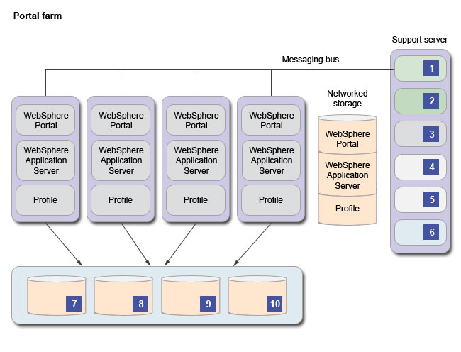

# Setting up farm instances with a shared configuration 

You maintain only one installation for all members of a farm in a shared configuration. Farm maintenance is easier because it is deployed to only one system. The single installation is shared by multiple servers, which has significant benefits.

The disadvantage is that there is no ability to apply specific changes on a per-server basis. If you did, the change would be visible through the shared file system and shared database to all members. Most maintenance requires downtime of the farm. Implement a "two lines of production" system to avoid downtime and eliminate the shared installation as a singe point of failure. With this setup, there is a shadow installation of the Farm in an active and passive mode of operation.

The server that is used to maintain the farm installation is referred to as the Farm Master.

There are certain HCL Digital Experience functions that are designed to run on a single node in a cluster; for example: seedlist generation. When you configure a portal farm with a shared file system, all of the farm client members read their configuration information from a single, master server. The enable-farm-mode task prepares the profile to support the shared file system operation. The enable-farm-mode task also disables the functions designed to run on a single node; for example: seedlist generation and subscriptions. Disabling these functions keeps all members from running the same services at the same time. If you plan to use search, configure a dedicated support server to run these tasks. The support server is unique in some of its configurations. However, it must share many of the same configuration as the other farm members, such as database connections and security configurations.

There are multiple ways to create the support server, including taking advantage of multiple profile support or separate installations. When the support server is on its own server, copy the master server profile to the support server. The directory paths must match on both servers \(master and support\). You can rely on the base HCL Portal and IBM® WebSphere® Application Server binary installation directories shared on the master file system and reference the local file system for the profile. See the Messaging Bus image:

The following annotations apply to the image labels:

-   **1. Messaging engine**

    The messaging engine is optional. Run the create-wcm-jms-resources task. Go to *Setting up farm instances as unique installations* for instructions. If not complete, run the create-wcm-jms-resources task on the farm master server to read messages from this server.

-   **2. Subscriber**

    This server is the syndication subscriber. No action is required on this profile. Read *Working with syndicators and subscribers*.

-   **3. Search engine**

    Follow the instructions to set up a remote search server in a cluster. Read *Configuring search in a cluster*.

-   **4. Shared portal**

    Shared portal with the filesystem replication or other sharing techniques. Read *Configuring a cloned or shared file system*.

-   **5. Shared application server**

    Shared application server with filesystem replication or other sharing techniques. Read *Configuring a cloned or shared file system*.

-   **6. Unique profile**

    Unique profile with filesystem replication or multiple profiles support. This profile is configured differently than the farm master. It is isolated from the farm workers to support operations in this list.

-   **7. JCR database domain**

    The JCR database domain is inherited from the initial farm profile configuration. There is no need to change the database domains.

-   **8. Customization database domain**

    The Customization database domain is inherited from the initial farm profile configuration. There is no need to change the database domains.

-   **9. Communication database domain**

    The Communication database domain is inherited from the initial farm profile configuration. There is no need to change the database domains.

-   **10. Release database domain**

    The Release database domain is inherited from the initial farm profile configuration. There is no need to change the database domains.

Complete the following tasks to set up your farm instance with a shared configuration:

-   **[Installing the Farm Master and setting up the support server ](../install/set_portal_farm_master.md)**  
The first server where HCL Digital Experience is installed is the basis for the portal farm and is termed the Farm Master.
-   **[Configuring a cloned file system ](../install/cfg_farm_clone.md)**  
A cloned file system does not require the profile directory to be read-only. Read-only profile directories can cause some limitations with portlets and other applications that try to write to the profile. A cloned file system alleviates this limitation. Nodes in a cloned system do not require that the host name be set to localhost. Therefore, there is no issue related to remote Enterprise Java Beans and other applications that require a real host name.
-   **[Configuring a shared file system ](../install/set_portal_farm_gpfs.md)**  
When you choose the option to install the Farm with a shared file system, provide the file system before you install the first farm member. Tune your file system. Slow access to the files impacts performance. Because all the farm members access the file system concurrently, the system must handle this situation.
-   **[Disabling farm mode ](../install/disable_farm.md)**  
After setting up your farm using a shared configuration, you may need to disable the farm mode, which will allow you to return the original HCL Digital Experience instance that manages the shared file system to a regular, stand-alone server instance. You can then make system updates, for example change the systemTemp value, and then run the enable-farm-mode task to re-enable the farm or you can use the instance for a different purpose.

**Parent topic:**[Choosing the type of portal farm to create ](../install/choose_portal_farm.md)

