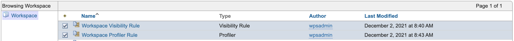
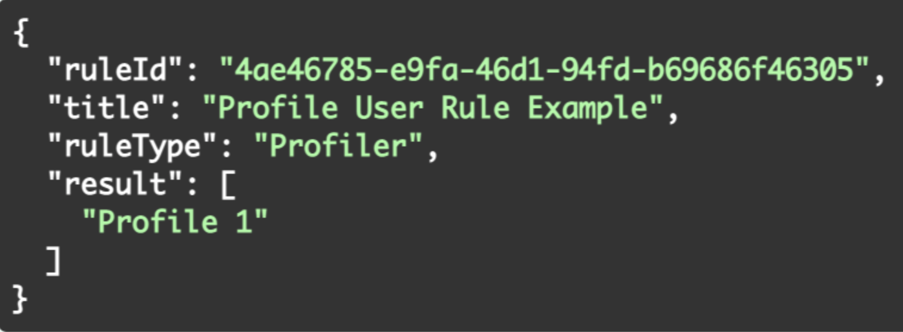
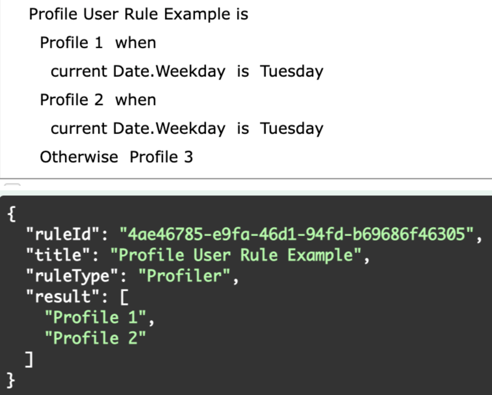
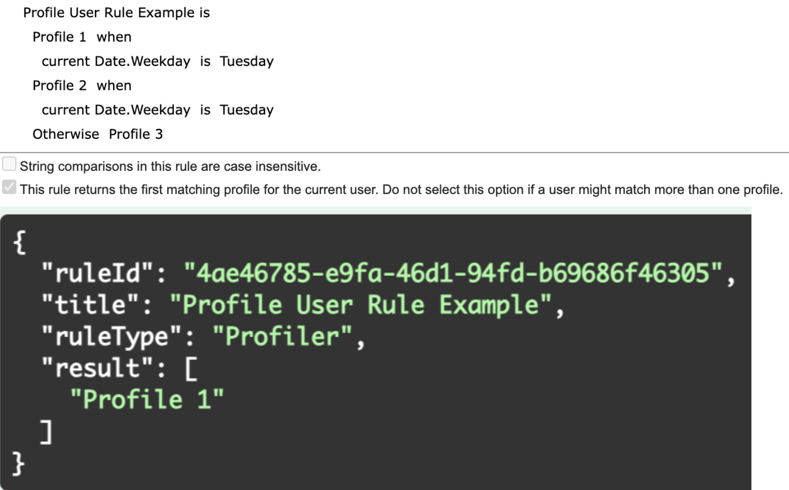
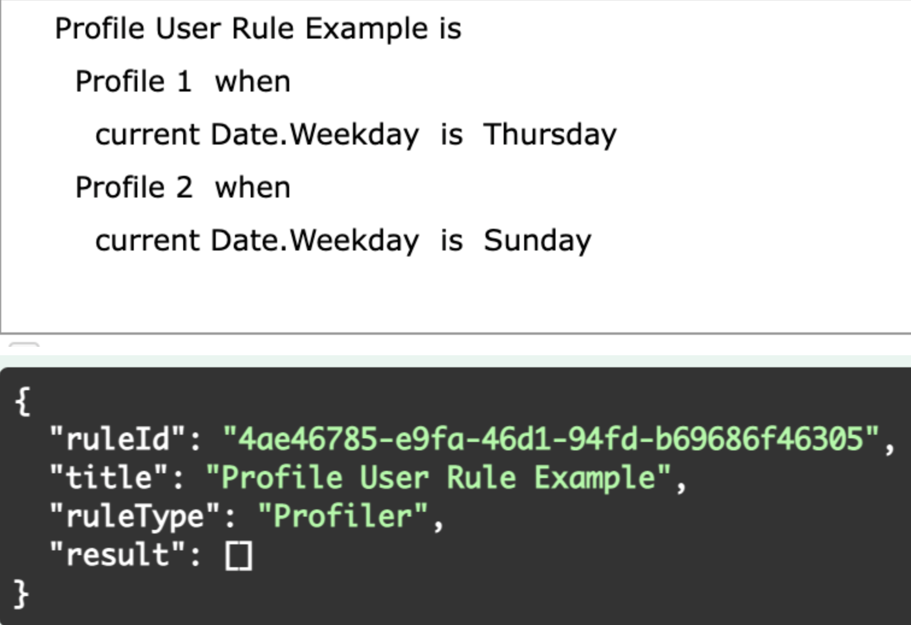
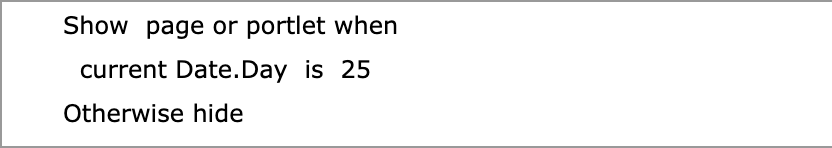
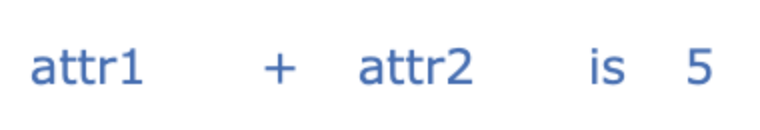
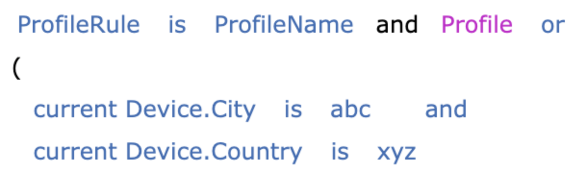
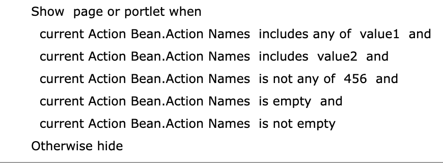
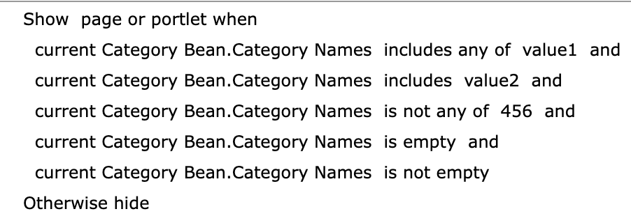

# Personalization Rules APIs 

The Personalization Rules REST APIs provide access to personalization rules capabilities using REST services.

As of HCL Digital Experience CF and Container Update CF202, REST APIs are developed for **Create Rule**, and is available for Personalization **Visibility Rules** with **Date** properties and **Profiler** rule types only.

For more information on HCL Digital Experience Personalization Rules, refer to the [Personalization](https://help.hcltechsw.com/digital-experience/8.5/pzn/pzn_overview.html) Help Center topic.

APIs are in beta stage at this time - changes are possible until finalized.

## Access and launch the Personalization REST API Explorer

To access the Personalization REST API Explorer, after installing HCL DX 9.5 CF or Container Update CF200 or later, launch the following URL located at:

```
http or https://host:port/dx/api/pzn/v1/explorer/
```

**Example:**

```
https://localhost:10039/dx/api/pzn/v1/explorer/
```

## Endpoints

The following Personalization REST APIs are available:

1.  GET list of Personalization Rules REST API
2.  GET Personalization Rule-ID details REST API
3.  API to invoke the Personalization rule
4.  POST Personalization Rule-ID
5.  DELETE Personalization Rule-ID

## Get list of Personalization Rules REST API

Use this API to obtain a list of Personalization Rules defined to the Personalization workspace. Pagination of the list results is supported.

-   **GET request format:**

    ```
    https://localhost:10039/wps/mycontenthandler/pzn-rest/rules
    ```


-   **Get List of Personalization Rules REST API Example:**

    ```
    https://localhost:10039/wps/mycontenthandler/pzn-rest/rules?limit=30&offset=0&ruleType=Visibility%20Rule
    ```


-   **Steps to execute the Get List of Personalization Rules RESTAPI:**

    1.  Login to your Digital Experience solution.
    2.  The login cookie contains the Authentication token. Leave the cookie field empty if you are already authenticated, unless you intend to put a token value.
    3.  Add the limit parameter which defines the number of results that will be returned in the pagination parameter.
    4.  Add the offset, which defines the pagination parameter and the starting point from which results will be returned.
    5.  Add the `ruleType`, which is the parameter to filter rules based on the Personalization rule type. As of HCL DX Container Update and CF200, Personalization [Visibility rules](https://help.hcltechsw.com/digital-experience/8.5/pzn/pzn_visibility.html) and Profiler are supported.
    Example:

    


-   **Response Structure Details:**

    -   The response structure will get the list of all the Visibility and Profiler rules details.
    -   For more details on the Personalization contents attribute, please refer to the *Personalization REST API contents attribute* section below.
    -   The example below shows the response for one Personalization rule:

        ```
        {
          "offset": 0,
          "limit": 30,
          "total": 2,
          "items": [
            {
              "id": "c32d5c01-94b2-4470-abe8-e64b5d66b273",
              "description": "Description for this Visibility rule.",
              "title": "Visibility Rule Example",
              "ruleType": "Visibility Rule",
              "contents": {
                "visibility": "show",
                "otherwise": "hide",
                "conditions": {
                  "and": [
                    {
                      "operator": "is",
                      "attributeName": "date",
                      "attributeType": "Date",
                      "value": [
                        "2022-02-14"
                      ]
                    }
                  ]
                },
                "caseInsensitive": false
              },
              "authors": "uid=wpsadmin,o=defaultWIMFileBasedRealm",
              "creator": "uid=wpsadmin,o=defaultWIMFileBasedRealm",
              "created": "2021-11-18T07:07:43.043Z",
              "publishedOnDate": "1970-01-01T00:00:00.001Z",
              "lastModified": "2021-11-18T07:07:43.043Z",
              "lastModifier": "uid=wpsadmin,o=defaultWIMFileBasedRealm",
              "parentId": "_6QR_0048AAQUGF0A1T2A_18L"
            },
            {
              "id": "1ed429e5-80a2-4bbc-97d8-adcbaebb85ce",
              "description": "Description for this Profiler rule.",
              "title": "Profiler Rule Example",
              "ruleType": "Profiler",
              "contents": {
                "profiles": [
                  {
                    "profileName": "Profile1",
                    "conditions": {
                      "and": [
                        {
                          "operator": "is",
                          "attributeName": "date",
                          "attributeType": "Date",
                          "value": [
                            "2022-12-01"
                          ]
                        }
                      ]
                    }
                  }
                ],
                "otherwiseProfile": "Profile2",
                "caseInsensitive": false,
                "stopFirstProfile": true
              },
              "authors": "uid=wpsadmin,o=defaultWIMFileBasedRealm",
              "creator": "uid=wpsadmin,o=defaultWIMFileBasedRealm",
              "created": "2021-11-29T07:33:31.613Z",
              "publishedOnDate": "1970-01-01T00:00:00.001Z",
              "lastModified": "2021-11-29T07:33:31.613Z",
              "lastModifier": "uid=wpsadmin,o=defaultWIMFileBasedRealm",
              "parentId": "_6QR_0048AAQUGF0A1T2A_18L"
            }
          ]
        }
        ```


-   ****

    **Example 1: Get Personalization Rules List**

    List of rules created in the Personalization interface:

    

    In the API response structure below, the list of Visibility and Profiler rules available in the Workspace interface is presented:

    ```
    {
      "offset": 0,
      "limit": 30,
      "total": 2,
      "items": [
        {
          "id": "c32d5c01-94b2-4470-abe8-e64b5d66b273",
          "description": "Description for this Workspace Visibility rule.",
          "title": "Workspace Visibility Rule",
          "ruleType": "Visibility Rule",
          "contents": {
            "visibility": "show",
            "otherwise": "hide",
            "conditions": {
              "and": [
                {
                  "operator": "is",
                  "attributeName": "date",
                  "attributeType": "Date",
                  "value": [
                    "2021-11-18"
                  ]
                }
              ]
            },
            "caseInsensitive": false
          },
          "authors": "uid=wpsadmin,o=defaultWIMFileBasedRealm",
          "creator": "uid=wpsadmin,o=defaultWIMFileBasedRealm",
          "created": "2021-11-18T07:07:43.043Z",
          "publishedOnDate": "1970-01-01T00:00:00.001Z",
          "lastModified": "2021-11-18T07:07:43.043Z",
          "lastModifier": "uid=wpsadmin,o=defaultWIMFileBasedRealm",
          "parentId": "_6QR_0048AAQUGF0A1T2A_18L"
        },
        {
          "id": "1ed429e5-80a2-4bbc-97d8-adcbaebb85ce",
          "description": "Description for this Workspace Profiler rule.",
          "title": "Workspace Profiler Rule",
          "ruleType": "Profiler",
          "contents": {
            "profiles": [
              {
                "profileName": "Profile1",
                "conditions": {
                  "and": [
                    {
                      "operator": "is",
                      "attributeName": "date",
                      "attributeType": "Date",
                      "value": [
                        "2022-02-21"
                      ]
                    }
                  ]
                }
              },
            ],
            "otherwiseProfile": "Profile2",
            "caseInsensitive": false,
            "stopFirstProfile": true
          },
          "authors": "uid=wpsadmin,o=defaultWIMFileBasedRealm",
          "creator": "uid=wpsadmin,o=defaultWIMFileBasedRealm",
          "created": "2021-11-29T07:33:31.613Z",
          "publishedOnDate": "1970-01-01T00:00:00.001Z",
          "lastModified": "2021-11-29T07:33:31.613Z",
          "lastModifier": "uid=wpsadmin,o=defaultWIMFileBasedRealm",
          "parentId": "_6QR_0048AAQUGF0A1T2A_18L"
        }
      ]
    }
    ```

    **Example 2: Personalization API Get List Personalization Rules REST API**

    List of Personalization rules in the Personalization interface:

    

    In the API response structure below, the list of Visibility and Profiler rules available in the Folder created under the Workspace interface is presented:

    ```
    {
      "offset": 0,
      "limit": 30,
      "total": 2,
      "items": [
        {
          "id": "8687069e-2dfa-423f-b9fa-5d42c37ff817",
          "description": "Description for this Folder Visibility rule.",
          "title": "Folder Visibility Rule",
          "ruleType": "Visibility Rule",
          "contents": {
            "visibility": "show",
            "otherwise": "hide",
            "conditions": {
              "and": [
                {
                  "operator": "is",
                  "attributeName": "AcceptLanguage",
                  "attributeType": "BrowserCapability",
                  "value": [
                    "English"
                  ]
                }
              ]
            },
            "caseInsensitive": false
          },
          "authors": "uid=wpsadmin,o=defaultWIMFileBasedRealm",
          "creator": "uid=wpsadmin,o=defaultWIMFileBasedRealm",
          "created": "2021-11-18T07:28:55.549Z",
          "publishedOnDate": "1970-01-01T00:00:00.001Z",
          "lastModified": "2021-11-18T07:28:55.549Z",
          "lastModifier": "uid=wpsadmin,o=defaultWIMFileBasedRealm",
          "parentId": "ee99433c-82d2-46eb-b48b-90cc234e57e2"
        },
        {
          "id": "ecfa60df-a85e-493f-b902-3d91bd8da1bb",
          "description": "Description for this Folder Profiler rule.",
          "title": "Folder Profiler Rule",
          "ruleType": "Profiler",
          "contents": {
            "profiles": [
              {
                "profileName": "Profile1",
                "conditions": {
                  "and": [
                    {
                      "operator": "is",
                      "attributeName": "date",
                      "attributeType": "Date",
                      "value": [
                        "2022-04-03"
                      ]
                    }
                  ]
                }
              },
              {
                "profileName": "Profile2",
                "conditions": {
                  "and": [
                    {
                      "operator": "is",
                      "attributeName": "city",
                      "attributeType": "wpsUser",
                      "value": [
                        "Bengaluru"
                      ]
                    }
                  ]
                }
              }
            ],
            "otherwiseProfile": "Profile3",
            "caseInsensitive": false,
            "stopFirstProfile": true
          },
          "authors": "uid=wpsadmin,o=defaultWIMFileBasedRealm",
          "creator": "uid=wpsadmin,o=defaultWIMFileBasedRealm",
          "created": "2021-11-29T07:33:31.613Z",
          "publishedOnDate": "1970-01-01T00:00:00.001Z",
          "lastModified": "2021-11-29T07:33:31.613Z",
          "lastModifier": "uid=wpsadmin,o=defaultWIMFileBasedRealm",
          "parentId": "ee99433c-82d2-46eb-b48b-90cc234e57e2"
        }
      ]
    }
    ```


-   **Combined Response Structure:**

    The following example shows how to execute the Get Personalization Rules List REST API to return the total list of rules available through the Personalization interface Workspace and Folder.

    `parentId` is the main attribute to use to find the difference between the rules available in the `Workspace` and `Folder`:

    -   `Workspace parentId` always starts with a hyphen \("-"\).

        Example:

        ```
        "parentId": "_6QR_0048AAQUGF0A1T2A_18L"
        ```

    -   `Folder parentId` always starts without a hyphen \("-"\).

        Example:

        ```
        "parentId": "ee99433c-82d2-46eb-b48b-90cc234e57e2"
        ```

    Refer to this API response structure below:

    ```
    {
      "offset": 0,
      "limit": 30,
      "total": 4,
      "items": [
        {
          "id": "c32d5c01-94b2-4470-abe8-e64b5d66b273",
          "description": "Description for this Workspace Visibility rule.",
          "title": "Workspace Visibility Rule",
          "ruleType": "Visibility Rule",
          "contents": {
            "visibility": "show",
            "otherwise": "hide",
            "conditions": {
              "and": [
                {
                  "operator": "is",
                  "attributeName": "date",
                  "attributeType": "Date",
                  "value": [
                    "2021-11-18"
                  ]
                }
              ]
            },
            "caseInsensitive": false
          },
          "authors": "uid=wpsadmin,o=defaultWIMFileBasedRealm",
          "creator": "uid=wpsadmin,o=defaultWIMFileBasedRealm",
          "created": "2021-11-18T07:07:43.043Z",
          "publishedOnDate": "1970-01-01T00:00:00.001Z",
          "lastModified": "2021-11-18T07:07:43.043Z",
          "lastModifier": "uid=wpsadmin,o=defaultWIMFileBasedRealm",
          "parentId": "_6QR_0048AAQUGF0A1T2A_18L"
        },
        {
          "id": "1ed429e5-80a2-4bbc-97d8-adcbaebb85ce",
          "description": "Description for this Workspace Profiler rule.",
          "title": "Workspace Profiler Rule",
          "ruleType": "Profiler",
          "contents": {
            "profiles": [
              {
                "profileName": "Profile1",
                "conditions": {
                  "and": [
                    {
                      "operator": "is",
                      "attributeName": "date",
                      "attributeType": "Date",
                      "value": [
                        "2022-02-21"
                      ]
                    }
                  ]
                }
              },
            ],
            "otherwiseProfile": "Profile2",
            "caseInsensitive": false,
            "stopFirstProfile": true
          },
          "authors": "uid=wpsadmin,o=defaultWIMFileBasedRealm",
          "creator": "uid=wpsadmin,o=defaultWIMFileBasedRealm",
          "created": "2021-11-29T07:33:31.613Z",
          "publishedOnDate": "1970-01-01T00:00:00.001Z",
          "lastModified": "2021-11-29T07:33:31.613Z",
          "lastModifier": "uid=wpsadmin,o=defaultWIMFileBasedRealm",
          "parentId": "_6QR_0048AAQUGF0A1T2A_18L"
        },
        {
          "id": "8687069e-2dfa-423f-b9fa-5d42c37ff817",
          "description": "Description for this Folder Visibility rule.",
          "title": "Folder Visibility Rule",
          "ruleType": "Visibility Rule",
          "contents": {
            "visibility": "show",
            "otherwise": "hide",
            "conditions": {
              "and": [
                {
                  "operator": "is",
                  "attributeName": "AcceptLanguage",
                  "attributeType": "BrowserCapability",
                  "value": [
                    "English"
                  ]
                }
              ]
            },
            "caseInsensitive": false
          },
          "authors": "uid=wpsadmin,o=defaultWIMFileBasedRealm",
          "creator": "uid=wpsadmin,o=defaultWIMFileBasedRealm",
          "created": "2021-11-18T07:28:55.549Z",
          "publishedOnDate": "1970-01-01T00:00:00.001Z",
          "lastModified": "2021-11-18T07:28:55.549Z",
          "lastModifier": "uid=wpsadmin,o=defaultWIMFileBasedRealm",
          "parentId": "ee99433c-82d2-46eb-b48b-90cc234e57e2"
        },
        {
          "id": "ecfa60df-a85e-493f-b902-3d91bd8da1bb",
          "description": "Description for this Folder Profiler rule.",
          "title": "Folder Profiler Rule",
          "ruleType": "Profiler",
          "contents": {
            "profiles": [
              {
                "profileName": "Profile1",
                "conditions": {
                  "and": [
                    {
                      "operator": "is",
                      "attributeName": "date",
                      "attributeType": "Date",
                      "value": [
                        "2022-04-03"
                      ]
                    }
                  ]
                }
              },
              {
                "profileName": "Profile2",
                "conditions": {
                  "and": [
                    {
                      "operator": "is",
                      "attributeName": "city",
                      "attributeType": "wpsUser",
                      "value": [
                        "Bengaluru"
                      ]
                    }
                  ]
                }
              }
            ],
            "otherwiseProfile": "Profile3",
            "caseInsensitive": false,
            "stopFirstProfile": true
          },
          "authors": "uid=wpsadmin,o=defaultWIMFileBasedRealm",
          "creator": "uid=wpsadmin,o=defaultWIMFileBasedRealm",
          "created": "2021-11-29T07:33:31.613Z",
          "publishedOnDate": "1970-01-01T00:00:00.001Z",
          "lastModified": "2021-11-29T07:33:31.613Z",
          "lastModifier": "uid=wpsadmin,o=defaultWIMFileBasedRealm",
          "parentId": "ee99433c-82d2-46eb-b48b-90cc234e57e2"
        }
      ]
    }
    ```

-   **GET List Personalization Rules REST API Success and Error Messages**

    |Error Code|Means|
    |----------|-----|
    |200|This code is returned when the list of Personalization rules are successfully returned.|
    |400|This code is returned if the input parameters are missing or invalid.    -   Limit is a decimal value.
    -   Offset is a decimal value.
    -   Rule type is not one among the allowed rule types.
|
    |401|This code is returned when the `LtpaToken` is invalid or expired.|
    |403|This code is returned when user access is restricted.|
    |404|This code is returned when the `?URL` can’t be accessed.|
    |500|This code is returned when an internal server error occurs.|


## Get Personalization Rule-ID REST API

The Get Personalization Rule ID REST API is used to get individual Personalization Rule ID details.

-   **GET Request format:**

    ```
    https://localhost:10039/wps/mycontenthandler/pzn-rest/rules/{rule-id}
    ```


-   **GET Personalization Rule ID example:**

    ```
    https://localhost:10039/wps/mycontenthandler/pzn-rest/rules/d3548bd9-fcf5-49c4-a926-09b6c03d1fbf
    ```


-   **Steps to execute the Get Personalization Rule REST API:**

    1.  Login to your Digital Experience solution.
    2.  The login cookie contains the Authentication token. Leave the cookie field empty if you are already authenticated, unless you intend to put a token value.
    3.  Obtain the Get Personalization Rule ID details using the REST API `GET all` API command, as shown in the following example:
    


-   **Response structure details:**

    The response structure will get the details of the Personalization ID rule. See the example *Response Structure Details of GET request* below.


-   **Get List of Personalization Rules ID Success and Error Messages:**

    |Error Code|Means|
    |----------|-----|
    |200|This code is returned when the rules details are obtained successfully.|
    |401|This code is returned when the `LtpaToken` is invalid or expired.|
    |403|This code is returned when access is restricted for user.|
    |404|This code is returned when the Rule UUID is not found or invalid.|
    |500|This code is returned when an internal server error occurs.|


## Invoke the Personalization ID rule

The following example shows how to use this API is to invoke the rule.

-   **POST request format:**

    ```
    https://localhost:10039/wps/mycontenthandler/pzn-rest/rules/{rule-id}/invoke
    ```


-   **POST Personalization ID invoke example:**

    ```
    https://localhost:10039/wps/mycontenthandler/pzn-rest/rules/d3548bd9-fcf5-49c4-a926-09b6c03d1fbf/invoke
    ```


-   **Steps to execute the API:**

    1.  Login to your Digital Experience solution.
    2.  The login cookie contains the Authentication token. Leave the cookie field empty if you are already authenticated, unless you intend to put a token value.
    3.  Invoke the Personalization ID rule as shown in the example below:
    


-   **Response Structure for Visibility rule:**

    The response structure presents the details of `ruleId`, `title`, `ruleType` and `result`, as shown below:

    

    For example, the image below shows the use of the API to create a **Visibility Rule ruleType** called `TestRule` with a condition that the `current date` is November 16, 2021, and when executed, the `result` shows as `Show`:

    

    When you modify the rule condition of the example from the current date \(November 16, 2021\) to a different date \(November 17, 2021\), and when executed, the `result` shows as `Hide`, the response structure is shown as follows:

    

-   **Response Structure for Profiler:**

    The response structure presents the details of `ruleID`, `title`, `ruleType`, and `result`, as shown below:

    

    For example, the image below shows the use of the API to create a **Profiler ruleType** called `Profile User Example` with a condition that assumes `current Weekday` is Tuesday, and when executed, the `result` shows as an array as `Profile 2`, the response structure is as follows:

    

    When you modify the rule to satisfy conditions for multiple profiles and on execution, the result shows in an array as `Profile 1` and `Profile 2`, the response structure is as follows:

    

    When you modify the rule to satisfy conditions for multiple profiles, but request to get first profile that satisfies the condition and on execution, the result shows in an array as `Profile 1`, the response structure is as follows:

    

    When you modify the rule to not satisfy any condition and on execution, the `result` shows in an array as `Profile 3`, the response structure is as follows:

    

    When you modify the rule to not satisfy any condition, but you removed the profile otherwise and on execution, the `result` shows an empty array as `[]`, the response structure is as follows:

    


-   **Success and Error Messages for Personalization Rule Scenarios:**

    |Error Code|Means|
    |----------|-----|
    |200|This code is returned when the API is executed with rule result successfully.|
    |401|This code is returned when the `LtpaToken` is invalid or expired.|
    |403|This code is returned access is restricted for users.|
    |404|This code is returned when the Rule UUID is not found or invalid.|
    |500|This code is returned when internal server error occurs.|


## Create Personalization rules

The following example shows how to use this API is to create Personalization rules.

-   **POST request format:**

    ```
    https://localhost:10039/wps/mycontenthandler/pzn-rest/rules
    ```


-   **POST Personalization ID create rule example:**

    ```
    https://localhost:10039/wps/mycontenthandler/pzn-rest/rules
    ```


-   **Sample Request Payload:**

    ```
    {
      "title": "Visibility Rule Example",
      "description": "Visibility Rule Description",
      "ruleType": "Visibility Rule",
      "contents": {
        "visibility": "show",
        "otherwise": "hide",
        "conditions": {
          "and": [
            {
              "attributeType": "Date",
              "attributeName": "day",
              "operator": "is between",
              "value": [
                25,
                31
              ]
            },
            {
              "or": [
                {
                  "attributeType": "Date",
                  "attributeName": "weekday",
                  "operator": "is not",
                  "value": [
                    "Monday"
                  ]
                },
                {
                  "attributeType": "Date",
                  "attributeName": "month",
                  "operator": "is",
                  "value": [
                    "December"
                  ]
                },
              ]
            }
          ]
        },
        "caseInsensitive": false
      },
      "parentId": "_6QR_0048AAQUGF0A1T2A_18L"
    }
    ```


-   **Steps to execute the API:**

    1.  Login to your Digital Experience solution.
    2.  The login cookie contains the Authentication token. Leave the cookie field empty if you are already authenticated, unless you intend to put a token value.
    3.  Provide the `title` and `ruleType` of the new Personalization rule.
    4.  \(Optional\) Provide the description and `caseInsensitive` of the mew Personalization rule.​
    5.  \(Optional\) Provide the `parentId` in the location where we want to create the new Personalization rule in. By default it will create in workspace. Refer to the section below on how to get the `parentId`.
    6.  Provide the contents of the rule. Please refer to *Personalization API contents details* below for a detailed explanation of contents and its conditions.
    To get the `parentId` of the workspace or folder:

    1.  Navigate to [WCM Support Tools](https://help.hcltechsw.com/digital-experience/8.5/trouble/wcm_support_tools.html).
    2.  Click **Browse Nodes**.
    3.  To get the workspace `parentID`, navigate to **Properties** section and use the value of the **jcr:uuid** field as shown below.

        

    4.  To get the `parentID` for an existing folder, click to select a folder from the **Children** section and use the value of the **jcr:uuid** field as shown below.

        

    Example:

    


## Delete Personalization rule using rule-id

The following example shows how to use this API is to delete a Personalization rule using `rule-id`.

-   **DELETE request format:**

    ```
    https://localhost:10039/wps/mycontenthandler/pzn-rest/rules/{rule-id}
    ```


-   **DELETE Personalization rule-ID example:**

    ```
    https://localhost:10039/wps/mycontenthandler/pzn-rest/rules/a7f72eb5-fffa-4bbb-955e-7dd0a9c9c88f
    ```


-   **Steps to execute the DELETE Personalization rule-ID REST API:**

    1.  Login to your Digital Experience solution.
    2.  The login cookie contains the Authentication token. Leave the cookie field empty if you are already authenticated, unless you intend to put a token value.
    3.  Provide the `rule-id` of the rule you wish to delete.
    For example:

    


-   **Response Structure Details:**

    The response structure will display a success message that says the rule with the provided ID is deleted successfully, just like in this example shown below:

    ```
    {
      "message": rule with id: 880bb281-bb82-489c-a220-56104f0f638d deleted successfully
    }
    ```


-   **Success and Error Messages for Delete Personalization Rule ID Scenarios:**

    |Error Code|Means|
    |----------|-----|
    |200|This code is returned when the Personalization rule is deleted successfully.|
    |401|This code is returned when the `LtpaToken` is invalid or expired.|
    |403|This code is returned access is restricted for users.|
    |404|This code is returned when the Rule UUID is not found or invalid.|
    |500|This code is returned when internal server error occurs.|


## Response Structure Details of the Personalization Rules GET request

When the GET request is executed by providing the rule-id, the response gets the rule details.

The response structure details example below shows results for `rule-id`, `rule-description`, `rule-title`, `rule-Type`, and `rule-contents`:

```
{
  "id": "ce285ec1-af9e-485b-8911-ab454946a104",
  "description": "This is Test rule.",
  "title": "TestRule",
  "ruleType": "Visibility Rule",
  "contents":
}
```

## Personalization API `contents` details

`Visibility` rule contents:

-   `"visibility"` - Field to indicate `"show"` or `"hide"` if the "conditions" are met.
-   `"otherwise"` - Field to indicate `"show"` or `"hide"` if the "conditions" are met.
-   `"caseInsensitive"` - Boolean indication that the string comparisons in the rule are case insensitive.
-   `"conditions"` - List of conditions to meet the visibility rule criteria. More details are provided in the below section.

`Profiler` rule contents:

-   `"profiles"` - List of profiles created. Array of objects.
-   `"otherwiseProfile"` - Fall back profile name if none of the conditions for other profiles are not met.
-   `"caseInsensitive"` - Boolean indication that the string comparisons in the rule are case insensitive.
-   `"stopFirstProfile"` - Boolean indication that the rule returns the first matching profile for the current user.

Each object in the `"profiles"` array contains the following attributes:

-   `"profileName":` - Profile name to be selected if the "conditions" are met.
-   `"conditions"` - List of conditions to meet the visibility rule criteria. More details are provided in the below section.

To show the `contents` item requires conditions defined be met, as shown in the following examples:

1.  **Example: The condition with `Date` property `current Date.day is 25"` is shown**

    

    -   In this example, the condition with `Date` property `current Date.day is 25` is shown.
    -   The operator given is *is* and gets a single parameter in the `value` key.
    **Reference response structure:**

    ```
    {
      "and": [
        {
          "operator": "is",
          "attributeName": "day",
          "attributeType": "Date",
          "value": [
            25
          ]
        }
      ]
    }
    ```

    **Reference response structure body for Visibility type rule:**

    ```
    {
      "id": "ce285ec1-af9e-485b-8911-ab454946a104",
      "description": "This is Test rule.",
      "title": "Visibility Rule Example",
      "ruleType": "Visibility Rule",
      "contents": {
        "visibility": "show",
        "otherwise": "hide",
        "conditions": {
          "and": [
            {
              "operator": "is",
              "attributeName": "day",
              "attributeType": "Date",
              "value": [
                25
              ]
            }
          ]
        },
        "caseInsensitive": false,
      },
      "authors": "uid=wpsadmin,o=defaultWIMFileBasedRealm",
      "creator": "uid=wpsadmin,o=defaultWIMFileBasedRealm",
      "created": "2021-11-18T02:56:31.475Z",
      "publishedOnDate": "1970-01-01T00:00:00.001Z",
      "lastModified": "2021-11-18T04:28:32.549Z",
      "lastModifier": "uid=wpsadmin,o=defaultWIMFileBasedRealm",
      "parentId": "_6QR_0048AAQUGF0A1T2A_18L"
    }
    ```

2.  **Example: The condition `current Browser Capability.Accept Language is 1` is shown**

    

    -   In this example, the condition `current Browser Capability.Accept Language is 1` is shown.
    -   The operator given is *is* and gets a single parameter in the `value` key.
    **Reference response structure:**

    ```
    {
          "and": [
            {
              "operator": "is",
              "attributeName": "AcceptLanguage",
              "attributeType": "BrowserCapability",
              "value": [
                1
              ]
            }
          ]
        }
    ```

3.  **Example: The condition of like `current Browser Capability.Accept Language is between 1 and 5` is defined**


    -   This example shows results when the condition of like `current Browser Capability.Accept Language is between 1 and 5` is defined.
    -   The operator is defined as *is between* and returns multiple parameters in the **value** key.
    **Reference response structure:**

    ```
    {
      "and": [
        {
          "operator": "is between",
          "attributeName": "AcceptLanguage",
          "attributeType": "BrowserCapability",
          "value": [
            1,
            5
          ]
        }
      ]
    }
    ```

4.  **Example: The condition `current Device.Device Class includes current Device.City` is defined**

    

    -   In this example, the condition `current Device.Device Class includes current Device.City` is defined.
    -   The `current Device.Device Class` property is defined as `current Device.City`.
    **Reference response structure:**

    ```
    {
      "operator": "includes",
      "attributeName": "DeviceClass",
      "attributeType": "Device",
      "value": [
        {
          "attributeName": "City",
          "attributeType": "Device"
        }
      ]
    }
    ```

5.  **Example: The condition of addition of one or more attributes is defined `attr1 + attr2 is 5`**

    

    -   In this example the condition of addition of one or more attributes is defined `attr1 + attr2 is 5`.
    -   The `attributes`, `arithmeticOperator` are defined and values presented in an array format.
    **Reference response structure:**

    ```
    {
      "operator": "is",
      "arithmetic": {
        "attributeNames": [
          "attr1",
          "attr2"
        ],
        "arithmeticOperator": "+"
      },
      "value": [
        5
      ]
    }
    ```

6.  **Example: The condition is defined as a set of matching conditions**

    

    -   In this example the condition is defined as a set of matching conditions which is a wrapper of two properties `(current Action Bean.Action Names is 1) is 2` and `(current Device.Device Class is current Device.City) is between 1 and 4`.
    **Reference response structure:**

    ```
    {
      "operator": "is",
      "matchingItems": {
        "operator": "is",
        "attributeName": "actionNames",
        "attributeType": "ActionBean",
        "value": [
          1
        ]
      },
      "value": [
        2
      ]
    },
    {
      "operator": "is between",
      "matchingItems": {
        "operator": "is",
        "attributeName": "DeviceClass",
        "attributeType": "Device",
        "value": [
          {
            "attributeName": "City",
            "attributeType": "Device"
          }
        ]
      },
      "value": [
        1,
        4
      ]
    }
    ```

7.  **Example: The profile user conditions are defined by selecting `ProfileName` with result\(s\) returned in an array format**

    

    -   In this example, the profile user conditions are defined by selecting `ProfileName` with result\(s\) returned in an array format. Multiple multiple names can be presented.
    -   `"or"` and `"and"` conditions can also be defined.
    **Reference response structure:**

    ```
    
    {
              "or": [
                {
                  "profile": {
                    "id": "c1a8f9a4-95c8-4e86-87c1-b106f075d190",
                    "profiles": [
                      "ProfileName"
                    ]
                  },
                  "operator": "is"
                },
                {
                  "and": [
                    {
                      "operator": "is",
                      "attributeName": "City",
                      "attributeType": "Device",
                      "value": [
                        "abc"
                      ]
                    },
                    {
                      "operator": "is",
                      "attributeName": "Country",
                      "attributeType": "Device",
                      "value": [
                        "xyz"
                      ]
                    }
                  ]
                }
              ]
    }
    ```

8.  **Overall summary:**

    

    The following example shows the entire API response structure body for `Visibility` rule type as reference:

    ```
    {
      "id": "ce285ec1-af9e-485b-8911-ab454946a104",
      "description": "This is Test rule.",
      "title": "TestRule",
      "ruleType": "Visibility Rule",
      "contents": {
        "visibility": "show",
        "otherwise": "hide",
        "conditions": {
          "and": [
            {
              "operator": "is",
              "attributeName": "AcceptLanguage",
              "attributeType": "BrowserCapability",
              "value": [
                1
              ]
            },
            {
              "operator": "is between",
              "attributeName": "AcceptLanguage",
              "attributeType": "BrowserCapability",
              "value": [
                1,
                5
              ]
            },
            {
              "operator": "includes",
              "attributeName": "DeviceClass",
              "attributeType": "Device",
              "value": [
                {
                  "attributeName": "City",
                  "attributeType": "Device"
                }
              ]
            },
            {
              "operator": "is",
              "arithmetic": {
                "attributeNames": [
                  1,
                  2
                ],
                "arithmeticOperator": "+"
              },
              "value": [
                3
              ]
            },
            {
              "operator": "is",
              "matchingItems": {
                "operator": "is",
                "attributeName": "actionNames",
                "attributeType": "ActionBean",
                "value": [
                  1
                ]
              },
              "value": [
                2
              ]
            },
            {
              "operator": "is between",
              "matchingItems": {
                "operator": "is",
                "attributeName": "DeviceClass",
                "attributeType": "Device",
                "value": [
                  {
                    "attributeName": "City",
                    "attributeType": "Device"
                  }
                ]
              },
              "value": [
                1,
                4
              ]
            },
            {
              "or": [
                {
                  "profile": {
                    "id": "c1a8f9a4-95c8-4e86-87c1-b106f075d190",
                    "profiles": [
                      "ProfileName"
                    ]
                  },
                  "operator": "is"
                },
                {
                  "and": [
                    {
                      "operator": "is",
                      "attributeName": "City",
                      "attributeType": "Device",
                      "value": [
                        "abc"
                      ]
                    },
                    {
                      "operator": "is",
                      "attributeName": "Country",
                      "attributeType": "Device",
                      "value": [
                        "xyz"
                      ]
                    }
                  ]
                }
              ]
            }
          ]
        },
        "caseInsensitive": false,
      },
      "authors": "uid=wpsadmin,o=defaultWIMFileBasedRealm",
      "creator": "uid=wpsadmin,o=defaultWIMFileBasedRealm",
      "created": "2021-11-18T02:56:31.475Z",
      "publishedOnDate": "1970-01-01T00:00:00.001Z",
      "lastModified": "2021-11-18T04:28:32.549Z",
      "lastModifier": "uid=wpsadmin,o=defaultWIMFileBasedRealm",
      "parentId": "_6QR_0048AAQUGF0A1T2A_18L"
    }
    ```

    The following example shows the entire API response structure body for `Profiler` rule type as reference:

    ```
    {
      "id": "1ed429e5-80a2-4bbc-97d8-adcbaebb85ce",
      "description": "",
      "title": "Profile User Rule 1",
      "ruleType": "Profiler",
      "contents": {
        "profiles": [
          {
            "profileName": "Profile1",
            "conditions": {
              "and": [
                {
                  "operator": "is",
                  "attributeName": "date",
                  "attributeType": "Date",
                  "value": [
                    "2021-11-29"
                  ]
                }
              ]
            }
          },
          {
            "profileName": "Profile2",
            "conditions": {
              "and": [
                {
                  "operator": "is",
                  "attributeName": "city",
                  "attributeType": "wpsUser",
                  "value": [
                    "Bangalore"
                  ]
                }
              ]
            }
          }
        ],
        "otherwiseProfile": "Profile3",
        "caseInsensitive": false,
        "stopFirstProfile": true
      },
      "authors": "uid=wpsadmin,o=defaultWIMFileBasedRealm",
      "creator": "uid=wpsadmin,o=defaultWIMFileBasedRealm",
      "created": "2021-11-29T07:33:31.613Z",
      "publishedOnDate": "1970-01-01T00:00:00.001Z",
      "lastModified": "2021-11-29T07:33:31.613Z",
      "lastModifier": "uid=wpsadmin,o=defaultWIMFileBasedRealm",
      "parentId": "_6QR_0048AAQUGF0A1T2A_18L"
    }
    ```


## Reference for display formats of attribute properties defined to Personalization APIs and examples

The following section provides additional details about the conditions and response structures for various attributes defined in the examples to execute API calls presenting different attributes of DX [Personalization](pzn_concepts.md) services.

1.  **Browser Capability**

    Sample conditions for each Browser Capability property with different operators:

    

    -   Sample attributes: `AcceptLanguage`, `AcceptMimeTypes`, `Agent`, `BrowserType`, `FullVersion`, and `MajorVersion`.
    -   Sample operators allowed \(values passed differs from based on the applied operator\):
        -   `includes`, `includes any of`, `is not any of`, `is empty and is not empty` for `AcceptMimeTypes`.
        -   `includes`, `is`, `is not`, `is empty`, `is not empty`, `is between`, `is between but not equal to`, `is greater than`, `is greater than or equal to`, `is less than`, `is less than or equal to`, and `is included in` for other properties.
    -   `BrowserType` allows set of values from the following operators: `Mozilla`, `Internet Explorer`, `Safari`, `Opera`, `Netscape`, `Firefox`, `Chrome`, and `Other`.
    -   Response structure example:

        ```
        {
          "and": [
            {
              "operator": "is included in",
              "attributeName": "AcceptLanguage",
              "attributeType": "BrowserCapability",
              "value": [
                "en-US"
              ]
            },
            {
              "operator": "includes",
              "attributeName": "AcceptMimeTypes",
              "attributeType": "BrowserCapability",
              "value": [
                "application/json"
              ]
            },
            {
              "operator": "is",
              "attributeName": "Agent",
              "attributeType": "BrowserCapability",
              "value": [
                "Mozilla/5.0"
              ]
            },
            {
              "operator": "is",
              "attributeName": "BrowserType",
              "attributeType": "BrowserCapability",
              "value": [
                "Mozilla"
              ]
            },
            {
              "operator": "is between",
              "attributeName": "FullVersion",
              "attributeType": "BrowserCapability",
              "value": [
                4.5,
                5.8
              ]
            },
            {
              "operator": "is greater than",
              "attributeName": "MajorVersion",
              "attributeType": "BrowserCapability",
              "value": [
                4
              ]
            }
          ]
        }
        ```

    -   Response structure example: Sample `Accept Language` condition is `current Browser Capability.Accept Language is English` and `current Browser Capability. Accept Languages between A and F`:

        ```
        "conditions": {
           "and": [
             {
               "operator": "is",
               "attributeName": "AcceptLanguage",
               "attributeType": "BrowserCapability",
               "value": [
                 "English"
               ]
             },
             {
               "operator": "is between",
               "attributeName": "AcceptLanguage",
               "attributeType": "BrowserCapability",
               "value": [
                 "A",
                 "F"
               ]
             }
           ]
         }
        ```

2.  **Date**

    Sample conditions for each `Date` property with different operators:

    

    -   Sample attributes: `day`, `date`, `month`, `time`, `weekday`, `timestamp`, and `year`.
    -   Sample operators allowed \(values passed differs from based on the applied operator\): `is`, `is not`, `is empty`, `is not empty`, `is between`, `is between but not equal to`, `is greater than`, `is greater than or equal to`, `is less than`, `is less than or equal to`, and `is included in`.
    -   Response structure example:

        ```
        {
          "and": [
            {
              "operator": "is between",
              "attributeName": "day",
              "attributeType": "Date",
              "value": [
                10,
                20
              ]
            },
            {
              "operator": "is not",
              "attributeName": "date",
              "attributeType": "Date",
              "value": [
                "2022-02-14"
              ]
            },
            {
              "or": [
                {
                  "operator": "is between but not equal to",
                  "attributeName": "month",
                  "attributeType": "Date",
                  "value": [
                    "January",
                    "August"
                  ]
                },
                {
                  "operator": "is",
                  "attributeName": "time",
                  "attributeType": "Date",
                  "value": [
                    "19:45:00"
                  ]
                },
                {
                  "operator": "is",
                  "attributeName": "weekday",
                  "attributeType": "Date",
                  "value": [
                    "Friday"
                  ]
                },
                {
                  "operator": "is",
                  "attributeName": "timestamp",
                  "attributeType": "Date",
                  "value": [
                    "2022-04-01 00:00:00"
                  ]
                },
                {
                  "operator": "is greater than or equal to",
                  "attributeName": "year",
                  "attributeType": "Date",
                  "value": [
                    2022
                  ]
                }
              ]
            }
          ]
        }
        ```

    -   Response structure example: Sample condition for `Time` is `current Date.Time is 09:16 AM GMT` and `current Date.Time is between 09:16 AM GMT and 11:16 AM GMT`:

        ```
        {
          "operator": "is",
          "attributeName": "time",
          "attributeType": "Date",
          "value": [
            "09:16:00"
          ]
        },
        {
          "operator": "is between",
          "attributeName": "time",
          "attributeType": "Date",
          "value": [
            "09:16:00",
            "11:16:00"
          ]
        }
        ```

3.  **Device**

    Sample conditions for each `Device` property with different operators:

    

    -   Sample attributes: `City`, `Country`, `DeviceClass`, `Latitude`, `Longitude`, and `State`.
    -   Sample operators allowed \(values passed differs from based on the applied operator\):
        -   `includes`, `includes any of`, `is not any of`, `is empty` and `is not empty` for `DeviceClass`.
        -   `includes`, `is`, `is not`, `is empty`, `is not empty`, `is between`, `is between but not equal to`, `is greater than`, `is greater than or equal to`, `is less than`, `is less than or equal to`, and `is included in` for other properties.
    -   `DeviceClass` allows set of values from: `Mozilla`, `Internet Explorer`, `Safari`, `Opera`, `Netscape`, `Firefox`, `Chrome`, and `Other`.
    -   Response structure example:

        ```
        {
          "and": [
            {
              "operator": "is",
              "attributeName": "City",
              "attributeType": "Device",
              "value": [
                "Bengaluru"
              ]
            },
            {
              "operator": "is",
              "attributeName": "Country",
              "attributeType": "Device",
              "value": [
                "India"
              ]
            },
            {
              "operator": "includes",
              "attributeName": "DeviceClass",
              "attributeType": "Device",
              "value": [
                "ios"
              ]
            },
            {
              "operator": "is",
              "attributeName": "Latitude",
              "attributeType": "Device",
              "value": [
                "12.9716° N"
              ]
            },
            {
              "operator": "is",
              "attributeName": "Longitude",
              "attributeType": "Device",
              "value": [
                "77.5946° E"
              ]
            },
            {
              "operator": "is",
              "attributeName": "State",
              "attributeType": "Device",
              "value": [
                "Karnataka"
              ]
            }
          ]
        }
        ```

    -   Response structure example: Sample condition is `current Device.City is Bangalore`:

        ```
        {
          "operator": "is",
          "attributeName": "City",
          "attributeType": "Device",
          "value": [
            "Bangalore"
          ]
        }
        ```

4.  **Referrer**

    Sample condition for each `Referrer` property with different operators:

    

    -   Sample attributes: `ReferralHost`, `ReferralUrl`, and `SearchKeywords`.
    -   Sample operators allowed \(values passed differs from based on the applied operator\): `includes`, `is`, `is not`, `is empty`, `is not empty`, `is between`, `is between but not equal to`, `is greater than`, `is greater than or equal to`, `is less than`, `is less than or equal to`, and `is included in`.
    -   Response structure example:

        ```
        {
          "and": [
            {
              "operator": "is",
              "attributeName": "SearchKeywords",
              "attributeType": "Referrer",
              "value": [
                "Digital Experience"
              ]
            },
            {
              "or": [
                {
                  "operator": "is",
                  "attributeName": "ReferralHost",
                  "attributeType": "Referrer",
                  "value": [
                    "www.google.com"
                  ]
                },
                {
                  "operator": "is",
                  "attributeName": "ReferralUrl",
                  "attributeType": "Referrer",
                  "value": [
                    "www.hcl.com"
                  ]
                }
              ]
            }
          ]
        }
        ```

    -   Response structure example: Referral Host sample condition is `current Referrer.Referral Host is xyz`:

        ```
        {
          "operator": "is",
          "attributeName": "ReferralHost",
          "attributeType": "Referrer",
          "value": [
            "xyz"
          ]
        }
        ```

5.  **Digital Experience Users**

-   Sample Condition: `current Portal Users.businessAddress is 54`.
-   Response structure example:

    ```
    {
      "operator": "is",
      "attributeName": "businessAddress",
      "attributeType": "wpsUser",
      "value": [
        54
      ]
    }
    ```

6.  **Action Bean**

    Sample condition for `ActionBean` property with different operators:

    

    -   Sample attribute: `actionNames`
    -   Sample operators allowed \(values passed differs from based on the applied operator\): `includes`, `includes any of`, `is not any of`, `is empty`, and `is not empty`.
    -   Response structure example:

        ```
        {
          "and": [
            {
              "attributeType": "ActionBean",
              "attributeName": "actionNames",
              "operator": "includes any of",
              "value": [
                  "value1"
              ]
            },
            {
              "attributeType": "ActionBean",
              "attributeName": "actionNames",
              "operator": "includes",
              "value": [
                  "value2"
              ]
            },
            {
              "attributeType": "ActionBean",
              "attributeName": "actionNames",
              "operator": "is not any of",
              "value": [
                456
              ]
            },
            {
              "attributeType": "ActionBean",
              "attributeName": "actionNames",
              "operator": "is empty"
            },
            {
              "attributeType": "ActionBean",
              "attributeName": "actionNames",
              "operator": "is not empty"
            }
          ]
        }
        ```

    -   Response structure example: Sample condition is `current Action Bean.Action Names includes 07`
    -   ```
{
  "operator": "includes",
  "attributeName": "actionNames",
  "attributeType": "ActionBean",
  "value": [
    "07"
  ]
}
```

7.  \(Custom\) **Action Count**
    -   Sample Condition: `current Action Count.Action Custom Prop is 10`.
    -   Response structure example:

        ```
        {
          "operator": "is",
          "attributeName": "Action Custom Prop",
          "attributeType": "ActionCount",
          "value": [
            10
          ]
        }
        ```

8.  **Category Bean**

    Sample condition for `CategoryBean` property with different operators:

    

    -   Sample attribute: `categoryNames`.
    -   Sample operators allowed \(values passed differs from based on the applied operator\): `includes`, `includes any of`, `is not any of`, `is empty`, and `is not empty`.
    -   Response structure example:

        ```
        {
          "and": [
            {
              "attributeType": "CategoryBean",
              "attributeName": "categoryNames",
              "operator": "includes any of",
              "value": [
                  "value1"
              ]
            },
            {
              "attributeType": "CategoryBean",
              "attributeName": "categoryNames",
              "operator": "includes",
              "value": [
                  "value2"
              ]
            },
            {
              "attributeType": "CategoryBean",
              "attributeName": "categoryNames",
              "operator": "is not any of",
              "value": [
                456
              ]
            },
            {
              "attributeType": "CategoryBean",
              "attributeName": "categoryNames",
              "operator": "is empty"
            },
            {
              "attributeType": "CategoryBean",
              "attributeName": "categoryNames",
              "operator": "is not empty"
            }
          ]
        }
        ```

    -   Response structure example: Sample Condition is `current Category Bean.Category Names includes Dog`:
    -   ```
{
  "operator": "includes",
  "attributeName": "categoryNames",
  "attributeType": "CategoryBean",
  "value": [
    "Dog"
  ]
}
```

9.  **Category Count**
    -   Sample Condition: `current Category Count.CategoryCount Prop is 12`.
    -   Response structure example:

        ```
        {
          "operator": "is",
          "attributeName": "CategoryCount Prop",
          "attributeType": "CategoryCount",
          "value": [
            12
          ]
        }
        ```

10. **Digital Experience \(Portal\) Attributes**

-   Sample Condition: `current Portlet Attributes.PortalAttributes Prop is 14`.
-   Response structure example:

    ```
    {
      "operator": "is",
      "attributeName": "PortalAttributes Prop",
      "attributeType": "PortletAttr",
      "value": [
        14
      ]
    }
    ```

11. **Public Render Parameters**

-   Sample Condition: `current Public Render Parameters.PublicRen Prop is Yes`.
-   Response structure example:

    ```
    {
      "operator": "is",
      "attributeName": "PublicRen Prop",
      "attributeType": "RenderParameter",
      "value": [
        "Yes"
      ]
    }
    ```

12. **Request**
    -   Sample Condition: `current Request.Request Prop is request`.
    -   Response structure example:

        ```
        {
          "operator": "is",
          "attributeName": "Request Prop",
          "attributeType": "Request",
          "value": [
            "request"
          ]
        }
        ```

13. **Session**

-   Sample Condition: `current Session.Session Prop is session`.
-   Response structure example:

    ```
    {
      "operator": "is",
      "attributeName": "Session Prop",
      "attributeType": "Session",
      "value": [
        "session"
      ]
    }
    ```

14. **Shared Data**

-   Sample Condition: `current Shared Data.dynamic_prop1 is shared`.
-   Response structure example:

    ```
    {
      "operator": "is",
      "attributeName": "dynamic prop1",
      "attributeType": "SharedData",
      "value": [
        "shared"
      ]
    }
    ```

15. **ToolbarApplicationObject**
    -   Sample Condition: `current ToolbarApplicationObject.isManagedPagesEnabled is False`.
    -   Response structure example:

        ```
        {
          "operator": "is",
          "attributeName": "isManagedPagesEnabled",
          "attributeType": "ToolbarApplicationObject",
          "value": [
            false
          ]
        }
        ```

16. **Web Content**

-   Sample Condition: `current Web Content.Language is En`.
-   Response structure example:

    ```
    {
      "operator": "is",
      "attributeName": "icm:language",
      "attributeType": "WcmWebContent",
      "value": [
        "En"
      ]
    }
    ```

**Note:** For all the [Web Content](../site/site_setup.md) related properties, the `attributeName` here refers to actual name of the attribute and not the display name.

17. **User and Group**

    Sample condition for `User` property with different operators:

    

    -   Sample attributes: `Last Name`, `mail`.

        **Note:** Custom attributes can be configured as needed, depending on the leveraged underlying the user registry.

    -   Sample operators allowed \(values passed differs from based on the applied operator\):
        -   `includes`, `includes any of`, `is not any of`, `is empty`, and `is not empty` for `AcceptMimeTypes`.
        -   `includes`, `is`, `is not`, `is empty`, `is not empty`, `is between`, `is between but not equal to`, `is greater than`, `is greater than or equal to`, `is less than`, `is less than or equal to`, and `is included in` for other properties.
        -   Response structure example:

            ```
            {
              "and": [
                    {
                      "operator": "is",
                      "attributeName": "mail",
                      "attributeType": "wpsUser",
                      "value": [
                        "wpsadmin@hcl.com"
                      ]
                    },
                    {
                      "operator": "is",
                      "attributeName": "sn",
                      "attributeType": "wpsUser",
                      "value": [
                        "Sample"
                      ]
                    },
                    {
                      "operator": "is",
                      "attributeName": "MyFavoriteAttribute",
                      "attributeType": "wpsUser",
                      "value": [
                        "Demo"
                      ]
                    }
                  ]
            }
            ```


**Parent topic:**[Personalization REST API explorer](../pzn/dev_pzn_rest_api_explorer.md)

**Parent topic:**[Personalization REST API explorer](../pzn/dev_pzn_rest_api_explorer.md)

