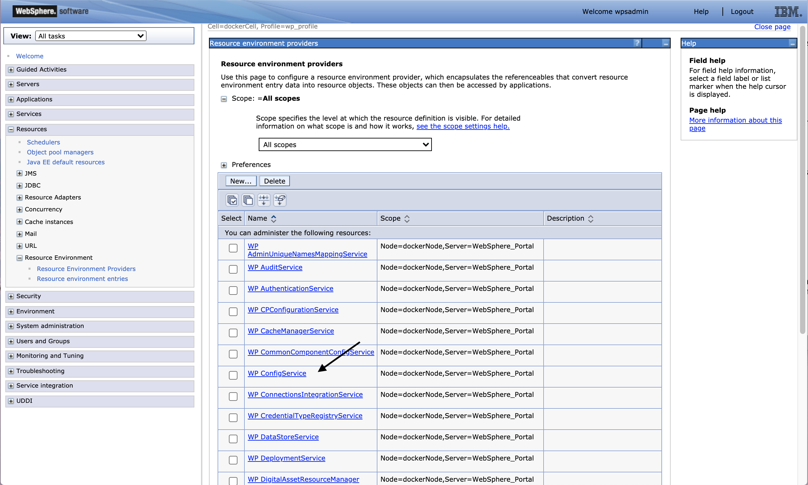

# WP\_ConfigService Resource Environment Parameters \(REP\) for Content Security Policy configuration 

The following WebSphere Application Server \(WAS\) resource environment parameters will be introduced to configure CSP.

-   **csp-enabled**

    Set to `‘true’` if CSP is enabled.

-   **csp-report-enabled**

    Set to `‘true’` if CSP reporting is enabled.

-   **csp-header**

    Set to the desired CSP allowlist `Default: default-src 'self'; script-src 'self' 'nonce-default'; img-src 'self' data:; style-src 'self' 'nonce-default’;`.

-   **csp-header-report**

    Set to the desired CSP report allowlist `Default: default-src 'self'; script-src 'self' 'nonce-default'; img-src 'self' data:; style-src 'self' 'nonce-default';`


These parameters are included under the `WP_ConfigService` resource environment provider custom properties.



## `csp-replace-string parameter`

In addition, the `csp-replace-string` plus a number \(i.e. `csp-replace-string.1`\) configures find and replace strings used in the CSP filter. This parameter was designed to allow users to implement filtering to correct their site specific CSP issues.


## Separators '@' and '=’

There are two separators which can be used with the `csp-replace-string` parameter.

1.  **Literal string replacements**

    The separator `'@'` does a literal find/replace in the markup.

    For example, the out-of-the-box `csp-replace-string.1` is:

    ```
    <style @<style nonce=\"nonceID\"
    ```

    This parameter replaces the string referencing the style element preceding the `'@'` with the string following the `'@'` \(a string for string replacement\). Please note that the quotations in the string are being escaped using the \\ character and that "nonceID" is an internal keyword that signals the filter to call the nonce service for a nonce to go in the place of "nonceID".

    Customers can use this literal find/replace to append a nonce to any inline script that they choose to permit in custom code. However, as previously stated, this is considered risky. One option would be for developers to use a "shared secret" that could be placed on script tags that should contain a nonce value. This "shared secret" could be shared with the Portal admin creating the resource environment parameters used by the filter.

    For example,

    ```
    <script secret!abc @<script nonce=\"nonceID\"
    ```

    would specify that a nonce value should be placed on this script tag.

2.  **Style replacements**

**Note:** The search and replace described below can only be used for style replacements.

    The separator `'='` searches the markup for the regex value preceding the `'='` and replaces it on the element with the CSS class following the `'='`.

    Out of the box, DX filters CSS inline styles of `"display:none"` and `"clear:both"` and adds the necessary classes to the DOM element. The format of the parameter is:

    ```
    regex find string = replacement class
    ```

    For example:

    ```
    display:none;?=wpthemeDisplayNone
    ```

    will replace either `style="display:none"` or `style="display:none;"` with `class="wpthemeDisplayNone"`.

    In addition, the replacement will consider whether or not a class attribute already exists on the element. For example:

    ```
    <div style="display:none"></div>
    ```

    will be changed to:

    ```
    <div class="wpthemeDisplayNone"></div>
    ```

    However, this element

    ```
    <div class = "abc" style="display:none"></div>
    ```

    will be changed to:

    ```
    <div class="abc wpthemeDisplayNone"></div>
    ```


**Parent topic:**[Configuring Content Security Policy ](../security/configuring_content_security_policy.md)

