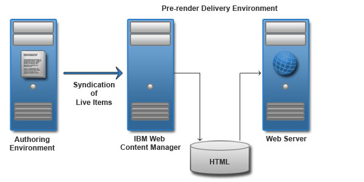
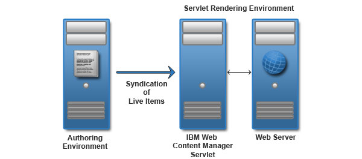

# Web content delivery environments 

If you have a HCL Web Content Manager only license, you can deliver your website without using HCL Digital Experience features.

## Pre-rendered delivery

Deploy a pre-rendered site when you are not using any HCL Digital Experience features, such as portlets, and your content is static and is only updated periodically. When you set up a pre-rendered delivery environment, your complete website is converted to static HTML files.

In a pre-rendered delivery environment, live items are syndicated from the authoring environment to the delivery environment. The content is converted into a set of static HTML files, which are then displayed to users through a web server.

## Servlet delivery

A servlet delivered website is used when you do not need to use any portlet-based features such as authoring tools. In a servlet delivery environment, content is syndicated from the authoring server to the delivery server. The HCLWeb Content Manager servlet displays the content. Site visitors access the site through a web server.

## Portlet delivery

A Web Content Viewer is a portlet that display content from a web content library as part of a portal page. If your presentation is simple, a single web content viewer can be sufficient. However, you can also use multiple web content viewers to aggregate content from different libraries and provide a richer experience for site visitors. A local web content view portlet is used to display content within your web content delivery environment.

In a portlet delivery environment, content is syndicated from the authoring server to the delivery server. It is displayed to users through a web content viewer portlet that is deployed on a portal server. When a local web content viewer is used, the web content viewer portlet is deployed on the same server as HCLWeb Content Manager.

## Remote portlet delivery

WSRP support in the web content viewer is used to display content on a remote HCL Portal server or cluster.

In a remote portlet delivery environment, content is syndicated from the authoring server to an HCL Web Content Manager server in the delivery environment. The web content viewer portlet is deployed on the HCLWeb Content Manager server. It is configured to communicate with the WSRP proxy portlet that is installed on a portal server in the delivery environment. Users view web content by accessing the proxy portlet on the remote portal server, typically through a web server.

**Parent topic:**[HCL Web Content Manager \(WCM\) environments](../wcm/wcm_deploy.md)

**Related information**  

[HCL Web Content Manager \(WCM\) environments](../wcm/wcm_deploy.md)

